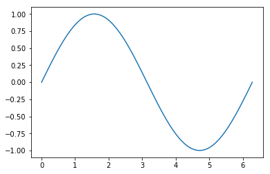

```python
print("Hello World")
```

    Hello World


```python
name='Lizz'
print(name[0:2])
```

    Li


```python
var = '01234567'
print(var[::2])
```

    0246


```python
A = {1,2,3,2,3,1}
A
```


    {1, 2, 3}


```python
Dict={"A":1,"B":"2","C":[3,3,3],"D":(4,4,4),'E':5,'F':6}
Dict["D"]
Dict["C"]
```


    [3, 3, 3]


```python
tup1 = ('physics', 'chemistry', 1997, 2000);
tup2 = (1, 2, 3, 4, 5 );
tup3 = "a", "b", "c", "d";
```


```python
tup1
tup2
tup3[2]=5

```


    ---------------------------------------------------------------------------

    TypeError                                 Traceback (most recent call last)

    <ipython-input-20-01e02342e837> in <module>()
          1 tup1
          2 tup2
    ----> 3 tup3[2]=5
    

    TypeError: 'tuple' object does not support item assignment


```python
thislist = ["apple", "banana", "cherry",569,687]
thislist[2]=5
thislist
```


    ['apple', 'banana', 5, 569, 687]


```python


def f(*x):

    return sum(c)

```


```python
f
```


    <function __main__.f(*x)>


```python
f([1,2,3])
```


    ---------------------------------------------------------------------------

    NameError                                 Traceback (most recent call last)

    <ipython-input-26-816cce84b257> in <module>()
    ----> 1 f([1,2,3])
    

    <ipython-input-24-ee7b3698a067> in f(*x)
          3 def f(*x):
          4 
    ----> 5     return sum(c)
    

    NameError: name 'c' is not defined


```python
class Car(object):
    def __init__(self,make,model,color):
        self.make=make;
        self.model=model;
        self.color=color;
        self.owner_number=0 
    def car_info(self):
        print("make: ",self.make)
        print("model:", self.model)
        print("color:",self.color)
        print("number of owners:",self.owner_number)
    def sell(self):
        self.owner_number=self.owner_number+1
```


```python
A="HEllo world"
```


```python
A[0:2]
```


    'HE'


```python
A[0:]
```


    'HEllo world'


```python
dir(Car)
```


    ['__class__',
     '__delattr__',
     '__dict__',
     '__dir__',
     '__doc__',
     '__eq__',
     '__format__',
     '__ge__',
     '__getattribute__',
     '__gt__',
     '__hash__',
     '__init__',
     '__init_subclass__',
     '__le__',
     '__lt__',
     '__module__',
     '__ne__',
     '__new__',
     '__reduce__',
     '__reduce_ex__',
     '__repr__',
     '__setattr__',
     '__sizeof__',
     '__str__',
     '__subclasshook__',
     '__weakref__',
     'car_info',
     'sell']


```python
File1 = open('iris.txt','r')
```


```python
File1.name
```


    'iris.txt'


```python
File1.mode
d = File1.read
print(d)
```

    <built-in method read of _io.TextIOWrapper object at 0x7f88042587e0>


```python
File1.close()
```


```python
with open('iris.txt','r') as Ris:
    #data = Ris.read()
    data2 = Ris.readline(4)
    line1 = Ris.readlines()
print(Ris.closed)
print(data)
```

    True
    Sepal.Length$Sepal.Width$Petal.Length$Petal.Width$Species
    5.1$3.5$1.4$0.2$setosa
    4.9$3$1.4$0.2$setosa
    4.7$3.2$1.3$0.2$setosa
    4.6$3.1$1.5$0.2$setosa
    5$3.6$1.4$0.2$setosa
    5.4$3.9$1.7$0.4$setosa
    4.6$3.4$1.4$0.3$setosa
    5$3.4$1.5$0.2$setosa
    4.4$2.9$1.4$0.2$setosa
    4.9$3.1$1.5$0.1$setosa
    5.4$3.7$1.5$0.2$setosa
    4.8$3.4$1.6$0.2$setosa
    4.8$3$1.4$0.1$setosa
    4.3$3$1.1$0.1$setosa
    5.8$4$1.2$0.2$setosa
    5.7$4.4$1.5$0.4$setosa
    5.4$3.9$1.3$0.4$setosa
    5.1$3.5$1.4$0.3$setosa
    5.7$3.8$1.7$0.3$setosa
    5.1$3.8$1.5$0.3$setosa
    5.4$3.4$1.7$0.2$setosa
    5.1$3.7$1.5$0.4$setosa
    4.6$3.6$1$0.2$setosa
    5.1$3.3$1.7$0.5$setosa
    4.8$3.4$1.9$0.2$setosa
    5$3$1.6$0.2$setosa
    5$3.4$1.6$0.4$setosa
    5.2$3.5$1.5$0.2$setosa
    5.2$3.4$1.4$0.2$setosa
    4.7$3.2$1.6$0.2$setosa
    4.8$3.1$1.6$0.2$setosa
    5.4$3.4$1.5$0.4$setosa
    5.2$4.1$1.5$0.1$setosa
    5.5$4.2$1.4$0.2$setosa
    4.9$3.1$1.5$0.2$setosa
    5$3.2$1.2$0.2$setosa
    5.5$3.5$1.3$0.2$setosa
    4.9$3.6$1.4$0.1$setosa
    4.4$3$1.3$0.2$setosa
    5.1$3.4$1.5$0.2$setosa
    5$3.5$1.3$0.3$setosa
    4.5$2.3$1.3$0.3$setosa
    4.4$3.2$1.3$0.2$setosa
    5$3.5$1.6$0.6$setosa
    5.1$3.8$1.9$0.4$setosa
    4.8$3$1.4$0.3$setosa
    5.1$3.8$1.6$0.2$setosa
    4.6$3.2$1.4$0.2$setosa
    5.3$3.7$1.5$0.2$setosa
    5$3.3$1.4$0.2$setosa
    7$3.2$4.7$1.4$versicolor
    6.4$3.2$4.5$1.5$versicolor
    6.9$3.1$4.9$1.5$versicolor
    5.5$2.3$4$1.3$versicolor
    6.5$2.8$4.6$1.5$versicolor
    5.7$2.8$4.5$1.3$versicolor
    6.3$3.3$4.7$1.6$versicolor
    4.9$2.4$3.3$1$versicolor
    6.6$2.9$4.6$1.3$versicolor
    5.2$2.7$3.9$1.4$versicolor
    5$2$3.5$1$versicolor
    5.9$3$4.2$1.5$versicolor
    6$2.2$4$1$versicolor
    6.1$2.9$4.7$1.4$versicolor
    5.6$2.9$3.6$1.3$versicolor
    6.7$3.1$4.4$1.4$versicolor
    5.6$3$4.5$1.5$versicolor
    5.8$2.7$4.1$1$versicolor
    6.2$2.2$4.5$1.5$versicolor
    5.6$2.5$3.9$1.1$versicolor
    5.9$3.2$4.8$1.8$versicolor
    6.1$2.8$4$1.3$versicolor
    6.3$2.5$4.9$1.5$versicolor
    6.1$2.8$4.7$1.2$versicolor
    6.4$2.9$4.3$1.3$versicolor
    6.6$3$4.4$1.4$versicolor
    6.8$2.8$4.8$1.4$versicolor
    6.7$3$5$1.7$versicolor
    6$2.9$4.5$1.5$versicolor
    5.7$2.6$3.5$1$versicolor
    5.5$2.4$3.8$1.1$versicolor
    5.5$2.4$3.7$1$versicolor
    5.8$2.7$3.9$1.2$versicolor
    6$2.7$5.1$1.6$versicolor
    5.4$3$4.5$1.5$versicolor
    6$3.4$4.5$1.6$versicolor
    6.7$3.1$4.7$1.5$versicolor
    6.3$2.3$4.4$1.3$versicolor
    5.6$3$4.1$1.3$versicolor
    5.5$2.5$4$1.3$versicolor
    5.5$2.6$4.4$1.2$versicolor
    6.1$3$4.6$1.4$versicolor
    5.8$2.6$4$1.2$versicolor
    5$2.3$3.3$1$versicolor
    5.6$2.7$4.2$1.3$versicolor
    5.7$3$4.2$1.2$versicolor
    5.7$2.9$4.2$1.3$versicolor
    6.2$2.9$4.3$1.3$versicolor
    5.1$2.5$3$1.1$versicolor
    5.7$2.8$4.1$1.3$versicolor
    6.3$3.3$6$2.5$virginica
    5.8$2.7$5.1$1.9$virginica
    7.1$3$5.9$2.1$virginica
    6.3$2.9$5.6$1.8$virginica
    6.5$3$5.8$2.2$virginica
    7.6$3$6.6$2.1$virginica
    4.9$2.5$4.5$1.7$virginica
    7.3$2.9$6.3$1.8$virginica
    6.7$2.5$5.8$1.8$virginica
    7.2$3.6$6.1$2.5$virginica
    6.5$3.2$5.1$2$virginica
    6.4$2.7$5.3$1.9$virginica
    6.8$3$5.5$2.1$virginica
    5.7$2.5$5$2$virginica
    5.8$2.8$5.1$2.4$virginica
    6.4$3.2$5.3$2.3$virginica
    6.5$3$5.5$1.8$virginica
    7.7$3.8$6.7$2.2$virginica
    7.7$2.6$6.9$2.3$virginica
    6$2.2$5$1.5$virginica
    6.9$3.2$5.7$2.3$virginica
    5.6$2.8$4.9$2$virginica
    7.7$2.8$6.7$2$virginica
    6.3$2.7$4.9$1.8$virginica
    6.7$3.3$5.7$2.1$virginica
    7.2$3.2$6$1.8$virginica
    6.2$2.8$4.8$1.8$virginica
    6.1$3$4.9$1.8$virginica
    6.4$2.8$5.6$2.1$virginica
    7.2$3$5.8$1.6$virginica
    7.4$2.8$6.1$1.9$virginica
    7.9$3.8$6.4$2$virginica
    6.4$2.8$5.6$2.2$virginica
    6.3$2.8$5.1$1.5$virginica
    6.1$2.6$5.6$1.4$virginica
    7.7$3$6.1$2.3$virginica
    6.3$3.4$5.6$2.4$virginica
    6.4$3.1$5.5$1.8$virginica
    6$3$4.8$1.8$virginica
    6.9$3.1$5.4$2.1$virginica
    6.7$3.1$5.6$2.4$virginica
    6.9$3.1$5.1$2.3$virginica
    5.8$2.7$5.1$1.9$virginica
    6.8$3.2$5.9$2.3$virginica
    6.7$3.3$5.7$2.5$virginica
    6.7$3$5.2$2.3$virginica
    6.3$2.5$5$1.9$virginica
    6.5$3$5.2$2$virginica
    6.2$3.4$5.4$2.3$virginica
    5.9$3$5.1$1.8$virginica
    


```python
print(data2)
```

    Sepa


```python
type(data2)
```


    ---------------------------------------------------------------------------

    AttributeError                            Traceback (most recent call last)

    <ipython-input-87-63ae04f10a8a> in <module>()
          1 type(data2)
    ----> 2 line1.head()
    

    AttributeError: 'list' object has no attribute 'head'


```python
print(line1[1])
```

    5.1$3.5$1.4$0.2$setosa
    


```python
with open('iris.txt','r') as Ris:
   for line in Ris:
        print(line)
print(Ris.closed)

```

    Sepal.Length$Sepal.Width$Petal.Length$Petal.Width$Species
    
    5.1$3.5$1.4$0.2$setosa
    
    4.9$3$1.4$0.2$setosa
    
    4.7$3.2$1.3$0.2$setosa
    
    4.6$3.1$1.5$0.2$setosa
    
    5$3.6$1.4$0.2$setosa
    
    5.4$3.9$1.7$0.4$setosa
    
    4.6$3.4$1.4$0.3$setosa
    
    5$3.4$1.5$0.2$setosa
    
    4.4$2.9$1.4$0.2$setosa
    
    4.9$3.1$1.5$0.1$setosa
    
    5.4$3.7$1.5$0.2$setosa
    
    4.8$3.4$1.6$0.2$setosa
    
    4.8$3$1.4$0.1$setosa
    
    4.3$3$1.1$0.1$setosa
    
    5.8$4$1.2$0.2$setosa
    
    5.7$4.4$1.5$0.4$setosa
    
    5.4$3.9$1.3$0.4$setosa
    
    5.1$3.5$1.4$0.3$setosa
    
    5.7$3.8$1.7$0.3$setosa
    
    5.1$3.8$1.5$0.3$setosa
    
    5.4$3.4$1.7$0.2$setosa
    
    5.1$3.7$1.5$0.4$setosa
    
    4.6$3.6$1$0.2$setosa
    
    5.1$3.3$1.7$0.5$setosa
    
    4.8$3.4$1.9$0.2$setosa
    
    5$3$1.6$0.2$setosa
    
    5$3.4$1.6$0.4$setosa
    
    5.2$3.5$1.5$0.2$setosa
    
    5.2$3.4$1.4$0.2$setosa
    
    4.7$3.2$1.6$0.2$setosa
    
    4.8$3.1$1.6$0.2$setosa
    
    5.4$3.4$1.5$0.4$setosa
    
    5.2$4.1$1.5$0.1$setosa
    
    5.5$4.2$1.4$0.2$setosa
    
    4.9$3.1$1.5$0.2$setosa
    
    5$3.2$1.2$0.2$setosa
    
    5.5$3.5$1.3$0.2$setosa
    
    4.9$3.6$1.4$0.1$setosa
    
    4.4$3$1.3$0.2$setosa
    
    5.1$3.4$1.5$0.2$setosa
    
    5$3.5$1.3$0.3$setosa
    
    4.5$2.3$1.3$0.3$setosa
    
    4.4$3.2$1.3$0.2$setosa
    
    5$3.5$1.6$0.6$setosa
    
    5.1$3.8$1.9$0.4$setosa
    
    4.8$3$1.4$0.3$setosa
    
    5.1$3.8$1.6$0.2$setosa
    
    4.6$3.2$1.4$0.2$setosa
    
    5.3$3.7$1.5$0.2$setosa
    
    5$3.3$1.4$0.2$setosa
    
    7$3.2$4.7$1.4$versicolor
    
    6.4$3.2$4.5$1.5$versicolor
    
    6.9$3.1$4.9$1.5$versicolor
    
    5.5$2.3$4$1.3$versicolor
    
    6.5$2.8$4.6$1.5$versicolor
    
    5.7$2.8$4.5$1.3$versicolor
    
    6.3$3.3$4.7$1.6$versicolor
    
    4.9$2.4$3.3$1$versicolor
    
    6.6$2.9$4.6$1.3$versicolor
    
    5.2$2.7$3.9$1.4$versicolor
    
    5$2$3.5$1$versicolor
    
    5.9$3$4.2$1.5$versicolor
    
    6$2.2$4$1$versicolor
    
    6.1$2.9$4.7$1.4$versicolor
    
    5.6$2.9$3.6$1.3$versicolor
    
    6.7$3.1$4.4$1.4$versicolor
    
    5.6$3$4.5$1.5$versicolor
    
    5.8$2.7$4.1$1$versicolor
    
    6.2$2.2$4.5$1.5$versicolor
    
    5.6$2.5$3.9$1.1$versicolor
    
    5.9$3.2$4.8$1.8$versicolor
    
    6.1$2.8$4$1.3$versicolor
    
    6.3$2.5$4.9$1.5$versicolor
    
    6.1$2.8$4.7$1.2$versicolor
    
    6.4$2.9$4.3$1.3$versicolor
    
    6.6$3$4.4$1.4$versicolor
    
    6.8$2.8$4.8$1.4$versicolor
    
    6.7$3$5$1.7$versicolor
    
    6$2.9$4.5$1.5$versicolor
    
    5.7$2.6$3.5$1$versicolor
    
    5.5$2.4$3.8$1.1$versicolor
    
    5.5$2.4$3.7$1$versicolor
    
    5.8$2.7$3.9$1.2$versicolor
    
    6$2.7$5.1$1.6$versicolor
    
    5.4$3$4.5$1.5$versicolor
    
    6$3.4$4.5$1.6$versicolor
    
    6.7$3.1$4.7$1.5$versicolor
    
    6.3$2.3$4.4$1.3$versicolor
    
    5.6$3$4.1$1.3$versicolor
    
    5.5$2.5$4$1.3$versicolor
    
    5.5$2.6$4.4$1.2$versicolor
    
    6.1$3$4.6$1.4$versicolor
    
    5.8$2.6$4$1.2$versicolor
    
    5$2.3$3.3$1$versicolor
    
    5.6$2.7$4.2$1.3$versicolor
    
    5.7$3$4.2$1.2$versicolor
    
    5.7$2.9$4.2$1.3$versicolor
    
    6.2$2.9$4.3$1.3$versicolor
    
    5.1$2.5$3$1.1$versicolor
    
    5.7$2.8$4.1$1.3$versicolor
    
    6.3$3.3$6$2.5$virginica
    
    5.8$2.7$5.1$1.9$virginica
    
    7.1$3$5.9$2.1$virginica
    
    6.3$2.9$5.6$1.8$virginica
    
    6.5$3$5.8$2.2$virginica
    
    7.6$3$6.6$2.1$virginica
    
    4.9$2.5$4.5$1.7$virginica
    
    7.3$2.9$6.3$1.8$virginica
    
    6.7$2.5$5.8$1.8$virginica
    
    7.2$3.6$6.1$2.5$virginica
    
    6.5$3.2$5.1$2$virginica
    
    6.4$2.7$5.3$1.9$virginica
    
    6.8$3$5.5$2.1$virginica
    
    5.7$2.5$5$2$virginica
    
    5.8$2.8$5.1$2.4$virginica
    
    6.4$3.2$5.3$2.3$virginica
    
    6.5$3$5.5$1.8$virginica
    
    7.7$3.8$6.7$2.2$virginica
    
    7.7$2.6$6.9$2.3$virginica
    
    6$2.2$5$1.5$virginica
    
    6.9$3.2$5.7$2.3$virginica
    
    5.6$2.8$4.9$2$virginica
    
    7.7$2.8$6.7$2$virginica
    
    6.3$2.7$4.9$1.8$virginica
    
    6.7$3.3$5.7$2.1$virginica
    
    7.2$3.2$6$1.8$virginica
    
    6.2$2.8$4.8$1.8$virginica
    
    6.1$3$4.9$1.8$virginica
    
    6.4$2.8$5.6$2.1$virginica
    
    7.2$3$5.8$1.6$virginica
    
    7.4$2.8$6.1$1.9$virginica
    
    7.9$3.8$6.4$2$virginica
    
    6.4$2.8$5.6$2.2$virginica
    
    6.3$2.8$5.1$1.5$virginica
    
    6.1$2.6$5.6$1.4$virginica
    
    7.7$3$6.1$2.3$virginica
    
    6.3$3.4$5.6$2.4$virginica
    
    6.4$3.1$5.5$1.8$virginica
    
    6$3$4.8$1.8$virginica
    
    6.9$3.1$5.4$2.1$virginica
    
    6.7$3.1$5.6$2.4$virginica
    
    6.9$3.1$5.1$2.3$virginica
    
    5.8$2.7$5.1$1.9$virginica
    
    6.8$3.2$5.9$2.3$virginica
    
    6.7$3.3$5.7$2.5$virginica
    
    6.7$3$5.2$2.3$virginica
    
    6.3$2.5$5$1.9$virginica
    
    6.5$3$5.2$2$virginica
    
    6.2$3.4$5.4$2.3$virginica
    
    5.9$3$5.1$1.8$virginica
    
    True


```python
lines=["this is line 1 \n","this is line 2 \n", "this is line 3 \n"]
with open('newfile.txt','w') as new:
    for line in lines:
        new.write(line)
```


```python
#dir(new)
```


```python
lines2=["this is line 4 \n","this is line 5 \n", "this is line 6 \n"]
with open('newfile.txt','a') as new:
    for line in lines2:
        new.write(line)
```


```python
with open('iris.txt','r') as Rdata:
   with open('Nris.txt','w') as wdata:
        for line in Rdata:
            wdata.write(line)
print(Rdata.closed)
```

    True


```python
import pandas as pd
```


```python
df=pd.read_csv("iris.csv")
```


```python
df.head(10)

```


<div>
<style scoped>
    .dataframe tbody tr th:only-of-type {
        vertical-align: middle;
    }

    .dataframe tbody tr th {
        vertical-align: top;
    }

    .dataframe thead th {
        text-align: right;
    }
</style>
<table border="1" class="dataframe">
  <thead>
    <tr style="text-align: right;">
      <th></th>
      <th>Sepal.Length</th>
      <th>Sepal.Width</th>
      <th>Petal.Length</th>
      <th>Petal.Width</th>
      <th>Species</th>
    </tr>
  </thead>
  <tbody>
    <tr>
      <th>0</th>
      <td>5.1</td>
      <td>3.5</td>
      <td>1.4</td>
      <td>0.2</td>
      <td>setosa</td>
    </tr>
    <tr>
      <th>1</th>
      <td>4.9</td>
      <td>3.0</td>
      <td>1.4</td>
      <td>0.2</td>
      <td>setosa</td>
    </tr>
    <tr>
      <th>2</th>
      <td>4.7</td>
      <td>3.2</td>
      <td>1.3</td>
      <td>0.2</td>
      <td>setosa</td>
    </tr>
    <tr>
      <th>3</th>
      <td>4.6</td>
      <td>3.1</td>
      <td>1.5</td>
      <td>0.2</td>
      <td>setosa</td>
    </tr>
    <tr>
      <th>4</th>
      <td>5.0</td>
      <td>3.6</td>
      <td>1.4</td>
      <td>0.2</td>
      <td>setosa</td>
    </tr>
    <tr>
      <th>5</th>
      <td>5.4</td>
      <td>3.9</td>
      <td>1.7</td>
      <td>0.4</td>
      <td>setosa</td>
    </tr>
    <tr>
      <th>6</th>
      <td>4.6</td>
      <td>3.4</td>
      <td>1.4</td>
      <td>0.3</td>
      <td>setosa</td>
    </tr>
    <tr>
      <th>7</th>
      <td>5.0</td>
      <td>3.4</td>
      <td>1.5</td>
      <td>0.2</td>
      <td>setosa</td>
    </tr>
    <tr>
      <th>8</th>
      <td>4.4</td>
      <td>2.9</td>
      <td>1.4</td>
      <td>0.2</td>
      <td>setosa</td>
    </tr>
    <tr>
      <th>9</th>
      <td>4.9</td>
      <td>3.1</td>
      <td>1.5</td>
      <td>0.1</td>
      <td>setosa</td>
    </tr>
  </tbody>
</table>
</div>


```python
Extratdf = df[df["Petal.Length"]>1.4]
Extratdf.to_csv("Extratdf.csv")
```


```python
df[["Sepal.Length"]]
```


<div>
<style scoped>
    .dataframe tbody tr th:only-of-type {
        vertical-align: middle;
    }

    .dataframe tbody tr th {
        vertical-align: top;
    }

    .dataframe thead th {
        text-align: right;
    }
</style>
<table border="1" class="dataframe">
  <thead>
    <tr style="text-align: right;">
      <th></th>
      <th>Sepal.Length</th>
    </tr>
  </thead>
  <tbody>
    <tr>
      <th>0</th>
      <td>5.1</td>
    </tr>
    <tr>
      <th>1</th>
      <td>4.9</td>
    </tr>
    <tr>
      <th>2</th>
      <td>4.7</td>
    </tr>
    <tr>
      <th>3</th>
      <td>4.6</td>
    </tr>
    <tr>
      <th>4</th>
      <td>5.0</td>
    </tr>
    <tr>
      <th>5</th>
      <td>5.4</td>
    </tr>
    <tr>
      <th>6</th>
      <td>4.6</td>
    </tr>
    <tr>
      <th>7</th>
      <td>5.0</td>
    </tr>
    <tr>
      <th>8</th>
      <td>4.4</td>
    </tr>
    <tr>
      <th>9</th>
      <td>4.9</td>
    </tr>
    <tr>
      <th>10</th>
      <td>5.4</td>
    </tr>
    <tr>
      <th>11</th>
      <td>4.8</td>
    </tr>
    <tr>
      <th>12</th>
      <td>4.8</td>
    </tr>
    <tr>
      <th>13</th>
      <td>4.3</td>
    </tr>
    <tr>
      <th>14</th>
      <td>5.8</td>
    </tr>
    <tr>
      <th>15</th>
      <td>5.7</td>
    </tr>
    <tr>
      <th>16</th>
      <td>5.4</td>
    </tr>
    <tr>
      <th>17</th>
      <td>5.1</td>
    </tr>
    <tr>
      <th>18</th>
      <td>5.7</td>
    </tr>
    <tr>
      <th>19</th>
      <td>5.1</td>
    </tr>
    <tr>
      <th>20</th>
      <td>5.4</td>
    </tr>
    <tr>
      <th>21</th>
      <td>5.1</td>
    </tr>
    <tr>
      <th>22</th>
      <td>4.6</td>
    </tr>
    <tr>
      <th>23</th>
      <td>5.1</td>
    </tr>
    <tr>
      <th>24</th>
      <td>4.8</td>
    </tr>
    <tr>
      <th>25</th>
      <td>5.0</td>
    </tr>
    <tr>
      <th>26</th>
      <td>5.0</td>
    </tr>
    <tr>
      <th>27</th>
      <td>5.2</td>
    </tr>
    <tr>
      <th>28</th>
      <td>5.2</td>
    </tr>
    <tr>
      <th>29</th>
      <td>4.7</td>
    </tr>
    <tr>
      <th>...</th>
      <td>...</td>
    </tr>
    <tr>
      <th>120</th>
      <td>6.9</td>
    </tr>
    <tr>
      <th>121</th>
      <td>5.6</td>
    </tr>
    <tr>
      <th>122</th>
      <td>7.7</td>
    </tr>
    <tr>
      <th>123</th>
      <td>6.3</td>
    </tr>
    <tr>
      <th>124</th>
      <td>6.7</td>
    </tr>
    <tr>
      <th>125</th>
      <td>7.2</td>
    </tr>
    <tr>
      <th>126</th>
      <td>6.2</td>
    </tr>
    <tr>
      <th>127</th>
      <td>6.1</td>
    </tr>
    <tr>
      <th>128</th>
      <td>6.4</td>
    </tr>
    <tr>
      <th>129</th>
      <td>7.2</td>
    </tr>
    <tr>
      <th>130</th>
      <td>7.4</td>
    </tr>
    <tr>
      <th>131</th>
      <td>7.9</td>
    </tr>
    <tr>
      <th>132</th>
      <td>6.4</td>
    </tr>
    <tr>
      <th>133</th>
      <td>6.3</td>
    </tr>
    <tr>
      <th>134</th>
      <td>6.1</td>
    </tr>
    <tr>
      <th>135</th>
      <td>7.7</td>
    </tr>
    <tr>
      <th>136</th>
      <td>6.3</td>
    </tr>
    <tr>
      <th>137</th>
      <td>6.4</td>
    </tr>
    <tr>
      <th>138</th>
      <td>6.0</td>
    </tr>
    <tr>
      <th>139</th>
      <td>6.9</td>
    </tr>
    <tr>
      <th>140</th>
      <td>6.7</td>
    </tr>
    <tr>
      <th>141</th>
      <td>6.9</td>
    </tr>
    <tr>
      <th>142</th>
      <td>5.8</td>
    </tr>
    <tr>
      <th>143</th>
      <td>6.8</td>
    </tr>
    <tr>
      <th>144</th>
      <td>6.7</td>
    </tr>
    <tr>
      <th>145</th>
      <td>6.7</td>
    </tr>
    <tr>
      <th>146</th>
      <td>6.3</td>
    </tr>
    <tr>
      <th>147</th>
      <td>6.5</td>
    </tr>
    <tr>
      <th>148</th>
      <td>6.2</td>
    </tr>
    <tr>
      <th>149</th>
      <td>5.9</td>
    </tr>
  </tbody>
</table>
<p>150 rows × 1 columns</p>
</div>


```python
Extract_IRis=df[['Sepal.Length','Species']]
Extract_IRis.head()
```


<div>
<style scoped>
    .dataframe tbody tr th:only-of-type {
        vertical-align: middle;
    }

    .dataframe tbody tr th {
        vertical-align: top;
    }

    .dataframe thead th {
        text-align: right;
    }
</style>
<table border="1" class="dataframe">
  <thead>
    <tr style="text-align: right;">
      <th></th>
      <th>Sepal.Length</th>
      <th>Species</th>
    </tr>
  </thead>
  <tbody>
    <tr>
      <th>0</th>
      <td>5.1</td>
      <td>setosa</td>
    </tr>
    <tr>
      <th>1</th>
      <td>4.9</td>
      <td>setosa</td>
    </tr>
    <tr>
      <th>2</th>
      <td>4.7</td>
      <td>setosa</td>
    </tr>
    <tr>
      <th>3</th>
      <td>4.6</td>
      <td>setosa</td>
    </tr>
    <tr>
      <th>4</th>
      <td>5.0</td>
      <td>setosa</td>
    </tr>
  </tbody>
</table>
</div>


```python
type(df)
```


    pandas.core.frame.DataFrame


```python
Extract_IRis.ix[1,'Species']
Extract_IRis.iloc[1,0]
```

    /opt/conda/lib/python3.6/site-packages/ipykernel_launcher.py:1: DeprecationWarning: 
    .ix is deprecated. Please use
    .loc for label based indexing or
    .iloc for positional indexing
    
    See the documentation here:
    http://pandas.pydata.org/pandas-docs/stable/indexing.html#ix-indexer-is-deprecated
      """Entry point for launching an IPython kernel.


    4.9000000000000004


```python

```


```python

```


```python
#dir(df)
```


```python
df["Species"].unique()
```


    array(['setosa', 'versicolor', 'virginica'], dtype=object)


```python
Dict={"A":1,"B":"2","C":[3,4,7,"you"],"D":(4,4,4,9),'E':5,'F':6}
```


```python
Ndata=pd.DataFrame(Dict)
type(Ndata)
Ndata
```


<div>
<style scoped>
    .dataframe tbody tr th:only-of-type {
        vertical-align: middle;
    }

    .dataframe tbody tr th {
        vertical-align: top;
    }

    .dataframe thead th {
        text-align: right;
    }
</style>
<table border="1" class="dataframe">
  <thead>
    <tr style="text-align: right;">
      <th></th>
      <th>A</th>
      <th>B</th>
      <th>C</th>
      <th>D</th>
      <th>E</th>
      <th>F</th>
    </tr>
  </thead>
  <tbody>
    <tr>
      <th>0</th>
      <td>1</td>
      <td>2</td>
      <td>3</td>
      <td>4</td>
      <td>5</td>
      <td>6</td>
    </tr>
    <tr>
      <th>1</th>
      <td>1</td>
      <td>2</td>
      <td>4</td>
      <td>4</td>
      <td>5</td>
      <td>6</td>
    </tr>
    <tr>
      <th>2</th>
      <td>1</td>
      <td>2</td>
      <td>7</td>
      <td>4</td>
      <td>5</td>
      <td>6</td>
    </tr>
    <tr>
      <th>3</th>
      <td>1</td>
      <td>2</td>
      <td>you</td>
      <td>9</td>
      <td>5</td>
      <td>6</td>
    </tr>
  </tbody>
</table>
</div>


```python
Ndata["A"].unique()
```


    array([1])


```python
Ndata["A"]==1
```


    0    True
    1    True
    2    True
    3    True
    Name: A, dtype: bool


```python
MyDick= {"A":(1,2,3,4),"B":(5,6,7,8)}
```


```python
pd.DataFrame(MyDick)
```


<div>
<style scoped>
    .dataframe tbody tr th:only-of-type {
        vertical-align: middle;
    }

    .dataframe tbody tr th {
        vertical-align: top;
    }

    .dataframe thead th {
        text-align: right;
    }
</style>
<table border="1" class="dataframe">
  <thead>
    <tr style="text-align: right;">
      <th></th>
      <th>A</th>
      <th>B</th>
    </tr>
  </thead>
  <tbody>
    <tr>
      <th>0</th>
      <td>1</td>
      <td>5</td>
    </tr>
    <tr>
      <th>1</th>
      <td>2</td>
      <td>6</td>
    </tr>
    <tr>
      <th>2</th>
      <td>3</td>
      <td>7</td>
    </tr>
    <tr>
      <th>3</th>
      <td>4</td>
      <td>8</td>
    </tr>
  </tbody>
</table>
</div>


```python
import numpy as np
vec1=np.array([1,2,3,4,5])
```


```python
vec1
```


    array([1, 2, 3, 4, 5])


```python
type(vec1)
vec1.dtype
```


    dtype('int64')


```python
print(vec1.size)
print(vec1.ndim)
print(vec1.shape)
```

    5
    1
    (5,)


```python
vec1[0:]=np.array([4,5,3,2,9])
vec1
```


    array([4, 5, 3, 2, 9])


```python
vec2=np.array([1,2,3,4,5])
np.random.rand
```


    <function RandomState.rand>


```python
vec3=vec1+vec2
```


```python
vec3
```


    array([ 5,  7,  6,  6, 14])


```python
vec4=vec1-vec2
vec4
```


    array([ 3,  3,  0, -2,  4])


```python
vec5=vec1*vec2
vec5
```


    array([ 4, 10,  9,  8, 45])


```python
vec6=np.dot(vec1,vec2)
vec6
```


    76


```python
vec5.max()
```


    45


```python
np.pi
```


    3.141592653589793


```python
x=np.array([0, (np.pi)/2, np.pi])
np.sin(x)
```


    array([  0.00000000e+00,   1.00000000e+00,   1.22464680e-16])


```python
np.linspace(-2,2,5)
```


    array([-2., -1.,  0.,  1.,  2.])


```python
x=np.linspace(0,2*np.pi,100)
y = np.sin(x)
```


```python
import matplotlib.pyplot as plt
plt.plot(x,y)
```


    [<matplotlib.lines.Line2D at 0x7f87e3911e48>]





```python
a=[[1,4,2],[4,5,2],[8,4,1]]
```


```python
A=np.array(a)
```


```python
A.ndim
```


    2


```python
A.shape
```


    (3, 3)


```python
A.size
```


    9


```python
A[0][2]
```


    2


```python
A[0:2,2]
```


    array([2, 2])


```python
A[1,0]
```


    4


```python
B=2*A
B
```


    array([[ 2,  8,  4],
           [ 8, 10,  4],
           [16,  8,  2]])


```python
C=np.dot(A,B)
C
```


    array([[ 66,  64,  24],
           [ 80,  98,  40],
           [ 64, 112,  50]])


```python
Name="Michael Jackson"
Name.find('el')
```


    5


```python
 F="You are wrong"
G=F.upper()
G
```


    'YOU ARE WRONG'


```python
 tuple1=("A","B","C" )
tuple1[-1]
```


    'C'


```python
 A=((11,12),[21,22])
A[1]
```


    [21, 22]


```python
'1,2,3,4'.split(',')
```


    ['1', '2', '3', '4']


```python
V={'A','B'}
V.add('C')
V
```


    {'A', 'B', 'C'}


```python
range(3)
```


    range(0, 3)


```python


for n in range(3):

    print(n)

```

    0
    1
    2


```python

```
