```python
# loading the necessary library for this exercise

import matplotlib.pyplot as plt
import pandas as pd
import pylab as pl
import numpy as np
%matplotlib inline
```


```python
!wget -O FuelConsumption.csv https://s3-api.us-geo.objectstorage.softlayer.net/cf-courses-data/CognitiveClass/ML0101ENv3/labs/FuelConsumptionCo2.csv
```

    --2018-12-10 19:29:22--  https://s3-api.us-geo.objectstorage.softlayer.net/cf-courses-data/CognitiveClass/ML0101ENv3/labs/FuelConsumptionCo2.csv
    Resolving s3-api.us-geo.objectstorage.softlayer.net (s3-api.us-geo.objectstorage.softlayer.net)... 67.228.254.193
    Connecting to s3-api.us-geo.objectstorage.softlayer.net (s3-api.us-geo.objectstorage.softlayer.net)|67.228.254.193|:443... connected.
    HTTP request sent, awaiting response... 200 OK
    Length: 72629 (71K) [text/csv]
    Saving to: ‘FuelConsumption.csv’
    
    FuelConsumption.csv 100%[===================>]  70.93K  --.-KB/s    in 0.04s   
    
    2018-12-10 19:29:22 (1.58 MB/s) - ‘FuelConsumption.csv’ saved [72629/72629]
    


```python
DataFile = open('FuelConsumption.csv','r')
```


```python
Data = DataFile.read()
```


```python
type(Data)
```


    str


```python
with open('FuelConsumption.csv','r') as RawData:
    for line in RawData:
        print(line)
    
RawData.closed
```

    MODELYEAR,MAKE,MODEL,VEHICLECLASS,ENGINESIZE,CYLINDERS,TRANSMISSION,FUELTYPE,FUELCONSUMPTION_CITY,FUELCONSUMPTION_HWY,FUELCONSUMPTION_COMB,FUELCONSUMPTION_COMB_MPG,CO2EMISSIONS
    
    2014,ACURA,ILX,COMPACT,2,4,AS5,Z,9.9,6.7,8.5,33,196
    
    2014,ACURA,ILX,COMPACT,2.4,4,M6,Z,11.2,7.7,9.6,29,221
    
    2014,ACURA,ILX HYBRID,COMPACT,1.5,4,AV7,Z,6,5.8,5.9,48,136
    
    2014,ACURA,MDX 4WD,SUV - SMALL,3.5,6,AS6,Z,12.7,9.1,11.1,25,255
    
    2014,ACURA,RDX AWD,SUV - SMALL,3.5,6,AS6,Z,12.1,8.7,10.6,27,244
    
    2014,ACURA,RLX,MID-SIZE,3.5,6,AS6,Z,11.9,7.7,10,28,230
    
    2014,ACURA,TL,MID-SIZE,3.5,6,AS6,Z,11.8,8.1,10.1,28,232
    
    2014,ACURA,TL AWD,MID-SIZE,3.7,6,AS6,Z,12.8,9,11.1,25,255
    
    2014,ACURA,TL AWD,MID-SIZE,3.7,6,M6,Z,13.4,9.5,11.6,24,267
    
    2014,ACURA,TSX,COMPACT,2.4,4,AS5,Z,10.6,7.5,9.2,31,212
    
    2014,ACURA,TSX,COMPACT,2.4,4,M6,Z,11.2,8.1,9.8,29,225
    
    2014,ACURA,TSX,COMPACT,3.5,6,AS5,Z,12.1,8.3,10.4,27,239
    
    2014,ASTON MARTIN,DB9,MINICOMPACT,5.9,12,A6,Z,18,12.6,15.6,18,359
    
    2014,ASTON MARTIN,RAPIDE,SUBCOMPACT,5.9,12,A6,Z,18,12.6,15.6,18,359
    
    2014,ASTON MARTIN,V8 VANTAGE,TWO-SEATER,4.7,8,AM7,Z,17.4,11.3,14.7,19,338
    
    2014,ASTON MARTIN,V8 VANTAGE,TWO-SEATER,4.7,8,M6,Z,18.1,12.2,15.4,18,354
    
    2014,ASTON MARTIN,V8 VANTAGE S,TWO-SEATER,4.7,8,AM7,Z,17.4,11.3,14.7,19,338
    
    2014,ASTON MARTIN,V8 VANTAGE S,TWO-SEATER,4.7,8,M6,Z,18.1,12.2,15.4,18,354
    
    2014,ASTON MARTIN,VANQUISH,MINICOMPACT,5.9,12,A6,Z,18,12.6,15.6,18,359
    
    2014,AUDI,A4,COMPACT,2,4,AV8,Z,9.9,7.4,8.8,32,202
    
    2014,AUDI,A4 QUATTRO,COMPACT,2,4,AS8,Z,11.5,8.1,10,28,230
    
    2014,AUDI,A4 QUATTRO,COMPACT,2,4,M6,Z,10.8,7.5,9.3,30,214
    
    2014,AUDI,A5 CABRIOLET QUATTRO,SUBCOMPACT,2,4,AS8,Z,11.5,8.1,10,28,230
    
    2014,AUDI,A5 QUATTRO,SUBCOMPACT,2,4,AS8,Z,11.5,8.1,10,28,230
    
    2014,AUDI,A5 QUATTRO,SUBCOMPACT,2,4,M6,Z,10.8,7.5,9.3,30,214
    
    2014,AUDI,A6 QUATTRO,MID-SIZE,2,4,AS8,Z,12,8.1,10.2,28,235
    
    2014,AUDI,A6 QUATTRO,MID-SIZE,3,6,AS8,Z,12.8,8.6,10.9,26,251
    
    2014,AUDI,A6 QUATTRO TDI CLEAN DIESEL,MID-SIZE,3,6,AS8,D,9.8,6.4,8.3,34,224
    
    2014,AUDI,A7 QUATTRO,MID-SIZE,3,6,AS8,Z,13.1,8.8,11.2,25,258
    
    2014,AUDI,A7 QUATTRO TDI CLEAN DIESEL,MID-SIZE,3,6,AS8,D,9.8,6.4,8.3,34,224
    
    2014,AUDI,A8,MID-SIZE,3,6,AS8,Z,13.1,8.8,11.2,25,258
    
    2014,AUDI,A8,MID-SIZE,4,8,AS8,Z,13.5,8.6,11.3,25,260
    
    2014,AUDI,A8 TDI CLEAN DIESEL,MID-SIZE,3,6,AS8,D,10,6.4,8.4,34,227
    
    2014,AUDI,A8L,FULL-SIZE,3,6,AS8,Z,13.1,8.8,11.2,25,258
    
    2014,AUDI,A8L,FULL-SIZE,4,8,AS8,Z,14.7,9.7,12.5,23,288
    
    2014,AUDI,A8L,FULL-SIZE,6.3,12,AS8,Z,18.2,12.6,15.7,18,361
    
    2014,AUDI,A8L TDI CLEAN DIESEL,FULL-SIZE,3,6,AS8,D,10.1,6.5,8.5,33,230
    
    2014,AUDI,ALLROAD QUATTRO,STATION WAGON - SMALL,2,4,AS8,Z,11.8,8.8,10.5,27,242
    
    2014,AUDI,Q5,SUV - SMALL,2,4,AS8,Z,12,8.5,10.4,27,239
    
    2014,AUDI,Q5,SUV - SMALL,3,6,AS8,Z,12.9,9.2,11.2,25,258
    
    2014,AUDI,Q5 HYBRID,SUV - SMALL,2,4,AS8,Z,9.9,8.3,9.2,31,212
    
    2014,AUDI,Q5 TDI CLEAN DIESEL,SUV - SMALL,3,6,AS8,D,10.3,7.6,9.1,31,246
    
    2014,AUDI,Q7,SUV - STANDARD,3,6,AS8,Z,15.1,10.9,13.2,21,304
    
    2014,AUDI,Q7 TDI CLEAN DIESEL,SUV - STANDARD,3,6,AS8,D,12.9,8.4,10.9,26,294
    
    2014,AUDI,R8,TWO-SEATER,4.2,8,A7,Z,17.6,11,14.6,19,336
    
    2014,AUDI,R8,TWO-SEATER,4.2,8,M6,Z,21.2,13.4,17.7,16,407
    
    2014,AUDI,R8,TWO-SEATER,5.2,10,A7,Z,18.8,11.3,15.4,18,354
    
    2014,AUDI,R8,TWO-SEATER,5.2,10,M6,Z,21.1,13.8,17.8,16,409
    
    2014,AUDI,R8 SPYDER,TWO-SEATER,4.2,8,A7,Z,17.6,11,14.6,19,336
    
    2014,AUDI,R8 SPYDER,TWO-SEATER,4.2,8,M6,Z,21.2,13.4,17.7,16,407
    
    2014,AUDI,R8 SPYDER,TWO-SEATER,5.2,10,A7,Z,18.8,11.3,15.4,18,354
    
    2014,AUDI,R8 SPYDER,TWO-SEATER,5.2,10,M6,Z,21.1,13.8,17.8,16,409
    
    2014,AUDI,RS5,SUBCOMPACT,4.2,8,A7,Z,15.3,10.9,13.3,21,306
    
    2014,AUDI,RS5 CABRIOLET,SUBCOMPACT,4.2,8,A7,Z,15.2,11.3,13.4,21,308
    
    2014,AUDI,RS7,MID-SIZE,4,8,AS8,Z,15.3,9.3,12.6,22,290
    
    2014,AUDI,S4,COMPACT,3,6,A7,Z,13.2,9.2,11.4,25,262
    
    2014,AUDI,S4,COMPACT,3,6,M6,Z,14.6,9.8,12.4,23,285
    
    2014,AUDI,S5,SUBCOMPACT,3,6,A7,Z,13.2,9.2,11.4,25,262
    
    2014,AUDI,S5,SUBCOMPACT,3,6,M6,Z,14.6,9.8,12.4,23,285
    
    2014,AUDI,S5 CABRIOLET,SUBCOMPACT,3,6,A7,Z,13.3,9.5,11.6,24,267
    
    2014,AUDI,S6,MID-SIZE,4,8,A7,Z,14.2,9.7,12.2,23,281
    
    2014,AUDI,S7,MID-SIZE,4,8,A7,Z,14.2,9.7,12.2,23,281
    
    2014,AUDI,S8,MID-SIZE,4,8,AS8,Z,15.4,9.8,12.9,22,297
    
    2014,AUDI,SQ5,SUV - SMALL,3,6,AS8,Z,14.9,10.1,12.7,22,292
    
    2014,AUDI,TT COUPE QUATTRO,SUBCOMPACT,2,4,A6,Z,10.4,7.6,9.1,31,209
    
    2014,AUDI,TT ROADSTER QUATTRO,TWO-SEATER,2,4,A6,Z,10.4,7.6,9.1,31,209
    
    2014,AUDI,TTS COUPE QUATTRO,SUBCOMPACT,2,4,A6,Z,11.5,8.8,10.3,27,237
    
    2014,AUDI,TTS ROADSTER QUATTRO,TWO-SEATER,2,4,A6,Z,11.5,8.8,10.3,27,237
    
    2014,BENTLEY,CONTINENTAL GT,SUBCOMPACT,4,8,AS8,Z,15.4,9.8,12.9,22,297
    
    2014,BENTLEY,CONTINENTAL GT,SUBCOMPACT,6,12,AS8,Z,18.8,11.5,15.5,18,356
    
    2014,BENTLEY,CONTINENTAL GT CONVERTIBLE,SUBCOMPACT,4,8,AS8,Z,16.8,10.3,13.9,20,320
    
    2014,BENTLEY,CONTINENTAL GT SPEED CONVERTIBLE,SUBCOMPACT,6,12,AS8,Z,20,12.2,16.5,17,380
    
    2014,BENTLEY,CONTINENTAL GTC,SUBCOMPACT,4,8,AS8,Z,16.7,10.6,14,20,322
    
    2014,BENTLEY,CONTINENTAL GTC,SUBCOMPACT,6,12,AS8,Z,20,12.2,16.5,17,380
    
    2014,BENTLEY,FLYING SPUR,MID-SIZE,6,12,AS8,Z,20,12.2,16.5,17,380
    
    2014,BENTLEY,MULSANNE,MID-SIZE,6.8,8,AS8,Z,22.3,14.9,19,15,437
    
    2014,BMW,320i,COMPACT,2,4,A8,Z,10,6.5,8.4,34,193
    
    2014,BMW,320i,COMPACT,2,4,M6,Z,10.4,6.7,8.7,32,200
    
    2014,BMW,320i xDRIVE,COMPACT,2,4,A8,Z,10.2,7,8.8,32,202
    
    2014,BMW,328d xDRIVE,COMPACT,2,4,A8,D,7.6,5.5,6.7,42,181
    
    2014,BMW,328d xDRIVE TOURING,STATION WAGON - SMALL,2,4,A8,D,7.6,5.5,6.7,42,181
    
    2014,BMW,328i,COMPACT,2,4,A8,Z,10,6.5,8.4,34,193
    
    2014,BMW,328i,COMPACT,2,4,M6,Z,10.4,6.7,8.7,32,200
    
    2014,BMW,328i xDRIVE,COMPACT,2,4,A8,Z,10.6,7.2,9.1,31,209
    
    2014,BMW,328i xDRIVE GRAN TURISMO,FULL-SIZE,2,4,A8,Z,10.6,7.2,9.1,31,209
    
    2014,BMW,328i xDRIVE TOURING,STATION WAGON - SMALL,2,4,A8,Z,10.6,7.2,9.1,31,209
    
    2014,BMW,335i,COMPACT,3,6,A8,Z,11.4,7.3,9.6,29,221
    
    2014,BMW,335i,COMPACT,3,6,M6,Z,11.8,7.9,10,28,230
    
    2014,BMW,335i xDRIVE,COMPACT,3,6,A8,Z,11.7,7.8,9.9,29,228
    
    2014,BMW,335i xDRIVE,COMPACT,3,6,M6,Z,11.9,8.3,10.3,27,237
    
    2014,BMW,335i xDRIVE GRAN TURISMO,FULL-SIZE,3,6,A8,Z,11.9,8,10.1,28,232
    
    2014,BMW,428i COUPE,COMPACT,2,4,A8,Z,10,6.5,8.4,34,193
    
    2014,BMW,428i COUPE,COMPACT,2,4,M6,Z,10.4,6.7,8.7,32,200
    
    2014,BMW,428i xDRIVE COUPE,COMPACT,2,4,A8,Z,10.6,7.2,9.1,31,209
    
    2014,BMW,435i COUPE,COMPACT,3,6,A8,Z,11.4,7.3,9.6,29,221
    
    2014,BMW,435i COUPE,COMPACT,3,6,M6,Z,11.8,7.9,10,28,230
    
    2014,BMW,435i xDRIVE COUPE,COMPACT,3,6,A8,Z,11.7,7.8,9.9,29,228
    
    2014,BMW,435i xDRIVE COUPE,COMPACT,3,6,M6,Z,11.9,8.3,10.3,27,237
    
    2014,BMW,528i,MID-SIZE,2,4,A8,Z,10.2,7,8.8,32,202
    
    2014,BMW,528i xDRIVE,MID-SIZE,2,4,A8,Z,10.6,7.2,9.1,31,209
    
    2014,BMW,535d xDRIVE,MID-SIZE,3,6,A8,D,9.2,6.4,7.9,36,213
    
    2014,BMW,535i xDRIVE,MID-SIZE,3,6,A8,Z,11.9,8,10.1,28,232
    
    2014,BMW,535i xDRIVE GRAN TURISMO,FULL-SIZE,3,6,A8,Z,12.5,8.6,10.7,26,246
    
    2014,BMW,550i xDRIVE,MID-SIZE,4.4,8,A8,Z,14.4,9.6,12.2,23,281
    
    2014,BMW,550i xDRIVE GRAN TURISMO,FULL-SIZE,4.4,8,A8,Z,15,9.8,12.7,22,292
    
    2014,BMW,640i xDRIVE GRAN COUPE,COMPACT,3,6,A8,Z,11.9,8,10.1,28,232
    
    2014,BMW,650i xDRIVE CABRIOLET,SUBCOMPACT,4.4,8,A8,Z,15,9.8,12.7,22,292
    
    2014,BMW,650i xDRIVE COUPE,COMPACT,4.4,8,A8,Z,14.4,9.6,12.2,23,281
    
    2014,BMW,650i xDRIVE GRAN COUPE,COMPACT,4.4,8,A8,Z,15,9.8,12.7,22,292
    
    2014,BMW,740Li xDRIVE,FULL-SIZE,3,6,A8,Z,12.5,8.6,10.7,26,246
    
    2014,BMW,750i xDRIVE,FULL-SIZE,4.4,8,A8,Z,15,9.8,12.7,22,292
    
    2014,BMW,750Li xDRIVE,FULL-SIZE,4.4,8,A8,Z,15,9.8,12.7,22,292
    
    2014,BMW,760Li,FULL-SIZE,6,12,A8,Z,18.7,11.5,15.5,18,356
    
    2014,BMW,ACTIVEHYBRID 3,COMPACT,3,6,A8,Z,9.2,7.1,8.3,34,191
    
    2014,BMW,ACTIVEHYBRID 5,MID-SIZE,3,6,A8,Z,10.5,7.9,9.3,30,214
    
    2014,BMW,ACTIVEHYBRID 7L,FULL-SIZE,3,6,A8,Z,10.5,7.6,9.2,31,212
    
    2014,BMW,ALPINA B7 xDRIVE LWB,FULL-SIZE,4.4,8,A8,Z,15,9.8,12.7,22,292
    
    2014,BMW,ALPINA B7 xDRIVE SWB,FULL-SIZE,4.4,8,A8,Z,15,9.8,12.7,22,292
    
    2014,BMW,M5,MID-SIZE,4.4,8,AM7,Z,17.3,11.5,14.7,19,338
    
    2014,BMW,M5,MID-SIZE,4.4,8,M6,Z,16.2,10.9,13.8,20,317
    
    2014,BMW,M6,COMPACT,4.4,8,AM7,Z,17.3,11.5,14.7,19,338
    
    2014,BMW,M6,COMPACT,4.4,8,M6,Z,16.2,10.9,13.8,20,317
    
    2014,BMW,M6 CABRIOLET,SUBCOMPACT,4.4,8,AM7,Z,17.3,11.5,14.7,19,338
    
    2014,BMW,M6 CABRIOLET,SUBCOMPACT,4.4,8,M6,Z,16.2,10.9,13.8,20,317
    
    2014,BMW,M6 GRAN COUPE,COMPACT,4.4,8,AM7,Z,17.3,11.5,14.7,19,338
    
    2014,BMW,M6 GRAN COUPE,COMPACT,4.4,8,M6,Z,16.2,10.9,13.8,20,317
    
    2014,BMW,X1 xDRIVE28i,SUV - SMALL,2,4,A8,Z,10.6,7.2,9.1,31,209
    
    2014,BMW,X1 xDRIVE35i,SUV - SMALL,3,6,A6,Z,13.2,8.9,11.3,25,260
    
    2014,BMW,X3 xDRIVE28i,SUV - SMALL,2,4,A8,Z,11.2,8.5,10,28,230
    
    2014,BMW,X3 xDRIVE35i,SUV - SMALL,3,6,A8,Z,12.6,9.1,11,26,253
    
    2014,BMW,X5 xDRIVE35i,SUV - STANDARD,3,6,A8,Z,12.9,8.8,11.1,25,255
    
    2014,BMW,X5 xDRIVE50i,SUV - STANDARD,4.4,8,A8,Z,16.3,10.9,13.9,20,320
    
    2014,BMW,X6 M,SUV - STANDARD,4.4,8,A6,Z,18.1,13.7,16.1,18,370
    
    2014,BMW,X6 xDRIVE35i,SUV - STANDARD,3,6,A8,Z,13.6,9.8,11.9,24,274
    
    2014,BMW,X6 xDRIVE50i,SUV - STANDARD,4.4,8,A8,Z,16.4,11.3,14.1,20,324
    
    2014,BMW,Z4 sDRIVE28i,TWO-SEATER,2,4,A8,Z,10.8,7.1,9.1,31,209
    
    2014,BMW,Z4 sDRIVE28i,TWO-SEATER,2,4,M6,Z,10.4,6.7,8.7,32,200
    
    2014,BMW,Z4 sDRIVE35i,TWO-SEATER,3,6,AM7,Z,13.7,10.1,12.1,23,278
    
    2014,BMW,Z4 sDRIVE35i,TWO-SEATER,3,6,M6,Z,12.7,9,11,26,253
    
    2014,BMW,Z4 sDRIVE35is,TWO-SEATER,3,6,AM7,Z,13.7,10.1,12.1,23,278
    
    2014,BUICK,ENCLAVE,SUV - STANDARD,3.6,6,A6,X,14.3,9.9,12.3,23,283
    
    2014,BUICK,ENCLAVE AWD,SUV - STANDARD,3.6,6,A6,X,14.6,10.2,12.6,22,290
    
    2014,BUICK,ENCORE,SUV - SMALL,1.4,4,AS6,X,9.5,7.2,8.5,33,196
    
    2014,BUICK,ENCORE AWD,SUV - SMALL,1.4,4,AS6,X,10.2,8,9.2,31,212
    
    2014,BUICK,LACROSSE,MID-SIZE,3.6,6,AS6,X,13.7,8.7,11.5,25,264
    
    2014,BUICK,LACROSSE,MID-SIZE,3.6,6,AS6,E,18.4,12.2,15.6,18,250
    
    2014,BUICK,LACROSSE AWD,MID-SIZE,3.6,6,AS6,X,13.7,8.9,11.5,25,264
    
    2014,BUICK,LACROSSE AWD,MID-SIZE,3.6,6,AS6,E,19.4,13,16.5,17,264
    
    2014,BUICK,LACROSSE eASSIST,MID-SIZE,2.4,4,AS6,X,9.6,6.5,8.2,34,189
    
    2014,BUICK,REGAL,MID-SIZE,2,4,AS6,Z,11.5,7.9,9.9,29,228
    
    2014,BUICK,REGAL,MID-SIZE,2,4,M6,Z,11.6,7.5,9.8,29,225
    
    2014,BUICK,REGAL AWD,MID-SIZE,2,4,AS6,Z,12.3,8.7,10.7,26,246
    
    2014,BUICK,REGAL eASSIST,MID-SIZE,2.4,4,AS6,X,9.6,6.5,8.2,34,189
    
    2014,BUICK,VERANO,COMPACT,2,4,AS6,Z,11.5,7.9,9.9,29,228
    
    2014,BUICK,VERANO,COMPACT,2,4,M6,Z,11.6,7.5,9.8,29,225
    
    2014,BUICK,VERANO,COMPACT,2.4,4,AS6,X,11.3,7.4,9.5,30,218
    
    2014,CADILLAC,ATS,COMPACT,2,4,AS6,Z,11.3,7.5,9.6,29,221
    
    2014,CADILLAC,ATS,COMPACT,2,4,M6,Z,12.1,7.9,10.2,28,235
    
    2014,CADILLAC,ATS,COMPACT,2.5,4,AS6,X,10.5,7.2,9,31,207
    
    2014,CADILLAC,ATS,COMPACT,3.6,6,AS6,X,12.8,8.5,10.9,26,251
    
    2014,CADILLAC,ATS AWD,COMPACT,2,4,AS6,Z,11.8,8.1,10.1,28,232
    
    2014,CADILLAC,ATS AWD,COMPACT,3.6,6,AS6,X,13.1,9,11.3,25,260
    
    2014,CADILLAC,CTS COUPE,MID-SIZE,3.6,6,AS6,X,13.2,8.7,11.2,25,258
    
    2014,CADILLAC,CTS COUPE AWD,MID-SIZE,3.6,6,AS6,X,13.3,9,11.4,25,262
    
    2014,CADILLAC,CTS SEDAN,MID-SIZE,2,4,AS6,Z,11.9,7.9,10.1,28,232
    
    2014,CADILLAC,CTS SEDAN,MID-SIZE,3.6,6,AS8,X,12.9,8.2,10.8,26,248
    
    2014,CADILLAC,CTS SEDAN AWD,MID-SIZE,2,4,AS6,Z,12.6,8.5,10.8,26,248
    
    2014,CADILLAC,CTS SEDAN AWD,MID-SIZE,3.6,6,AS6,X,13.1,9,11.3,25,260
    
    2014,CADILLAC,CTS SEDAN Vsport,MID-SIZE,3.6,6,AS8,Z,15.1,9.9,12.8,22,294
    
    2014,CADILLAC,CTS SPORT WAGON,STATION WAGON - SMALL,3,6,AS6,X,12.7,8.9,11,26,253
    
    2014,CADILLAC,CTS SPORT WAGON,STATION WAGON - SMALL,3.6,6,AS6,X,13.3,8.9,11.3,25,260
    
    2014,CADILLAC,CTS SPORT WAGON AWD,STATION WAGON - SMALL,3,6,AS6,X,12.8,9.1,11.1,25,255
    
    2014,CADILLAC,CTS SPORT WAGON AWD,STATION WAGON - SMALL,3.6,6,AS6,X,13.3,9,11.4,25,262
    
    2014,CADILLAC,CTS-V COUPE,MID-SIZE,6.2,8,AS6,Z,19.7,12.9,16.6,17,382
    
    2014,CADILLAC,CTS-V COUPE,MID-SIZE,6.2,8,M6,Z,16.7,12.5,14.8,19,340
    
    2014,CADILLAC,CTS-V SEDAN,MID-SIZE,6.2,8,AS6,Z,19.7,12.9,16.6,17,382
    
    2014,CADILLAC,CTS-V SEDAN,MID-SIZE,6.2,8,M6,Z,16.7,12.5,14.8,19,340
    
    2014,CADILLAC,CTS-V SPORT WAGON,STATION WAGON - SMALL,6.2,8,AS6,Z,19.7,12.9,16.6,17,382
    
    2014,CADILLAC,CTS-V SPORT WAGON,STATION WAGON - SMALL,6.2,8,M6,Z,16.7,12.5,14.8,19,340
    
    2014,CADILLAC,ESCALADE AWD,SUV - STANDARD,6.2,8,A6,Z,17,11.8,14.7,19,338
    
    2014,CADILLAC,ESCALADE AWD,SUV - STANDARD,6.2,8,A6,E,23.3,16.1,20.1,14,322
    
    2014,CADILLAC,ESCALADE ESV AWD,SUV - STANDARD,6.2,8,A6,Z,18.8,13.4,16.4,17,377
    
    2014,CADILLAC,ESCALADE ESV AWD,SUV - STANDARD,6.2,8,A6,E,25.7,17.8,22.1,13,354
    
    2014,CADILLAC,SRX,SUV - STANDARD,3.6,6,AS6,X,14.3,9.8,12.3,23,283
    
    2014,CADILLAC,SRX AWD,SUV - STANDARD,3.6,6,AS6,X,14.8,10.4,12.8,22,294
    
    2014,CADILLAC,XTS,FULL-SIZE,3.6,6,AS6,X,13.6,8.6,11.4,25,262
    
    2014,CADILLAC,XTS AWD,FULL-SIZE,3.6,6,AS6,X,14,9.1,11.8,24,271
    
    2014,CADILLAC,XTS Vsport AWD,FULL-SIZE,3.6,6,AS6,Z,14.8,9.8,12.6,22,290
    
    2014,CHEVROLET,CAMARO,COMPACT,3.6,6,AS6,X,13.2,8.7,11.2,25,258
    
    2014,CHEVROLET,CAMARO,COMPACT,3.6,6,M6,X,14.2,8.6,11.7,24,269
    
    2014,CHEVROLET,CAMARO 2LS,COMPACT,3.6,6,AS6,X,12.7,7.9,10.5,27,242
    
    2014,CHEVROLET,CAMARO SS,COMPACT,6.2,8,AS6,Z,15.3,9.8,12.8,22,294
    
    2014,CHEVROLET,CAMARO SS,COMPACT,6.2,8,M6,Z,15,9.9,12.7,22,292
    
    2014,CHEVROLET,CAMARO ZL1,COMPACT,6.2,8,AS6,Z,19.7,12.9,16.6,17,382
    
    2014,CHEVROLET,CAMARO ZL1,COMPACT,6.2,8,M6,Z,16.7,12.5,14.8,19,340
    
    2014,CHEVROLET,CORVETTE,TWO-SEATER,6.2,8,AS6,Z,14.9,8.5,12,24,276
    
    2014,CHEVROLET,CORVETTE,TWO-SEATER,6.2,8,M7,Z,13.7,8.2,11.2,25,258
    
    2014,CHEVROLET,CRUZE,MID-SIZE,1.4,4,AS6,X,9.1,6.3,7.8,36,179
    
    2014,CHEVROLET,CRUZE,MID-SIZE,1.4,4,M6,X,9.1,6.3,7.8,36,179
    
    2014,CHEVROLET,CRUZE,MID-SIZE,1.8,4,AS6,X,10.5,6.7,8.8,32,202
    
    2014,CHEVROLET,CRUZE,MID-SIZE,1.8,4,M6,X,9.5,6.5,8.2,34,189
    
    2014,CHEVROLET,CRUZE DIESEL,MID-SIZE,2,4,AS6,D,8.7,5.1,7.1,40,192
    
    2014,CHEVROLET,CRUZE ECO,MID-SIZE,1.4,4,A6,X,9.1,6,7.7,37,177
    
    2014,CHEVROLET,CRUZE ECO,MID-SIZE,1.4,4,M6,X,8.4,5.6,7.1,40,163
    
    2014,CHEVROLET,EQUINOX,SUV - SMALL,2.4,4,A6,X,10.5,7.3,9.1,31,209
    
    2014,CHEVROLET,EQUINOX,SUV - SMALL,3.6,6,A6,X,13.9,9.6,12,24,276
    
    2014,CHEVROLET,EQUINOX,SUV - SMALL,3.6,6,A6,E,18.8,13.1,16.2,17,259
    
    2014,CHEVROLET,EQUINOX AWD,SUV - SMALL,2.4,4,A6,X,11.5,8.2,10,28,230
    
    2014,CHEVROLET,EQUINOX AWD,SUV - SMALL,3.6,6,A6,X,14.8,9.9,12.6,22,290
    
    2014,CHEVROLET,EQUINOX AWD,SUV - SMALL,3.6,6,A6,E,19.8,13.6,17,17,272
    
    2014,CHEVROLET,EXPRESS 1500 CARGO,VAN - CARGO,4.3,6,A4,X,17.1,12.7,15.1,19,347
    
    2014,CHEVROLET,EXPRESS 1500 CARGO,VAN - CARGO,5.3,8,A4,X,18,13.4,15.9,18,366
    
    2014,CHEVROLET,EXPRESS 1500 CARGO,VAN - CARGO,5.3,8,A4,E,23.5,17.7,20.9,14,334
    
    2014,CHEVROLET,EXPRESS 1500 CARGO AWD,VAN - CARGO,5.3,8,A4,X,18.3,14.2,16.5,17,380
    
    2014,CHEVROLET,EXPRESS 1500 CARGO AWD,VAN - CARGO,5.3,8,A4,E,23.7,18.8,21.5,13,344
    
    2014,CHEVROLET,EXPRESS 1500 CARGO CONV,VAN - CARGO,5.3,8,A4,X,18.6,13.9,16.5,17,380
    
    2014,CHEVROLET,EXPRESS 1500 CARGO CONV,VAN - CARGO,5.3,8,A4,E,23.9,18.5,21.5,13,344
    
    2014,CHEVROLET,EXPRESS 1500 CARGO CONV AWD,VAN - CARGO,5.3,8,A4,X,18.3,14.2,16.5,17,380
    
    2014,CHEVROLET,EXPRESS 1500 CARGO CONV AWD,VAN - CARGO,5.3,8,A4,E,25.3,19.3,22.6,12,362
    
    2014,CHEVROLET,EXPRESS 1500 PASSENGER,VAN - PASSENGER,5.3,8,A4,X,18.6,13.9,16.5,17,380
    
    2014,CHEVROLET,EXPRESS 1500 PASSENGER,VAN - PASSENGER,5.3,8,A4,E,23.9,18.5,21.5,13,344
    
    2014,CHEVROLET,EXPRESS 1500 PASSENGER AWD,VAN - PASSENGER,5.3,8,A4,X,18.3,14.2,16.5,17,380
    
    2014,CHEVROLET,EXPRESS 1500 PASSENGER AWD,VAN - PASSENGER,5.3,8,A4,E,25.3,19.3,22.6,12,362
    
    2014,CHEVROLET,EXPRESS 2500 PASSENGER,VAN - PASSENGER,4.8,8,A6,X,21.1,14.2,18,16,414
    
    2014,CHEVROLET,EXPRESS 2500 PASSENGER,VAN - PASSENGER,6,8,A6,X,21.9,15,18.8,15,432
    
    2014,CHEVROLET,EXPRESS 2500 PASSENGER,VAN - PASSENGER,6,8,A6,E,30,20.4,25.7,11,411
    
    2014,CHEVROLET,EXPRESS 3500 PASSENGER,VAN - PASSENGER,4.8,8,A6,X,21.3,14.3,18.2,16,419
    
    2014,CHEVROLET,EXPRESS 3500 PASSENGER,VAN - PASSENGER,6,8,A6,X,22.1,15,18.9,15,435
    
    2014,CHEVROLET,EXPRESS 3500 PASSENGER,VAN - PASSENGER,6,8,A6,E,30.2,20.5,25.8,11,413
    
    2014,CHEVROLET,IMPALA,FULL-SIZE,2.5,4,AS6,X,11.3,7.5,9.6,29,221
    
    2014,CHEVROLET,IMPALA,FULL-SIZE,3.6,6,AS6,X,12.6,8.2,10.6,27,244
    
    2014,CHEVROLET,IMPALA,FULL-SIZE,3.6,6,AS6,E,16.7,11.3,14.3,20,229
    
    2014,CHEVROLET,IMPALA ECO,FULL-SIZE,2.4,4,AS6,X,10,7,8.7,32,200
    
    2014,CHEVROLET,MALIBU,MID-SIZE,2,4,AS6,Z,11.5,7.9,9.9,29,228
    
    2014,CHEVROLET,MALIBU,MID-SIZE,2.5,4,AS6,X,9.3,6.4,8,35,184
    
    2014,CHEVROLET,ORLANDO,SUV - SMALL,2.4,4,AS6,X,12.2,8.6,10.6,27,244
    
    2014,CHEVROLET,ORLANDO,SUV - SMALL,2.4,4,M6,X,11.8,8.3,10.2,28,235
    
    2014,CHEVROLET,SILVERADO,PICKUP TRUCK - STANDARD,4.3,6,A6,X,13.4,9.9,11.8,24,271
    
    2014,CHEVROLET,SILVERADO,PICKUP TRUCK - STANDARD,4.3,6,A6,E,18.9,14.2,16.8,17,269
    
    2014,CHEVROLET,SILVERADO,PICKUP TRUCK - STANDARD,5.3,8,A6,X,14.6,10.3,12.7,22,292
    
    2014,CHEVROLET,SILVERADO,PICKUP TRUCK - STANDARD,5.3,8,A6,E,19.5,13.7,16.9,17,270
    
    2014,CHEVROLET,SILVERADO,PICKUP TRUCK - STANDARD,6.2,8,A6,Z,16.3,11.4,14.1,20,324
    
    2014,CHEVROLET,SILVERADO 4WD,PICKUP TRUCK - STANDARD,4.3,6,A6,X,14.2,10.6,12.6,22,290
    
    2014,CHEVROLET,SILVERADO 4WD,PICKUP TRUCK - STANDARD,4.3,6,A6,E,20,15.1,17.8,16,285
    
    2014,CHEVROLET,SILVERADO 4WD,PICKUP TRUCK - STANDARD,5.3,8,A6,X,14.9,10.6,13,22,299
    
    2014,CHEVROLET,SILVERADO 4WD,PICKUP TRUCK - STANDARD,5.3,8,A6,E,19.9,14.2,17.3,16,277
    
    2014,CHEVROLET,SILVERADO 4WD,PICKUP TRUCK - STANDARD,6.2,8,A6,Z,16.4,11.7,14.3,20,329
    
    2014,CHEVROLET,SONIC,COMPACT,1.4,4,AS6,X,9.1,6.7,8,35,184
    
    2014,CHEVROLET,SONIC,COMPACT,1.4,4,M6,X,8.5,6.2,7.5,38,173
    
    2014,CHEVROLET,SONIC,COMPACT,1.8,4,AS6,X,9.6,6.6,8.3,34,191
    
    2014,CHEVROLET,SONIC,COMPACT,1.8,4,M5,X,8.9,6.7,7.9,36,182
    
    2014,CHEVROLET,SONIC 5,MID-SIZE,1.4,4,AS6,X,9.1,6.7,8,35,184
    
    2014,CHEVROLET,SONIC 5,MID-SIZE,1.4,4,M6,X,8.5,6.2,7.5,38,172
    
    2014,CHEVROLET,SONIC 5,MID-SIZE,1.8,4,AS6,X,9.6,6.6,8.3,34,191
    
    2014,CHEVROLET,SONIC 5,MID-SIZE,1.8,4,M5,X,8.9,6.7,7.9,36,182
    
    2014,CHEVROLET,SONIC 5 RS,MID-SIZE,1.4,4,AS6,X,9.4,7,8.3,34,191
    
    2014,CHEVROLET,SONIC 5 RS,MID-SIZE,1.4,4,M6,X,8.7,7,7.9,36,182
    
    2014,CHEVROLET,SONIC RS,COMPACT,1.4,4,AS6,X,9.4,7,8.3,34,191
    
    2014,CHEVROLET,SONIC RS,COMPACT,1.4,4,M6,X,8.7,7,7.9,36,182
    
    2014,CHEVROLET,SPARK,SUBCOMPACT,1.2,4,AV,X,7.7,6,6.9,41,159
    
    2014,CHEVROLET,SPARK,SUBCOMPACT,1.2,4,M5,X,7.6,6,6.9,41,159
    
    2014,CHEVROLET,SUBURBAN,SUV - STANDARD,5.3,8,A6,X,16,11.1,13.8,20,317
    
    2014,CHEVROLET,SUBURBAN,SUV - STANDARD,5.3,8,A6,E,21.5,14.6,18.4,15,294
    
    2014,CHEVROLET,SUBURBAN 4WD,SUV - STANDARD,5.3,8,A6,X,16,11.1,13.8,20,317
    
    2014,CHEVROLET,SUBURBAN 4WD,SUV - STANDARD,5.3,8,A6,E,21.5,14.6,18.4,15,294
    
    2014,CHEVROLET,TAHOE,SUV - STANDARD,5.3,8,A6,X,16,11.1,13.8,20,317
    
    2014,CHEVROLET,TAHOE,SUV - STANDARD,5.3,8,A6,E,21.5,14.6,18.4,15,294
    
    2014,CHEVROLET,TAHOE 4WD,SUV - STANDARD,5.3,8,A6,X,16,11.1,13.8,20,317
    
    2014,CHEVROLET,TAHOE 4WD,SUV - STANDARD,5.3,8,A6,E,21.5,14.6,18.4,15,294
    
    2014,CHEVROLET,TRAVERSE,SUV - STANDARD,3.6,6,A6,X,14.3,9.9,12.3,23,283
    
    2014,CHEVROLET,TRAVERSE AWD,SUV - STANDARD,3.6,6,A6,X,14.6,10.2,12.6,22,290
    
    2014,CHEVROLET,TRAX,SUV - SMALL,1.4,4,AS6,X,9.4,7.1,8.4,34,193
    
    2014,CHEVROLET,TRAX,SUV - SMALL,1.4,4,M6,X,9.1,6.8,8.1,35,186
    
    2014,CHEVROLET,TRAX AWD,SUV - SMALL,1.4,4,AS6,X,10,7.8,9,31,207
    
    2014,CHRYSLER,300,FULL-SIZE,3.6,6,A8,X,12.4,7.7,10.3,27,237
    
    2014,CHRYSLER,200 CONVERTIBLE,COMPACT,2.4,4,A4,X,11.7,8.2,10.1,28,232
    
    2014,CHRYSLER,200 CONVERTIBLE,COMPACT,2.4,4,A6,X,12.9,8.1,10.7,26,246
    
    2014,CHRYSLER,200 CONVERTIBLE FFV,COMPACT,3.6,6,A6,X,12.5,8.1,10.5,27,242
    
    2014,CHRYSLER,200 CONVERTIBLE FFV,COMPACT,3.6,6,A6,E,17,11.2,14.4,20,230
    
    2014,CHRYSLER,200 SEDAN,MID-SIZE,2.4,4,A4,X,11.2,8,9.8,29,225
    
    2014,CHRYSLER,200 SEDAN,MID-SIZE,2.4,4,A6,X,12,7.6,10,28,230
    
    2014,CHRYSLER,200 SEDAN FFV,MID-SIZE,3.6,6,A6,X,12.5,8.1,10.5,27,242
    
    2014,CHRYSLER,200 SEDAN FFV,MID-SIZE,3.6,6,A6,E,17,11.2,14.4,20,230
    
    2014,CHRYSLER,300 (MDS),FULL-SIZE,5.7,8,A5,X,15.8,9.2,12.8,22,294
    
    2014,CHRYSLER,300 AWD,FULL-SIZE,3.6,6,A8,X,12.8,8.6,10.9,26,251
    
    2014,CHRYSLER,300 AWD (MDS),FULL-SIZE,5.7,8,A5,X,16.1,10,13.4,21,308
    
    2014,CHRYSLER,300 AWD FFV,FULL-SIZE,3.6,6,A8,X,12.8,8.6,10.9,26,251
    
    2014,CHRYSLER,300 AWD FFV,FULL-SIZE,3.6,6,A8,E,17.3,11.7,14.8,19,237
    
    2014,CHRYSLER,300 FFV,FULL-SIZE,3.6,6,A8,X,12.4,7.7,10.3,27,237
    
    2014,CHRYSLER,300 FFV,FULL-SIZE,3.6,6,A8,E,16.8,10.3,13.9,20,222
    
    2014,CHRYSLER,300 SRT (MDS),FULL-SIZE,6.4,8,A5,Z,16.7,10.3,13.8,20,317
    
    2014,CHRYSLER,TOWN & COUNTRY FFV,MINIVAN,3.6,6,A6,X,14.1,9.5,12,24,276
    
    2014,CHRYSLER,TOWN & COUNTRY FFV,MINIVAN,3.6,6,A6,E,19.7,13.3,16.8,17,269
    
    2014,DODGE,AVENGER,MID-SIZE,2.4,4,A4,X,11.2,8,9.8,29,225
    
    2014,DODGE,AVENGER,MID-SIZE,2.4,4,A6,X,12,7.6,10,28,230
    
    2014,DODGE,AVENGER FFV,MID-SIZE,3.6,6,A6,X,12.5,8.1,10.5,27,242
    
    2014,DODGE,AVENGER FFV,MID-SIZE,3.6,6,A6,E,17,11.2,14.4,20,230
    
    2014,DODGE,CHALLENGER,MID-SIZE,3.6,6,A5,X,13.2,8.7,11.2,25,258
    
    2014,DODGE,CHALLENGER,MID-SIZE,5.7,8,M6,X,15.6,10,13.1,22,301
    
    2014,DODGE,CHALLENGER (MDS),MID-SIZE,5.7,8,A5,X,15.8,9.2,12.8,22,294
    
    2014,DODGE,CHALLENGER SRT,MID-SIZE,6.4,8,M6,Z,16.8,10.4,13.9,20,320
    
    2014,DODGE,CHALLENGER SRT (MDS),MID-SIZE,6.4,8,A5,Z,16.7,10.3,13.8,20,317
    
    2014,DODGE,CHARGER,FULL-SIZE,3.6,6,A5,X,13.2,8.7,11.2,25,258
    
    2014,DODGE,CHARGER,FULL-SIZE,3.6,6,A8,X,12.4,7.7,10.3,27,237
    
    2014,DODGE,CHARGER (MDS),FULL-SIZE,5.7,8,A5,X,15.8,9.2,12.8,22,294
    
    2014,DODGE,CHARGER AWD,FULL-SIZE,3.6,6,A8,X,12.8,8.6,10.9,26,251
    
    2014,DODGE,CHARGER AWD (MDS),FULL-SIZE,5.7,8,A5,X,16.1,10,13.4,21,308
    
    2014,DODGE,CHARGER AWD FFV,FULL-SIZE,3.6,6,A8,X,12.8,8.6,10.9,26,251
    
    2014,DODGE,CHARGER AWD FFV,FULL-SIZE,3.6,6,A8,E,17.3,11.7,14.8,19,237
    
    2014,DODGE,CHARGER FFV,FULL-SIZE,3.6,6,A5,X,13.2,8.7,11.2,25,258
    
    2014,DODGE,CHARGER FFV,FULL-SIZE,3.6,6,A5,E,18.3,12.6,15.7,18,251
    
    2014,DODGE,CHARGER FFV,FULL-SIZE,3.6,6,A8,X,12.3,7.6,10.2,28,235
    
    2014,DODGE,CHARGER FFV,FULL-SIZE,3.6,6,A8,E,16.8,10.3,13.9,20,222
    
    2014,DODGE,CHARGER SRT (MDS),FULL-SIZE,6.4,8,A5,Z,16.7,10.3,13.8,20,317
    
    2014,DODGE,DART,MID-SIZE,2,4,M6,X,9.4,6.5,8.1,35,186
    
    2014,DODGE,DART,MID-SIZE,2.4,4,A6,X,10.1,6.8,8.6,33,198
    
    2014,DODGE,DART,MID-SIZE,2.4,4,M6,X,10.5,6.7,8.8,32,202
    
    2014,DODGE,DART FFV,MID-SIZE,2,4,A6,X,9.9,7,8.6,33,198
    
    2014,DODGE,DART FFV,MID-SIZE,2,4,A6,E,14.2,9.8,12.2,23,195
    
    2014,DODGE,DART GT,MID-SIZE,2.4,4,A6,X,10.6,7.5,9.2,31,212
    
    2014,DODGE,DART GT,MID-SIZE,2.4,4,M6,X,10.2,7,8.8,32,202
    
    2014,DODGE,DART TURBO AERO,MID-SIZE,1.4,4,AM6,X,8.4,5.9,7.3,39,168
    
    2014,DODGE,DART TURBO AERO,MID-SIZE,1.4,4,M6,X,8.5,5.8,7.3,39,168
    
    2014,DODGE,DURANGO AWD (MDS),SUV - STANDARD,5.7,8,A8,X,17.3,10.8,14.4,20,331
    
    2014,DODGE,DURANGO AWD FFV,SUV - STANDARD,3.6,6,A8,X,13.9,9.8,12.1,23,278
    
    2014,DODGE,DURANGO AWD FFV,SUV - STANDARD,3.6,6,A8,E,17.7,13,15.6,18,250
    
    2014,DODGE,GRAND CARAVAN FFV,MINIVAN,3.6,6,A6,X,13.7,9.4,11.8,24,271
    
    2014,DODGE,GRAND CARAVAN FFV,MINIVAN,3.6,6,A6,E,19.2,13.1,16.5,17,264
    
    2014,DODGE,JOURNEY,SUV - SMALL,2.4,4,A4,X,12.7,9.1,11.1,25,255
    
    2014,DODGE,JOURNEY AWD,SUV - SMALL,3.6,6,A6,X,14.5,9.9,12.4,23,285
    
    2014,DODGE,JOURNEY FFV,SUV - SMALL,3.6,6,A6,X,14.2,9.4,12,24,276
    
    2014,DODGE,JOURNEY FFV,SUV - SMALL,3.6,6,A6,E,18.9,12.9,16.2,17,259
    
    2014,FIAT,500 ABARTH CABRIO,MINICOMPACT,1.4,4,M5,X,8.5,6.9,7.8,36,179
    
    2014,FIAT,500 ABARTH HATCHBACK,MINICOMPACT,1.4,4,M5,X,8.5,6.9,7.8,36,179
    
    2014,FIAT,500 CABRIO,MINICOMPACT,1.4,4,A6,X,8.7,6.9,7.9,36,182
    
    2014,FIAT,500 CABRIO,MINICOMPACT,1.4,4,M5,X,7.9,6.3,7.2,39,166
    
    2014,FIAT,500 CABRIO TURBO,MINICOMPACT,1.4,4,M5,X,8.5,6.9,7.8,36,179
    
    2014,FIAT,500 HATCHBACK,MINICOMPACT,1.4,4,A6,X,8.7,6.9,7.9,36,182
    
    2014,FIAT,500 HATCHBACK,MINICOMPACT,1.4,4,M5,X,7.6,5.9,6.8,42,156
    
    2014,FIAT,500 HATCHBACK TURBO,MINICOMPACT,1.4,4,M5,X,8.5,6.9,7.8,36,179
    
    2014,FIAT,500L TURBO,STATION WAGON - SMALL,1.4,4,AM6,X,10,7.2,8.7,32,200
    
    2014,FIAT,500L TURBO,STATION WAGON - SMALL,1.4,4,M6,X,9.3,7.2,8.4,34,193
    
    2014,FORD,C-MAX HYBRID,FULL-SIZE,2,4,AV,X,5.6,6.4,6,47,138
    
    2014,FORD,E150 VAN FFV,VAN - CARGO,4.6,8,A4,X,17.7,14.4,16.2,17,373
    
    2014,FORD,E150 VAN FFV,VAN - CARGO,4.6,8,A4,E,24.1,19.2,21.9,13,350
    
    2014,FORD,E150 VAN FFV,VAN - CARGO,5.4,8,A4,X,19.3,14.7,17.2,16,396
    
    2014,FORD,E150 VAN FFV,VAN - CARGO,5.4,8,A4,E,24.9,19.6,22.5,13,360
    
    2014,FORD,E150 WAGON FFV,VAN - PASSENGER,4.6,8,A4,X,18.6,14.6,16.8,17,386
    
    2014,FORD,E150 WAGON FFV,VAN - PASSENGER,4.6,8,A4,E,25.5,20,23,12,368
    
    2014,FORD,E350 WAGON,VAN - PASSENGER,6.8,10,A5,X,23.9,17.8,21.2,13,488
    
    2014,FORD,E350 WAGON FFV,VAN - PASSENGER,5.4,8,A4,X,20.6,15.5,18.3,15,421
    
    2014,FORD,E350 WAGON FFV,VAN - PASSENGER,5.4,8,A4,E,26.7,20.5,23.9,12,382
    
    2014,FORD,EDGE,SUV - SMALL,2,4,A6,X,11.3,7.9,9.8,29,225
    
    2014,FORD,EDGE,SUV - SMALL,3.5,6,AS6,X,12.6,8.7,10.8,26,248
    
    2014,FORD,EDGE AWD,SUV - SMALL,3.5,6,AS6,X,13.3,9.3,11.5,25,264
    
    2014,FORD,EDGE AWD,SUV - SMALL,3.7,6,AS6,X,13.7,10.4,12.2,23,281
    
    2014,FORD,ESCAPE,SUV - SMALL,1.6,4,AS6,X,10.4,7.4,9.1,31,209
    
    2014,FORD,ESCAPE,SUV - SMALL,2,4,AS6,X,10.9,8,9.6,29,221
    
    2014,FORD,ESCAPE,SUV - SMALL,2.5,4,AS6,X,10.9,7.5,9.4,30,216
    
    2014,FORD,ESCAPE AWD,SUV - SMALL,1.6,4,AS6,X,10.5,7.9,9.3,30,214
    
    2014,FORD,ESCAPE AWD,SUV - SMALL,2,4,AS6,X,11.2,8.5,10,28,230
    
    2014,FORD,EXPEDITION 4X4 FFV,SUV - STANDARD,5.4,8,A6,X,18.2,13.3,16,18,368
    
    2014,FORD,EXPEDITION 4X4 FFV,SUV - STANDARD,5.4,8,A6,E,24.5,18,21.6,13,346
    
    2014,FORD,EXPLORER,SUV - STANDARD,2,4,A6,X,11.8,8.3,10.2,28,235
    
    2014,FORD,EXPLORER AWD,SUV - STANDARD,3.5,6,AS6,X,14.8,10.7,13,22,299
    
    2014,FORD,EXPLORER FFV,SUV - STANDARD,3.5,6,AS6,X,13.7,9.7,11.9,24,274
    
    2014,FORD,EXPLORER FFV,SUV - STANDARD,3.5,6,AS6,E,18.3,12.9,15.9,18,254
    
    2014,FORD,EXPLORER FFV AWD,SUV - STANDARD,3.5,6,AS6,X,14.3,10.3,12.5,23,288
    
    2014,FORD,EXPLORER FFV AWD,SUV - STANDARD,3.5,6,AS6,E,18.9,13.9,16.7,17,267
    
    2014,FORD,F150,PICKUP TRUCK - STANDARD,3.5,6,A6,X,14.5,10.6,12.7,22,292
    
    2014,FORD,F150,PICKUP TRUCK - STANDARD,3.5,6,AS6,X,14.6,10.6,12.8,22,294
    
    2014,FORD,F150,PICKUP TRUCK - STANDARD,6.2,8,AS6,X,18.3,12.9,15.9,18,366
    
    2014,FORD,F150 4X4,PICKUP TRUCK - STANDARD,3.5,6,A6,X,15.9,11.3,13.8,20,317
    
    2014,FORD,F150 4X4,PICKUP TRUCK - STANDARD,3.5,6,AS6,X,15.4,11,13.4,21,308
    
    2014,FORD,F150 4X4,PICKUP TRUCK - STANDARD,6.2,8,AS6,X,20.1,14.4,17.5,16,402
    
    2014,FORD,F150 FFV,PICKUP TRUCK - STANDARD,3.7,6,A6,X,14,10.3,12.3,23,283
    
    2014,FORD,F150 FFV,PICKUP TRUCK - STANDARD,3.7,6,A6,E,18.8,13.7,16.5,17,264
    
    2014,FORD,F150 FFV,PICKUP TRUCK - STANDARD,3.7,6,AS6,X,14,10.3,12.3,23,283
    
    2014,FORD,F150 FFV,PICKUP TRUCK - STANDARD,3.7,6,AS6,E,18.8,13.7,16.5,17,264
    
    2014,FORD,F150 FFV,PICKUP TRUCK - STANDARD,5,8,A6,X,16.4,12.3,14.6,19,336
    
    2014,FORD,F150 FFV,PICKUP TRUCK - STANDARD,5,8,A6,E,22.1,16.7,19.7,14,315
    
    2014,FORD,F150 FFV,PICKUP TRUCK - STANDARD,5,8,AS6,X,16.4,12.3,14.6,19,336
    
    2014,FORD,F150 FFV,PICKUP TRUCK - STANDARD,5,8,AS6,E,22.1,16.7,19.7,14,315
    
    2014,FORD,F150 FFV 4X4,PICKUP TRUCK - STANDARD,3.7,6,A6,X,15,11.4,13.4,21,308
    
    2014,FORD,F150 FFV 4X4,PICKUP TRUCK - STANDARD,3.7,6,A6,E,20.2,15.3,18,16,288
    
    2014,FORD,F150 FFV 4X4,PICKUP TRUCK - STANDARD,3.7,6,AS6,X,15,11.4,13.4,21,308
    
    2014,FORD,F150 FFV 4X4,PICKUP TRUCK - STANDARD,3.7,6,AS6,E,20.2,15.3,18,16,288
    
    2014,FORD,F150 FFV 4X4,PICKUP TRUCK - STANDARD,5,8,A6,X,16.8,12.6,14.9,19,343
    
    2014,FORD,F150 FFV 4X4,PICKUP TRUCK - STANDARD,5,8,A6,E,22.4,17,20,14,320
    
    2014,FORD,F150 FFV 4X4,PICKUP TRUCK - STANDARD,5,8,AS6,X,16.7,12.5,14.8,19,340
    
    2014,FORD,F150 FFV 4X4,PICKUP TRUCK - STANDARD,5,8,AS6,E,22.4,16.9,19.9,14,318
    
    2014,FORD,F150 RAPTOR 4X4,PICKUP TRUCK - STANDARD,6.2,8,AS6,X,20.4,15,18,16,414
    
    2014,FORD,FIESTA,SUBCOMPACT,1.6,4,AS6,X,8.5,6.5,7.6,37,175
    
    2014,FORD,FIESTA,SUBCOMPACT,1.6,4,M5,X,8.6,6.4,7.6,37,175
    
    2014,FORD,FIESTA SFE,SUBCOMPACT,1,4,M5,X,7.5,5.5,6.6,43,152
    
    2014,FORD,FIESTA SFE,SUBCOMPACT,1.6,4,AS6,X,8,5.8,7,40,161
    
    2014,FORD,FIESTA ST,COMPACT,1.6,4,M6,X,8.9,6.8,8,35,184
    
    2014,FORD,FLEX,SUV - STANDARD,3.5,6,AS6,X,13.2,9.4,11.5,25,264
    
    2014,FORD,FLEX AWD,SUV - STANDARD,3.5,6,AS6,X,13.7,10.2,12.1,23,278
    
    2014,FORD,FLEX AWD (EcoBoost),SUV - STANDARD,3.5,6,AS6,X,14.8,10.4,12.8,22,294
    
    2014,FORD,FOCUS,COMPACT,2,4,M6,X,10.2,7.4,8.9,32,205
    
    2014,FORD,FOCUS FFV,COMPACT,2,4,A6,X,8.8,6.4,7.7,37,177
    
    2014,FORD,FOCUS FFV,COMPACT,2,4,A6,E,11.7,8.5,10.3,27,165
    
    2014,FORD,FOCUS FFV,COMPACT,2,4,AS6,X,8.9,6.4,7.8,36,179
    
    2014,FORD,FOCUS FFV,COMPACT,2,4,AS6,E,11.7,8.5,10.3,27,165
    
    2014,FORD,FOCUS FFV,COMPACT,2,4,M5,X,9.1,6.6,8,35,184
    
    2014,FORD,FOCUS FFV,COMPACT,2,4,M5,E,11.9,8.9,10.6,27,170
    
    2014,FORD,FOCUS SFE FFV,COMPACT,2,4,A6,X,8.4,5.8,7.2,39,166
    
    2014,FORD,FOCUS SFE FFV,COMPACT,2,4,A6,E,11.6,8.3,10.1,28,162
    
    2014,FORD,FUSION,MID-SIZE,1.5,4,AS6,X,10.1,6.6,8.5,33,196
    
    2014,FORD,FUSION,MID-SIZE,1.6,4,M6,X,9.4,6.4,8.1,35,186
    
    2014,FORD,FUSION,MID-SIZE,2,4,AS6,X,10.5,7.1,9,31,207
    
    2014,FORD,FUSION,MID-SIZE,2.5,4,AS6,X,10.5,7,8.9,32,205
    
    2014,FORD,FUSION (Start/Stop),MID-SIZE,1.5,4,AS6,X,9.5,6.3,8.1,35,186
    
    2014,FORD,FUSION AWD,MID-SIZE,2,4,AS6,X,10.9,7.5,9.4,30,216
    
    2014,FORD,FUSION HYBRID,MID-SIZE,2,4,AV,X,5.3,5.7,5.5,51,126
    
    2014,FORD,MUSTANG,SUBCOMPACT,3.7,6,A6,X,12.1,7.8,10.2,28,235
    
    2014,FORD,MUSTANG,SUBCOMPACT,3.7,6,M6,X,12.7,8.1,10.6,27,244
    
    2014,FORD,MUSTANG,SUBCOMPACT,5,8,A6,X,13.3,9.3,11.5,25,264
    
    2014,FORD,MUSTANG,SUBCOMPACT,5,8,M6,X,15.4,9.4,12.7,22,292
    
    2014,FORD,MUSTANG,SUBCOMPACT,5.8,8,M6,Z,15.9,9.9,13.2,21,304
    
    2014,FORD,MUSTANG CONVERTIBLE,SUBCOMPACT,3.7,6,A6,X,12.5,8.2,10.6,27,244
    
    2014,FORD,TAURUS,FULL-SIZE,2,4,AS6,X,10.5,7.3,9.1,31,209
    
    2014,FORD,TAURUS AWD,FULL-SIZE,3.5,6,AS6,X,13.7,9.4,11.8,24,271
    
    2014,FORD,TAURUS FFV,FULL-SIZE,3.5,6,AS6,X,12.1,8.1,10.3,27,237
    
    2014,FORD,TAURUS FFV,FULL-SIZE,3.5,6,AS6,E,17,11.1,14.3,20,229
    
    2014,FORD,TAURUS FFV AWD,FULL-SIZE,3.5,6,AS6,X,13,9.1,11.2,25,258
    
    2014,FORD,TAURUS FFV AWD,FULL-SIZE,3.5,6,AS6,E,18.4,12.5,15.7,18,251
    
    2014,FORD,TRANSIT CONNECT,SPECIAL PURPOSE VEHICLE,1.6,4,AS6,X,10.8,8,9.5,30,218
    
    2014,FORD,TRANSIT CONNECT,SPECIAL PURPOSE VEHICLE,2.5,4,AS6,X,11.3,8.2,9.9,29,228
    
    2014,FORD,TRANSIT CONNECT TAXI,SPECIAL PURPOSE VEHICLE,1.6,4,AS6,X,11.5,8.3,10.1,28,232
    
    2014,FORD,TRANSIT CONNECT WAGON,SPECIAL PURPOSE VEHICLE,2.5,4,AS6,X,11.9,8.5,10.4,27,239
    
    2014,GMC,ACADIA,SUV - STANDARD,3.6,6,A6,X,14.3,9.9,12.3,23,283
    
    2014,GMC,ACADIA AWD,SUV - STANDARD,3.6,6,A6,X,14.9,10.4,12.9,22,297
    
    2014,GMC,SAVANA 1500 CARGO,VAN - CARGO,4.3,6,A4,X,17.1,12.7,15.1,19,347
    
    2014,GMC,SAVANA 1500 CARGO,VAN - CARGO,5.3,8,A4,X,18,13.4,15.9,18,366
    
    2014,GMC,SAVANA 1500 CARGO,VAN - CARGO,5.3,8,A4,E,23.5,17.7,20.9,14,334
    
    2014,GMC,SAVANA 1500 CARGO AWD,VAN - CARGO,5.3,8,A4,X,18.3,14.2,16.5,17,380
    
    2014,GMC,SAVANA 1500 CARGO AWD,VAN - CARGO,5.3,8,A4,E,23.7,18.8,21.5,13,344
    
    2014,GMC,SAVANA 1500 CARGO CONV,VAN - CARGO,5.3,8,A4,X,18.6,13.9,16.5,17,380
    
    2014,GMC,SAVANA 1500 CARGO CONV,VAN - CARGO,5.3,8,A4,E,23.9,18.5,21.5,13,344
    
    2014,GMC,SAVANA 1500 CARGO CONV AWD,VAN - CARGO,5.3,8,A4,X,18.3,14.2,16.5,17,380
    
    2014,GMC,SAVANA 1500 CARGO CONV AWD,VAN - CARGO,5.3,8,A4,E,25.3,19.3,22.6,12,362
    
    2014,GMC,SAVANA 1500 PASSENGER,VAN - PASSENGER,5.3,8,A4,X,18.6,13.9,16.5,17,380
    
    2014,GMC,SAVANA 1500 PASSENGER,VAN - PASSENGER,5.3,8,A4,E,23.9,18.5,21.5,13,344
    
    2014,GMC,SAVANA 1500 PASSENGER AWD,VAN - PASSENGER,5.3,8,A4,X,18.3,14.2,16.5,17,380
    
    2014,GMC,SAVANA 1500 PASSENGER AWD,VAN - PASSENGER,5.3,8,A4,E,25.3,19.3,22.6,12,362
    
    2014,GMC,SAVANA 2500 PASSENGER,VAN - PASSENGER,4.8,8,A6,X,21.1,14.2,18,16,414
    
    2014,GMC,SAVANA 2500 PASSENGER,VAN - PASSENGER,6,8,A6,X,21.9,15,18.8,15,432
    
    2014,GMC,SAVANA 2500 PASSENGER,VAN - PASSENGER,6,8,A6,E,30,20.4,25.7,11,411
    
    2014,GMC,SAVANA 3500 PASSENGER,VAN - PASSENGER,4.8,8,A6,X,21.3,14.3,18.2,16,419
    
    2014,GMC,SAVANA 3500 PASSENGER,VAN - PASSENGER,6,8,A6,X,22.1,15,18.9,15,435
    
    2014,GMC,SAVANA 3500 PASSENGER,VAN - PASSENGER,6,8,A6,E,30.2,20.5,25.8,11,413
    
    2014,GMC,SIERRA,PICKUP TRUCK - STANDARD,4.3,6,A6,X,13.4,9.9,11.8,24,271
    
    2014,GMC,SIERRA,PICKUP TRUCK - STANDARD,4.3,6,A6,E,18.9,14.2,16.8,17,269
    
    2014,GMC,SIERRA,PICKUP TRUCK - STANDARD,5.3,8,A6,X,14.6,10.3,12.7,22,292
    
    2014,GMC,SIERRA,PICKUP TRUCK - STANDARD,5.3,8,A6,E,19.5,13.7,16.9,17,270
    
    2014,GMC,SIERRA,PICKUP TRUCK - STANDARD,6.2,8,A6,Z,16.3,11.4,14.1,20,324
    
    2014,GMC,SIERRA 4WD,PICKUP TRUCK - STANDARD,4.3,6,A6,X,14.2,10.6,12.6,22,290
    
    2014,GMC,SIERRA 4WD,PICKUP TRUCK - STANDARD,4.3,6,A6,E,20,15.1,17.8,16,285
    
    2014,GMC,SIERRA 4WD,PICKUP TRUCK - STANDARD,5.3,8,A6,X,14.9,10.6,13,22,299
    
    2014,GMC,SIERRA 4WD,PICKUP TRUCK - STANDARD,5.3,8,A6,E,19.9,14.2,17.3,16,277
    
    2014,GMC,SIERRA 4WD,PICKUP TRUCK - STANDARD,6.2,8,A6,Z,16.4,11.7,14.3,20,329
    
    2014,GMC,TERRAIN,SUV - SMALL,2.4,4,A6,X,10.5,7.3,9.1,31,209
    
    2014,GMC,TERRAIN,SUV - SMALL,3.6,6,A6,X,13.9,9.6,12,24,276
    
    2014,GMC,TERRAIN,SUV - SMALL,3.6,6,A6,E,18.8,13.1,16.2,17,259
    
    2014,GMC,TERRAIN AWD,SUV - SMALL,2.4,4,A6,X,11.5,8.2,10,28,230
    
    2014,GMC,TERRAIN AWD,SUV - SMALL,3.6,6,A6,X,14.8,9.9,12.6,22,290
    
    2014,GMC,TERRAIN AWD,SUV - SMALL,3.6,6,A6,E,19.8,13.6,17,17,272
    
    2014,GMC,YUKON,SUV - STANDARD,5.3,8,A6,X,16,11.1,13.8,20,317
    
    2014,GMC,YUKON,SUV - STANDARD,5.3,8,A6,E,21.5,14.6,18.4,15,294
    
    2014,GMC,YUKON 4WD,SUV - STANDARD,5.3,8,A6,X,16,11.1,13.8,20,317
    
    2014,GMC,YUKON 4WD,SUV - STANDARD,5.3,8,A6,E,21.5,14.6,18.4,15,294
    
    2014,GMC,YUKON DENALI AWD,SUV - STANDARD,6.2,8,A6,Z,17,11.8,14.7,19,338
    
    2014,GMC,YUKON DENALI AWD,SUV - STANDARD,6.2,8,A6,E,23.3,16.1,20.1,14,322
    
    2014,GMC,YUKON DENALI XL AWD,SUV - STANDARD,6.2,8,A6,Z,18.8,13.4,16.4,17,377
    
    2014,GMC,YUKON DENALI XL AWD,SUV - STANDARD,6.2,8,A6,E,25.7,17.8,22.1,13,354
    
    2014,GMC,YUKON XL,SUV - STANDARD,5.3,8,A6,X,16,11.1,13.8,20,317
    
    2014,GMC,YUKON XL,SUV - STANDARD,5.3,8,A6,E,21.5,14.6,18.4,15,294
    
    2014,GMC,YUKON XL 4WD,SUV - STANDARD,5.3,8,A6,X,16,11.1,13.8,20,317
    
    2014,GMC,YUKON XL 4WD,SUV - STANDARD,5.3,8,A6,E,21.5,14.6,18.4,15,294
    
    2014,HONDA,ACCORD,MID-SIZE,2.4,4,AV,X,9,6.6,7.9,36,182
    
    2014,HONDA,ACCORD,MID-SIZE,2.4,4,AV7,X,9.1,6.9,8.1,35,186
    
    2014,HONDA,ACCORD,MID-SIZE,2.4,4,M6,X,10.1,6.9,8.7,32,200
    
    2014,HONDA,ACCORD,MID-SIZE,3.5,6,A6,X,11,6.8,9.1,31,209
    
    2014,HONDA,ACCORD,MID-SIZE,3.5,6,AS6,X,11.4,7.3,9.6,29,221
    
    2014,HONDA,ACCORD,MID-SIZE,3.5,6,M6,X,13,8.4,10.9,26,251
    
    2014,HONDA,ACCORD HYBRID,MID-SIZE,2,4,AV,X,4.7,4.9,4.8,59,110
    
    2014,HONDA,CIVIC,COMPACT,1.8,4,AV,X,7.9,6,7,40,161
    
    2014,HONDA,CIVIC,COMPACT,1.8,4,AV7,X,8.1,6.2,7.2,39,166
    
    2014,HONDA,CIVIC,COMPACT,1.8,4,M5,X,8.5,6.6,7.6,37,175
    
    2014,HONDA,CROSSTOUR AWD,SUV - SMALL,3.5,6,A6,X,12.5,8.5,10.7,26,246
    
    2014,HONDA,CR-V,SUV - SMALL,2.4,4,A5,X,10.3,7.6,9.1,31,209
    
    2014,HONDA,CR-V AWD,SUV - SMALL,2.4,4,A5,X,10.6,7.9,9.4,30,216
    
    2014,HONDA,CR-Z,TWO-SEATER,1.5,4,AV7,X,6.6,6,6.3,45,145
    
    2014,HONDA,CR-Z,TWO-SEATER,1.5,4,M6,X,7.6,6.1,6.9,41,159
    
    2014,HONDA,FIT,STATION WAGON - SMALL,1.5,4,A5,X,8.3,6.5,7.5,38,172
    
    2014,HONDA,FIT,STATION WAGON - SMALL,1.5,4,M5,X,8.3,6.9,7.7,37,177
    
    2014,HONDA,ODYSSEY,MINIVAN,3.5,6,A6,X,12.3,8.5,10.6,27,244
    
    2014,HONDA,PILOT,SUV - SMALL,3.5,6,A5,X,13.3,9.3,11.5,25,265
    
    2014,HONDA,PILOT AWD,SUV - SMALL,3.5,6,A5,X,13.9,9.7,12,24,276
    
    2014,HONDA,RIDGELINE AWD,PICKUP TRUCK - STANDARD,3.5,6,A5,X,15.2,11.3,13.4,21,308
    
    2014,HYUNDAI,ACCENT,COMPACT,1.6,4,A6,X,8.8,6.3,7.7,37,177
    
    2014,HYUNDAI,ACCENT,COMPACT,1.6,4,M6,X,8.7,6.4,7.7,37,177
    
    2014,HYUNDAI,ELANTRA GT,MID-SIZE,2,4,A6,X,9.8,7.2,8.6,33,198
    
    2014,HYUNDAI,ELANTRA GT,MID-SIZE,2,4,M6,X,9.8,7,8.5,33,196
    
    2014,HYUNDAI,EQUUS,FULL-SIZE,5,8,A8,Z,15.7,10.2,13.2,21,304
    
    2014,HYUNDAI,GENESIS,FULL-SIZE,3.8,6,A8,X,13,8.7,11.1,25,255
    
    2014,HYUNDAI,SANTA FE,SUV - SMALL,3.3,6,A6,X,13,9.1,11.2,25,258
    
    2014,HYUNDAI,SANTA FE 4WD,SUV - SMALL,3.3,6,A6,X,13.3,9.5,11.6,24,267
    
    2014,HYUNDAI,SANTA FE SPORT,SUV - SMALL,2.4,4,A6,X,11.6,8.7,10.3,27,237
    
    2014,HYUNDAI,SANTA FE SPORT 4WD,SUV - SMALL,2,4,A6,X,12.9,9.7,11.5,25,264
    
    2014,HYUNDAI,SANTA FE SPORT 4WD,SUV - SMALL,2.4,4,A6,X,12.5,9.4,11.1,25,255
    
    2014,HYUNDAI,SONATA,FULL-SIZE,2,4,A6,X,11.4,7.5,9.6,29,221
    
    2014,HYUNDAI,SONATA,FULL-SIZE,2.4,4,A6,X,9.8,7,8.5,33,196
    
    2014,HYUNDAI,SONATA HYBRID,MID-SIZE,2.4,4,AS6,X,6.5,5.9,6.2,46,143
    
    2014,HYUNDAI,SONATA HYBRID LIMITED,MID-SIZE,2.4,4,AS6,X,6.6,5.9,6.3,45,145
    
    2014,HYUNDAI,TUCSON,SUV - SMALL,2,4,A6,X,10.2,8.2,9.3,30,214
    
    2014,HYUNDAI,TUCSON,SUV - SMALL,2,4,M6,X,11.4,8.6,10.1,28,232
    
    2014,HYUNDAI,TUCSON,SUV - SMALL,2.4,4,A6,X,11.3,8.3,10,28,230
    
    2014,HYUNDAI,TUCSON 4WD,SUV - SMALL,2,4,A6,X,11.4,9.3,10.5,27,242
    
    2014,HYUNDAI,TUCSON 4WD,SUV - SMALL,2.4,4,A6,X,11.6,9.3,10.6,27,244
    
    2014,HYUNDAI,VELOSTER,COMPACT,1.6,4,AM6,X,8.6,6.6,7.7,37,177
    
    2014,HYUNDAI,VELOSTER,COMPACT,1.6,4,M6,X,9.1,6.7,8,35,184
    
    2014,HYUNDAI,VELOSTER TURBO,COMPACT,1.6,4,A6,X,9.9,7.5,8.8,32,202
    
    2014,HYUNDAI,VELOSTER TURBO,COMPACT,1.6,4,M6,X,9.7,7.1,8.5,33,196
    
    2014,INFINITI,Q50,MID-SIZE,3.7,6,AS7,Z,12,8,10.2,28,235
    
    2014,INFINITI,Q50 AWD,MID-SIZE,3.7,6,AS7,Z,12.6,8.7,10.8,26,248
    
    2014,INFINITI,Q50 HYBRID,COMPACT,3.5,6,AS7,Z,8.2,6.7,7.5,38,172
    
    2014,INFINITI,Q50 HYBRID AWD,COMPACT,3.5,6,AS7,Z,8.7,7.5,8.2,34,189
    
    2014,INFINITI,Q60 AWD COUPE,SUBCOMPACT,3.7,6,AS7,Z,13.3,9.4,11.5,25,265
    
    2014,INFINITI,Q60 CONVERTIBLE,SUBCOMPACT,3.7,6,AS7,Z,13.6,9.3,11.7,24,269
    
    2014,INFINITI,Q60 CONVERTIBLE,SUBCOMPACT,3.7,6,M6,Z,14.3,9.8,12.3,23,283
    
    2014,INFINITI,Q60 COUPE,SUBCOMPACT,3.7,6,AS7,Z,12.9,8.9,11.1,25,255
    
    2014,INFINITI,Q60 COUPE,SUBCOMPACT,3.7,6,M6,Z,13.5,9.3,11.6,24,267
    
    2014,INFINITI,Q70,MID-SIZE,3.7,6,AS7,Z,12.8,8.9,11,26,253
    
    2014,INFINITI,Q70,MID-SIZE,5.6,8,AS7,Z,14.5,9.5,12.3,23,283
    
    2014,INFINITI,Q70 AWD,MID-SIZE,3.7,6,AS7,Z,13.2,9.6,11.6,24,267
    
    2014,INFINITI,Q70 AWD,MID-SIZE,5.6,8,AS7,Z,15,10.2,12.8,22,294
    
    2014,INFINITI,Q70 HYBRID,MID-SIZE,3.5,6,AS7,Z,8,7,7.6,37,175
    
    2014,INFINITI,QX50 AWD,STATION WAGON - SMALL,3.7,6,AS7,Z,13.6,9.6,11.8,24,271
    
    2014,INFINITI,QX60,SUV - SMALL,3.5,6,AV,Z,11.9,9,10.6,27,244
    
    2014,INFINITI,QX60 AWD,SUV - SMALL,3.5,6,AV,Z,12.3,9.3,11,26,253
    
    2014,INFINITI,QX60 HYBRID AWD,SUV - STANDARD,2.5,4,AV,X,8.8,8.2,8.5,33,196
    
    2014,INFINITI,QX70 AWD,SUV - SMALL,3.7,6,AS7,Z,14.5,10.7,12.8,22,294
    
    2014,INFINITI,QX70 AWD,SUV - SMALL,5,8,AS7,Z,16.6,11.9,14.5,19,334
    
    2014,INFINITI,QX80 4WD,SUV - STANDARD,5.6,8,AS7,Z,17.4,12.1,15,19,345
    
    2014,JAGUAR,F-TYPE CONVERTIBLE,TWO-SEATER,3,6,AS8,Z,11.8,8.4,10.3,27,237
    
    2014,JAGUAR,F-TYPE S CONVERTIBLE,TWO-SEATER,3,6,AS8,Z,12.2,8.7,10.6,27,244
    
    2014,JAGUAR,F-TYPE V8 S CONVERTIBLE,TWO-SEATER,5,8,AS8,Z,15,10.2,12.8,22,294
    
    2014,JAGUAR,XF,MID-SIZE,2,4,AS8,Z,12.3,8.2,10.5,27,242
    
    2014,JAGUAR,XF 3.0L AWD,MID-SIZE,3,6,AS8,Z,14.7,9.1,12.2,23,281
    
    2014,JAGUAR,XFR,MID-SIZE,5,8,AS8,Z,15.7,10.3,13.3,21,306
    
    2014,JAGUAR,XFR,MID-SIZE,5,8,AS8,E,21.3,14.1,18.1,16,290
    
    2014,JAGUAR,XFR-S,MID-SIZE,5,8,AS8,Z,15.7,10.3,13.3,21,306
    
    2014,JAGUAR,XJ AWD,FULL-SIZE,3,6,AS8,Z,14.6,9.6,12.4,23,285
    
    2014,JAGUAR,XJ SUPERCHARGED,FULL-SIZE,5,8,AS8,Z,15.8,10.2,13.3,21,306
    
    2014,JAGUAR,XJ SUPERCHARGED,FULL-SIZE,5,8,AS8,E,20.6,13.6,17.5,16,280
    
    2014,JAGUAR,XJL AWD PORTFOLIO,FULL-SIZE,3,6,AS8,Z,14.7,9.6,12.4,23,285
    
    2014,JAGUAR,XJL SUPERCHARGED,FULL-SIZE,5,8,AS8,Z,15.8,10.2,13.3,21,306
    
    2014,JAGUAR,XJL SUPERCHARGED,FULL-SIZE,5,8,AS8,E,20.6,13.6,17.5,16,280
    
    2014,JAGUAR,XJR,FULL-SIZE,5,8,AS8,Z,15.8,10.2,13.3,21,306
    
    2014,JAGUAR,XJR LWB,FULL-SIZE,5,8,AS8,Z,15.8,10.2,13.3,21,306
    
    2014,JAGUAR,XK CONVERTIBLE,MINICOMPACT,5,8,AS6,Z,15.1,10.6,13.1,22,301
    
    2014,JAGUAR,XK COUPE,MINICOMPACT,5,8,AS6,Z,14.8,9.9,12.6,22,290
    
    2014,JAGUAR,XKR CONVERTIBLE,MINICOMPACT,5,8,AS6,Z,15.9,10.9,13.7,21,315
    
    2014,JAGUAR,XKR COUPE,MINICOMPACT,5,8,AS6,Z,15.6,10.9,13.5,21,310
    
    2014,JAGUAR,XKR-S CONVERTIBLE,MINICOMPACT,5,8,AS6,Z,15.9,10.9,13.7,21,315
    
    2014,JAGUAR,XKR-S COUPE,MINICOMPACT,5,8,AS6,Z,15.6,10.9,13.5,21,310
    
    2014,JEEP,CHEROKEE,SUV - SMALL,2.4,4,A9,X,10.9,7.7,9.5,30,218
    
    2014,JEEP,CHEROKEE,SUV - SMALL,3.2,6,A9,X,12.3,8.3,10.5,27,242
    
    2014,JEEP,CHEROKEE 4X4,SUV - SMALL,2.4,4,A9,X,11.3,8.3,10,28,230
    
    2014,JEEP,CHEROKEE 4X4,SUV - SMALL,3.2,6,A9,X,12.5,8.8,10.8,26,248
    
    2014,JEEP,CHEROKEE 4X4 Active Drive II,SUV - SMALL,2.4,4,A9,X,11.4,8.6,10.1,28,232
    
    2014,JEEP,CHEROKEE 4X4 Active Drive II,SUV - SMALL,3.2,6,A9,X,12.5,9.1,11,26,253
    
    2014,JEEP,CHEROKEE TRAILHAWK 4X4,SUV - SMALL,2.4,4,A9,X,12.1,9.4,10.9,26,251
    
    2014,JEEP,CHEROKEE TRAILHAWK 4X4,SUV - SMALL,3.2,6,A9,X,13.4,9.5,11.6,24,267
    
    2014,JEEP,COMPASS,SUV - SMALL,2,4,A6,X,11.1,8.3,9.8,29,225
    
    2014,JEEP,COMPASS,SUV - SMALL,2,4,M5,X,10.2,7.8,9.1,31,209
    
    2014,JEEP,COMPASS,SUV - SMALL,2.4,4,A6,X,11.1,8.3,9.8,29,225
    
    2014,JEEP,COMPASS,SUV - SMALL,2.4,4,M5,X,10.3,8.3,9.4,30,216
    
    2014,JEEP,COMPASS 4X4,SUV - SMALL,2.4,4,A6,X,11.4,8.7,10.2,28,235
    
    2014,JEEP,COMPASS 4X4,SUV - SMALL,2.4,4,M5,X,10.3,8.4,9.4,30,216
    
    2014,JEEP,COMPASS 4X4 TRAIL RATED,SUV - SMALL,2.4,4,AV,X,11.7,10.3,11.1,25,255
    
    2014,JEEP,GRAND CHEROKEE 4X4 (MDS),SUV - STANDARD,5.7,8,A8,X,17.3,11.7,14.8,19,340
    
    2014,JEEP,GRAND CHEROKEE 4X4 DIESEL,SUV - STANDARD,3,6,A8,D,11.2,8.4,9.9,29,267
    
    2014,JEEP,GRAND CHEROKEE 4X4 FFV,SUV - STANDARD,3.6,6,A8,X,13.9,9.8,12.1,23,278
    
    2014,JEEP,GRAND CHEROKEE 4X4 FFV,SUV - STANDARD,3.6,6,A8,E,17.7,13,15.6,18,250
    
    2014,JEEP,GRAND CHEROKEE 4X4 SRT (MDS),SUV - STANDARD,6.4,8,A8,Z,18.5,12.6,15.8,18,363
    
    2014,JEEP,PATRIOT,SUV - SMALL,2,4,A6,X,11.1,8.3,9.8,29,225
    
    2014,JEEP,PATRIOT,SUV - SMALL,2,4,M5,X,10.2,7.8,9.1,31,209
    
    2014,JEEP,PATRIOT,SUV - SMALL,2.4,4,A6,X,11.1,8.3,9.8,29,225
    
    2014,JEEP,PATRIOT,SUV - SMALL,2.4,4,M5,X,10.3,8.3,9.4,30,216
    
    2014,JEEP,PATRIOT 4X4,SUV - SMALL,2.4,4,A6,X,11.4,8.7,10.2,28,235
    
    2014,JEEP,PATRIOT 4X4,SUV - SMALL,2.4,4,M5,X,10.3,8.4,9.4,30,216
    
    2014,JEEP,PATRIOT 4X4 TRAIL RATED,SUV - SMALL,2.4,4,AV,X,11.7,10.3,11.1,25,255
    
    2014,JEEP,WRANGLER 4X4 (2-DOOR),SUV - SMALL,3.6,6,A5,X,14.1,11.1,12.8,22,294
    
    2014,JEEP,WRANGLER 4X4 (2-DOOR),SUV - SMALL,3.6,6,M6,X,14.2,11,12.8,22,294
    
    2014,JEEP,WRANGLER UNLIMITED 4X4 (4-DOOR),SUV - SMALL,3.6,6,A5,X,14.8,11.7,13.4,21,308
    
    2014,JEEP,WRANGLER UNLIMITED 4X4 (4-DOOR),SUV - SMALL,3.6,6,M6,X,15,11.4,13.4,21,308
    
    2014,KIA,CADENZA,FULL-SIZE,3.3,6,A6,X,12.7,8.8,10.9,26,251
    
    2014,KIA,FORTE,MID-SIZE,1.8,4,A6,X,9.6,6.6,8.3,34,191
    
    2014,KIA,FORTE,MID-SIZE,1.8,4,M6,X,9.3,6.4,8,35,184
    
    2014,KIA,FORTE,MID-SIZE,2,4,A6,X,9.8,6.6,8.4,34,193
    
    2014,KIA,FORTE,MID-SIZE,2,4,M6,X,9.7,6.8,8.4,34,193
    
    2014,KIA,FORTE 5,FULL-SIZE,1.6,4,A6,X,11.1,8,9.7,29,223
    
    2014,KIA,FORTE 5,FULL-SIZE,1.6,4,M6,X,11.1,8.2,9.8,29,225
    
    2014,KIA,FORTE 5,FULL-SIZE,2,4,A6,X,9.7,6.8,8.4,34,193
    
    2014,KIA,FORTE 5,FULL-SIZE,2,4,M6,X,9.8,7,8.5,33,196
    
    2014,KIA,FORTE KOUP,COMPACT,1.6,4,A6,X,10.6,7.9,9.4,30,216
    
    2014,KIA,FORTE KOUP,COMPACT,1.6,4,M6,X,10.8,8.1,9.6,29,221
    
    2014,KIA,FORTE KOUP,COMPACT,2,4,A6,X,9.6,7,8.4,34,193
    
    2014,KIA,FORTE KOUP,COMPACT,2,4,M6,X,9.8,7.2,8.6,33,198
    
    2014,KIA,OPTIMA,MID-SIZE,2,4,A6,X,11.7,7.6,9.9,29,228
    
    2014,KIA,OPTIMA,MID-SIZE,2.4,4,A6,X,10.2,6.8,8.7,32,200
    
    2014,KIA,RIO,COMPACT,1.6,4,A6,X,8.7,6.3,7.6,37,175
    
    2014,KIA,RIO,COMPACT,1.6,4,M6,X,8.7,6.4,7.7,37,177
    
    2014,KIA,RIO ECO,COMPACT,1.6,4,A6,X,8.5,6.4,7.6,37,175
    
    2014,KIA,RONDO,STATION WAGON - MID-SIZE,2,4,A6,X,10.5,7.5,9.2,31,212
    
    2014,KIA,RONDO,STATION WAGON - MID-SIZE,2,4,M6,X,10.8,7.4,9.3,30,214
    
    2014,KIA,SEDONA,MINIVAN,3.5,6,A6,X,13.7,9.9,12,24,276
    
    2014,KIA,SORENTO,SUV - SMALL,2.4,4,A6,X,11.8,8.5,10.3,27,237
    
    2014,KIA,SORENTO,SUV - SMALL,3.3,6,A6,X,12.9,9.5,11.4,25,262
    
    2014,KIA,SORENTO 4WD,SUV - SMALL,2.4,4,A6,X,12.3,9.3,11,26,253
    
    2014,KIA,SORENTO 4WD,SUV - SMALL,3.3,6,A6,X,13.4,9.9,11.8,24,271
    
    2014,KIA,SOUL,STATION WAGON - SMALL,1.6,4,A6,X,9.8,7.9,8.9,32,205
    
    2014,KIA,SOUL,STATION WAGON - SMALL,1.6,4,M6,X,9.9,7.8,9,31,207
    
    2014,KIA,SOUL,STATION WAGON - SMALL,2,4,A6,X,10.1,7.8,9.1,31,209
    
    2014,KIA,SOUL ECO Dynamics,STATION WAGON - SMALL,2,4,A6,X,9.7,7.8,8.8,32,202
    
    2014,KIA,SPORTAGE,SUV - SMALL,2.4,4,A6,X,11.4,8.3,10,28,230
    
    2014,KIA,SPORTAGE,SUV - SMALL,2.4,4,M6,X,12.9,9.3,11.3,25,260
    
    2014,KIA,SPORTAGE AWD,SUV - SMALL,2,4,A6,X,12.7,9.7,11.4,25,262
    
    2014,KIA,SPORTAGE AWD,SUV - SMALL,2.4,4,A6,X,12,9.1,10.7,26,246
    
    2014,LAMBORGHINI,AVENTADOR COUPE,TWO-SEATER,6.5,12,A7,Z,22.8,12.9,18.3,15,421
    
    2014,LAMBORGHINI,GALLARDO COUPE,TWO-SEATER,5.2,10,A6,Z,18,12.8,15.7,18,361
    
    2014,LAMBORGHINI,GALLARDO COUPE,TWO-SEATER,5.2,10,M6,Z,20.6,13.5,17.4,16,400
    
    2014,LAND ROVER,LR2,SUV - SMALL,2,4,AS6,Z,13.5,9.9,11.9,24,274
    
    2014,LAND ROVER,LR4,SUV - STANDARD,3,6,AS8,Z,16.3,12.4,14.5,19,334
    
    2014,LAND ROVER,RANGE ROVER EVOQUE,SUV - SMALL,2,4,AS9,Z,11.3,7.9,9.8,29,225
    
    2014,LAND ROVER,RANGE ROVER EVOQUE COUPE,SUV - SMALL,2,4,AS9,Z,11.3,7.9,9.8,29,225
    
    2014,LAND ROVER,RANGE ROVER LWB V8 5.0 SC,SUV - STANDARD,5,8,AS8,Z,18,12.2,15.4,18,354
    
    2014,LAND ROVER,RANGE ROVER LWB V8 5.0 SC FFV,SUV - STANDARD,5,8,AS8,Z,17.2,12.5,15.1,19,347
    
    2014,LAND ROVER,RANGE ROVER LWB V8 5.0 SC FFV,SUV - STANDARD,5,8,AS8,E,25,16.9,21.4,13,342
    
    2014,LAND ROVER,RANGE ROVER SPORT V6 3.0 SC,SUV - STANDARD,3,6,AS8,Z,14.2,10.2,12.4,23,285
    
    2014,LAND ROVER,RANGE ROVER SPORT V6 3.0 SC FFV,SUV - STANDARD,3,6,AS8,Z,14.2,10.2,12.4,23,285
    
    2014,LAND ROVER,RANGE ROVER SPORT V6 3.0 SC FFV,SUV - STANDARD,3,6,AS8,E,19.4,14.9,17.4,16,278
    
    2014,LAND ROVER,RANGE ROVER SPORT V8 5.0 SC,SUV - STANDARD,5,8,AS8,Z,17.3,12.2,15,19,345
    
    2014,LAND ROVER,RANGE ROVER SPORT V8 5.0 SC FFV,SUV - STANDARD,5,8,AS8,Z,16.6,12.3,14.7,19,338
    
    2014,LAND ROVER,RANGE ROVER SPORT V8 5.0 SC FFV,SUV - STANDARD,5,8,AS8,E,24,16.6,20.7,14,331
    
    2014,LAND ROVER,RANGE ROVER V6 3.0 SC,SUV - STANDARD,3,6,AS8,Z,14.1,10.1,12.3,23,283
    
    2014,LAND ROVER,RANGE ROVER V6 3.0 SC FFV,SUV - STANDARD,3,6,AS8,Z,14.1,10.1,12.3,23,283
    
    2014,LAND ROVER,RANGE ROVER V6 3.0 SC FFV,SUV - STANDARD,3,6,AS8,E,19.4,14.8,17.3,16,277
    
    2014,LAND ROVER,RANGE ROVER V8 5.0 SC,SUV - STANDARD,5,8,AS8,Z,18,12.2,15.4,18,354
    
    2014,LAND ROVER,RANGE ROVER V8 5.0 SC FFV,SUV - STANDARD,5,8,AS8,Z,17.2,12.5,15.1,19,347
    
    2014,LAND ROVER,RANGE ROVER V8 5.0 SC FFV,SUV - STANDARD,5,8,AS8,E,25,16.9,21.4,13,342
    
    2014,LEXUS,CT 200h,COMPACT,1.8,4,AV,X,5.5,5.8,5.6,50,129
    
    2014,LEXUS,ES 300h,MID-SIZE,2.5,4,AV6,X,5.8,6.2,6,47,138
    
    2014,LEXUS,ES 350,MID-SIZE,3.5,6,AS6,X,11.3,7.6,9.6,29,221
    
    2014,LEXUS,GS 350,MID-SIZE,3.5,6,AS8,Z,12.1,8.3,10.4,27,239
    
    2014,LEXUS,GS 350 AWD,MID-SIZE,3.5,6,AS6,Z,12.5,9.1,11,26,253
    
    2014,LEXUS,GS 450h,MID-SIZE,3.5,6,AV8,Z,7.7,7.4,7.6,37,175
    
    2014,LEXUS,GX 460,SUV - STANDARD,4.6,8,AS6,Z,15.7,11.8,13.9,20,320
    
    2014,LEXUS,IS 250,COMPACT,2.5,6,AS6,Z,11.2,7.8,9.7,29,223
    
    2014,LEXUS,IS 250 AWD,COMPACT,2.5,6,AS6,Z,11.8,8.7,10.4,27,239
    
    2014,LEXUS,IS 250 C,SUBCOMPACT,2.5,6,AS6,Z,11.2,7.8,9.7,29,223
    
    2014,LEXUS,IS 350,COMPACT,3.5,6,AS8,Z,12.2,8.7,10.6,27,244
    
    2014,LEXUS,IS 350 AWD,COMPACT,3.5,6,AS6,Z,12.5,9.1,11,26,253
    
    2014,LEXUS,IS 350 C,SUBCOMPACT,3.5,6,AS6,Z,12.1,8.7,10.6,27,244
    
    2014,LEXUS,IS F,SUBCOMPACT,5,8,AS8,Z,14.6,10.1,12.6,22,290
    
    2014,LEXUS,LS 460,MID-SIZE,4.6,8,AS8,Z,14.5,9.6,12.3,23,283
    
    2014,LEXUS,LS 460 AWD,MID-SIZE,4.6,8,AS8,Z,15.1,10.3,12.9,22,297
    
    2014,LEXUS,LS 460 L AWD,MID-SIZE,4.6,8,AS8,Z,15.1,10.3,12.9,22,297
    
    2014,LEXUS,LS 600h L,MID-SIZE,5,8,AV8,Z,12,10.7,11.4,25,262
    
    2014,LEXUS,LX 570,SUV - STANDARD,5.7,8,AS6,Z,18.8,13.6,16.5,17,380
    
    2014,LEXUS,RX 350 AWD,SUV - SMALL,3.5,6,AS6,X,13.3,9.8,11.7,24,269
    
    2014,LEXUS,RX 350 AWD,SUV - SMALL,3.5,6,AS8,X,12.7,9.1,11.1,25,255
    
    2014,LEXUS,RX 450h AWD,SUV - SMALL,3.5,6,AV6,Z,7.9,8.6,8.2,34,189
    
    2014,LINCOLN,MKS AWD,FULL-SIZE,3.5,6,AS6,X,13.7,9.4,11.8,24,271
    
    2014,LINCOLN,MKS AWD,FULL-SIZE,3.7,6,AS6,X,13.1,9,11.3,25,260
    
    2014,LINCOLN,MKT AWD,SUV - STANDARD,3.5,6,AS6,X,14.8,10.4,12.8,22,294
    
    2014,LINCOLN,MKT LIVERY,SPECIAL PURPOSE VEHICLE,2,4,AS6,X,11.5,8.5,10.2,28,235
    
    2014,LINCOLN,MKT LIVERY AWD,SPECIAL PURPOSE VEHICLE,3.7,6,A6,X,14,9.9,12.2,23,281
    
    2014,LINCOLN,MKX AWD,SUV - SMALL,3.7,6,AS6,X,13.7,10.4,12.2,23,281
    
    2014,LINCOLN,MKZ,MID-SIZE,2,4,AS6,X,10.5,7.1,9,31,207
    
    2014,LINCOLN,MKZ AWD,MID-SIZE,3.7,6,AS6,X,13.1,9.3,11.4,25,262
    
    2014,LINCOLN,MKZ HYBRID,MID-SIZE,2,4,AV,X,6.2,6.4,6.3,45,145
    
    2014,LINCOLN,NAVIGATOR 4X4 FFV,SUV - STANDARD,5.4,8,A6,X,18.2,13.3,16,18,368
    
    2014,LINCOLN,NAVIGATOR 4X4 FFV,SUV - STANDARD,5.4,8,A6,E,24.5,18,21.6,13,346
    
    2014,MASERATI,GHIBLI,MID-SIZE,3,6,AS8,Z,15.2,9.6,12.7,22,292
    
    2014,MASERATI,GHIBLI AWD,MID-SIZE,3,6,AS8,Z,15.2,9.6,12.7,22,292
    
    2014,MASERATI,GRANTURISMO,SUBCOMPACT,4.7,8,AS6,Z,18.2,11.4,15.1,19,347
    
    2014,MASERATI,GRANTURISMO CONVERTIBLE,SUBCOMPACT,4.7,8,AS6,Z,18.2,11.7,15.3,18,352
    
    2014,MASERATI,QUATTROPORTE GTS,FULL-SIZE,3.8,8,AS8,Z,17.6,10.7,14.5,19,334
    
    2014,MASERATI,QUATTROPORTE SQ4,FULL-SIZE,3,6,AS8,Z,15.9,9.7,13.1,22,301
    
    2014,MAZDA,CX-5,SUV - SMALL,2,4,AS6,X,8.9,7.3,8.2,34,189
    
    2014,MAZDA,CX-5,SUV - SMALL,2,4,M6,X,9,6.8,8,35,184
    
    2014,MAZDA,CX-5,SUV - SMALL,2.5,4,AS6,X,9.6,7.4,8.6,33,198
    
    2014,MAZDA,CX-5 4WD,SUV - SMALL,2,4,AS6,X,9.3,7.6,8.5,33,196
    
    2014,MAZDA,CX-5 4WD,SUV - SMALL,2.5,4,AS6,X,9.8,7.9,8.9,32,205
    
    2014,MAZDA,CX-9,SUV - SMALL,3.7,6,AS6,X,14.2,10,12.3,23,283
    
    2014,MAZDA,CX-9 4WD,SUV - SMALL,3.7,6,AS6,X,14.3,10.6,12.6,22,290
    
    2014,MAZDA,MAZDA2,COMPACT,1.5,4,A4,X,8.4,6.9,7.7,37,177
    
    2014,MAZDA,MAZDA2,COMPACT,1.5,4,M5,X,8,6.7,7.4,38,170
    
    2014,MAZDA,MAZDA3 4-DOOR,COMPACT,2,4,AS6,X,7.9,5.7,6.9,41,159
    
    2014,MAZDA,MAZDA3 4-DOOR,COMPACT,2,4,M6,X,8,5.8,7,40,161
    
    2014,MAZDA,MAZDA3 4-DOOR,COMPACT,2.5,4,AS6,X,8.4,6.1,7.4,38,170
    
    2014,MAZDA,MAZDA3 4-DOOR (i-ELOOP),COMPACT,2.5,4,AS6,X,8.3,6.1,7.3,39,168
    
    2014,MAZDA,MAZDA3 4-DOOR (SIL),COMPACT,2,4,M6,X,8,5.8,7,40,161
    
    2014,MAZDA,MAZDA3 5-DOOR,MID-SIZE,2,4,AS6,X,8,5.9,7.1,40,163
    
    2014,MAZDA,MAZDA3 5-DOOR,MID-SIZE,2,4,M6,X,8.2,5.9,7.2,39,166
    
    2014,MAZDA,MAZDA3 5-DOOR,MID-SIZE,2.5,4,AS6,X,8.7,6.5,7.7,37,177
    
    2014,MAZDA,MAZDA3 5-DOOR (i-ELOOP),MID-SIZE,2.5,4,AS6,X,8.2,6.1,7.3,39,168
    
    2014,MAZDA,MAZDA3 5-DOOR (SIL),MID-SIZE,2,4,M6,X,8.2,5.9,7.2,39,166
    
    2014,MAZDA,MAZDA5,MINIVAN,2.5,4,AS5,X,10.8,8.4,9.7,29,223
    
    2014,MAZDA,MAZDA5,MINIVAN,2.5,4,M6,X,11.1,8.3,9.8,29,225
    
    2014,MAZDA,MAZDA6,MID-SIZE,2.5,4,AS6,X,8.8,6.2,7.6,37,175
    
    2014,MAZDA,MAZDA6,MID-SIZE,2.5,4,M6,X,9.4,6.4,8.1,35,186
    
    2014,MAZDA,MAZDA6 (i-ELOOP),MID-SIZE,2.5,4,AS6,X,8.4,5.9,7.3,39,168
    
    2014,MAZDA,MX-5,TWO-SEATER,2,4,AS6,Z,11.5,8.5,10.2,28,235
    
    2014,MAZDA,MX-5,TWO-SEATER,2,4,M5,Z,10.5,8.5,9.6,29,221
    
    2014,MAZDA,MX-5,TWO-SEATER,2,4,M6,Z,11.1,8.4,9.9,29,228
    
    2014,MERCEDES-BENZ,B 250,STATION WAGON - SMALL,2,4,AS7,Z,9.2,6.6,8,35,184
    
    2014,MERCEDES-BENZ,C 250,COMPACT,1.8,4,AS7,Z,10.9,7.5,9.4,30,216
    
    2014,MERCEDES-BENZ,C 250 COUPE,SUBCOMPACT,1.8,4,AS7,Z,11,7.4,9.4,30,216
    
    2014,MERCEDES-BENZ,C 300 4MATIC FFV,COMPACT,3.5,6,AS7,Z,12.2,8.5,10.5,27,242
    
    2014,MERCEDES-BENZ,C 300 4MATIC FFV,COMPACT,3.5,6,AS7,E,16.4,11.1,14,20,224
    
    2014,MERCEDES-BENZ,C 350,COMPACT,3.5,6,AS7,Z,12,8.6,10.5,27,242
    
    2014,MERCEDES-BENZ,C 350 4MATIC,COMPACT,3.5,6,AS7,Z,11.9,8.6,10.4,27,239
    
    2014,MERCEDES-BENZ,C 350 4MATIC COUPE,SUBCOMPACT,3.5,6,AS7,Z,12.1,8.7,10.6,27,244
    
    2014,MERCEDES-BENZ,C 350 COUPE,SUBCOMPACT,3.5,6,AS7,Z,12.1,8.6,10.5,27,242
    
    2014,MERCEDES-BENZ,C 63 AMG,COMPACT,6.2,8,AS7,Z,17.7,11.9,15.1,19,347
    
    2014,MERCEDES-BENZ,C 63 AMG COUPE,SUBCOMPACT,6.2,8,AS7,Z,17.9,12.2,15.3,18,352
    
    2014,MERCEDES-BENZ,CL 550 4MATIC,COMPACT,4.7,8,AS7,Z,15.4,10.4,13.2,21,304
    
    2014,MERCEDES-BENZ,CL 63 AMG,COMPACT,5.5,8,AS7,Z,15.4,11,13.4,21,308
    
    2014,MERCEDES-BENZ,CLA 250,COMPACT,2,4,AS7,Z,9.1,6.2,7.8,36,179
    
    2014,MERCEDES-BENZ,CLA 45 AMG 4MATIC,COMPACT,2,4,AS7,Z,10.3,7.8,9.2,31,212
    
    2014,MERCEDES-BENZ,CLS 550 4MATIC,COMPACT,4.7,8,AS7,Z,13.3,9.4,11.5,25,264
    
    2014,MERCEDES-BENZ,CLS 63 AMG 4MATIC,COMPACT,5.5,8,AS7,Z,15.1,10.7,13.1,22,301
    
    2014,MERCEDES-BENZ,CLS 63 AMG S 4MATIC,COMPACT,5.5,8,AS7,Z,15.1,10.7,13.1,22,301
    
    2014,MERCEDES-BENZ,E 250 BLUETEC 4MATIC,MID-SIZE,2.1,4,AS7,D,8.5,5.7,7.2,39,194
    
    2014,MERCEDES-BENZ,E 300 4MATIC,MID-SIZE,3.5,6,AS7,Z,11.8,8.2,10.2,28,235
    
    2014,MERCEDES-BENZ,E 350 4MATIC,MID-SIZE,3.5,6,AS7,Z,11.6,8.1,10,28,230
    
    2014,MERCEDES-BENZ,E 350 4MATIC COUPE,SUBCOMPACT,3.5,6,AS7,Z,11.9,8.5,10.4,27,239
    
    2014,MERCEDES-BENZ,E 350 4MATIC WAGON,STATION WAGON - MID-SIZE,3.5,6,AS7,Z,12.1,8.6,10.5,27,242
    
    2014,MERCEDES-BENZ,E 350 CABRIOLET,SUBCOMPACT,3.5,6,AS7,Z,12,8.5,10.4,27,239
    
    2014,MERCEDES-BENZ,E 350 COUPE,SUBCOMPACT,3.5,6,AS7,Z,11.9,8.2,10.2,28,235
    
    2014,MERCEDES-BENZ,E 400 HYBRID,MID-SIZE,3.5,6,AS7,Z,9.6,7.9,8.8,32,202
    
    2014,MERCEDES-BENZ,E 550 4MATIC,MID-SIZE,4.7,8,AS7,Z,13.6,9.1,11.6,24,267
    
    2014,MERCEDES-BENZ,E 550 CABRIOLET,SUBCOMPACT,4.7,8,AS7,Z,13.7,9.3,11.7,24,269
    
    2014,MERCEDES-BENZ,E 550 COUPE,SUBCOMPACT,4.7,8,AS7,Z,13.4,8.9,11.4,25,262
    
    2014,MERCEDES-BENZ,E 63 AMG 4MATIC,MID-SIZE,5.5,8,AS7,Z,15,10.3,12.9,22,297
    
    2014,MERCEDES-BENZ,E 63 AMG 4MATIC WAGON,STATION WAGON - MID-SIZE,5.5,8,AS7,Z,15.5,11,13.5,21,310
    
    2014,MERCEDES-BENZ,E 63 AMG S 4MATIC,MID-SIZE,5.5,8,AS7,Z,15,10.3,12.9,22,297
    
    2014,MERCEDES-BENZ,E 63 AMG S 4MATIC WAGON,STATION WAGON - MID-SIZE,5.5,8,AS7,Z,15.5,11,13.5,21,310
    
    2014,MERCEDES-BENZ,G 550,SUV - STANDARD,5.5,8,AS7,Z,20,15.9,18.2,16,419
    
    2014,MERCEDES-BENZ,G 63 AMG,SUV - STANDARD,5.5,8,AS7,Z,19.4,15.7,17.7,16,407
    
    2014,MERCEDES-BENZ,GL 350 BLUETEC 4MATIC,SUV - STANDARD,3,6,AS7,D,13.4,10.2,12,24,324
    
    2014,MERCEDES-BENZ,GL 450 4MATIC,SUV - STANDARD,4.7,8,AS7,Z,17.1,12.8,15.2,19,350
    
    2014,MERCEDES-BENZ,GL 550 4MATIC,SUV - STANDARD,4.7,8,AS7,Z,17.6,13.1,15.6,18,359
    
    2014,MERCEDES-BENZ,GL 63 AMG,SUV - STANDARD,5.5,8,AS7,Z,17.7,13.4,15.8,18,363
    
    2014,MERCEDES-BENZ,GLK 250 BLUETEC 4MATIC,SUV - SMALL,2.1,4,AS7,D,9.6,7.1,8.5,33,230
    
    2014,MERCEDES-BENZ,GLK 350 4MATIC,SUV - SMALL,3.5,6,AS7,Z,12.6,9.6,11.3,25,260
    
    2014,MERCEDES-BENZ,ML 350 4MATIC FFV,SUV - STANDARD,3.5,6,AS7,Z,13.4,10.5,12.1,23,278
    
    2014,MERCEDES-BENZ,ML 350 4MATIC FFV,SUV - STANDARD,3.5,6,AS7,E,17.8,13.8,16,18,256
    
    2014,MERCEDES-BENZ,ML 350 BLUETEC 4MATIC,SUV - STANDARD,3,6,AS7,D,11.8,8.5,10.3,27,278
    
    2014,MERCEDES-BENZ,ML 550 4MATIC,SUV - STANDARD,4.7,8,AS7,Z,16.2,11.8,14.2,20,327
    
    2014,MERCEDES-BENZ,ML 63 AMG 4MATIC,SUV - STANDARD,5.5,8,AS7,Z,17.2,13.5,15.5,18,356
    
    2014,MERCEDES-BENZ,S 550 4MATIC LWB,FULL-SIZE,4.7,8,AS7,Z,14.3,9.5,12.1,23,278
    
    2014,MERCEDES-BENZ,S 550 4MATIC SWB,FULL-SIZE,4.7,8,AS7,Z,14.2,9.4,12,24,276
    
    2014,MERCEDES-BENZ,S 63 AMG 4MATIC,FULL-SIZE,5.5,8,AS7,Z,15.6,10.3,13.2,21,304
    
    2014,MERCEDES-BENZ,SL 550,TWO-SEATER,4.7,8,AS7,Z,13.4,9.6,11.7,24,269
    
    2014,MERCEDES-BENZ,SL 63 AMG,TWO-SEATER,5.5,8,AS7,Z,14.8,10.2,12.7,22,292
    
    2014,MERCEDES-BENZ,SL 65 AMG,TWO-SEATER,6,8,AS7,Z,16.7,11.2,14.2,20,327
    
    2014,MERCEDES-BENZ,SLK 250,TWO-SEATER,1.8,4,AS7,Z,10.3,7.2,8.9,32,205
    
    2014,MERCEDES-BENZ,SLK 250,TWO-SEATER,1.8,4,M6,Z,10.4,7.3,9,31,207
    
    2014,MERCEDES-BENZ,SLK 350,TWO-SEATER,3.5,6,AS7,Z,11.1,8.1,9.8,29,225
    
    2014,MERCEDES-BENZ,SLK 55 AMG,TWO-SEATER,5.5,8,AS7,Z,12.3,8.7,10.7,26,246
    
    2014,MERCEDES-BENZ,SLS AMG BLACK SERIES COUPE,TWO-SEATER,6.2,8,AS7,Z,18.7,13.9,16.5,17,380
    
    2014,MERCEDES-BENZ,SLS AMG GT COUPE,TWO-SEATER,6.2,8,AS7,Z,18.2,12.6,15.7,18,361
    
    2014,MERCEDES-BENZ,SLS AMG ROADSTER,TWO-SEATER,6.2,8,AS7,Z,18.2,12.6,15.7,18,361
    
    2014,MINI,COOPER CLUBMAN,SUBCOMPACT,1.6,4,A6,Z,8.7,6.6,7.8,36,179
    
    2014,MINI,COOPER CLUBMAN,SUBCOMPACT,1.6,4,M6,Z,8.6,6.8,7.8,36,179
    
    2014,MINI,COOPER CONVERTIBLE,MINICOMPACT,1.6,4,A6,Z,8.7,6.6,7.8,36,179
    
    2014,MINI,COOPER CONVERTIBLE,MINICOMPACT,1.6,4,M6,Z,8.6,6.8,7.8,36,179
    
    2014,MINI,COOPER COUNTRYMAN,COMPACT,1.6,4,A6,Z,9.4,7.9,8.7,32,200
    
    2014,MINI,COOPER COUNTRYMAN,COMPACT,1.6,4,M6,Z,8.6,6.8,7.8,36,179
    
    2014,MINI,COOPER COUPE,TWO-SEATER,1.6,4,A6,Z,8.5,6.6,7.6,37,175
    
    2014,MINI,COOPER COUPE,TWO-SEATER,1.6,4,M6,Z,8,6.4,7.3,39,168
    
    2014,MINI,COOPER PACEMAN,COMPACT,1.6,4,A6,Z,9.4,7.9,8.7,32,200
    
    2014,MINI,COOPER PACEMAN,COMPACT,1.6,4,M6,Z,8.6,6.8,7.8,36,179
    
    2014,MINI,COOPER ROADSTER,TWO-SEATER,1.6,4,A6,Z,8.7,6.6,7.8,36,179
    
    2014,MINI,COOPER ROADSTER,TWO-SEATER,1.6,4,M6,Z,8.6,6.8,7.8,36,179
    
    2014,MINI,COOPER S CLUBMAN,SUBCOMPACT,1.6,4,A6,Z,9.3,7,8.3,34,191
    
    2014,MINI,COOPER S CLUBMAN,SUBCOMPACT,1.6,4,M6,Z,9.1,6.7,8,35,184
    
    2014,MINI,COOPER S CONVERTIBLE,MINICOMPACT,1.6,4,A6,Z,9.3,7,8.3,34,191
    
    2014,MINI,COOPER S CONVERTIBLE,MINICOMPACT,1.6,4,M6,Z,9.1,6.7,8,35,184
    
    2014,MINI,COOPER S COUNTRYMAN ALL4,COMPACT,1.6,4,A6,Z,10,7.8,9,31,207
    
    2014,MINI,COOPER S COUNTRYMAN ALL4,COMPACT,1.6,4,M6,Z,9.3,7.5,8.5,33,196
    
    2014,MINI,COOPER S COUPE,TWO-SEATER,1.6,4,A6,Z,9.3,7,8.3,34,191
    
    2014,MINI,COOPER S COUPE,TWO-SEATER,1.6,4,M6,Z,9.1,6.7,8,35,184
    
    2014,MINI,COOPER S PACEMAN ALL4,COMPACT,1.6,4,A6,Z,10,7.8,9,31,207
    
    2014,MINI,COOPER S PACEMAN ALL4,COMPACT,1.6,4,M6,Z,9.3,7.5,8.5,33,196
    
    2014,MINI,COOPER S ROADSTER,TWO-SEATER,1.6,4,A6,Z,9.3,7,8.3,34,191
    
    2014,MINI,COOPER S ROADSTER,TWO-SEATER,1.6,4,M6,Z,9.1,6.7,8,35,184
    
    2014,MINI,JOHN COOPER WORKS CLUBMAN,SUBCOMPACT,1.6,4,A6,Z,9.3,7,8.3,34,191
    
    2014,MINI,JOHN COOPER WORKS CLUBMAN,SUBCOMPACT,1.6,4,M6,Z,9.1,6.7,8,35,184
    
    2014,MINI,JOHN COOPER WORKS CONVERTIBLE,MINICOMPACT,1.6,4,A6,Z,9.3,7,8.3,34,191
    
    2014,MINI,JOHN COOPER WORKS CONVERTIBLE,MINICOMPACT,1.6,4,M6,Z,9.1,6.7,8,35,184
    
    2014,MINI,JOHN COOPER WORKS COUNTRYMAN ALL4,COMPACT,1.6,4,A6,Z,10,7.8,9,31,207
    
    2014,MINI,JOHN COOPER WORKS COUNTRYMAN ALL4,COMPACT,1.6,4,M6,Z,9.3,7.5,8.5,33,196
    
    2014,MINI,JOHN COOPER WORKS COUPE,TWO-SEATER,1.6,4,A6,Z,9.3,7,8.3,34,191
    
    2014,MINI,JOHN COOPER WORKS COUPE,TWO-SEATER,1.6,4,M6,Z,9.1,6.7,8,35,184
    
    2014,MINI,JOHN COOPER WORKS PACEMAN ALL4,COMPACT,1.6,4,A6,Z,10,7.8,9,31,207
    
    2014,MINI,JOHN COOPER WORKS PACEMAN ALL4,COMPACT,1.6,4,M6,Z,9.3,7.5,8.5,33,196
    
    2014,MINI,JOHN COOPER WORKS ROADSTER,TWO-SEATER,1.6,4,A6,Z,9.3,7,8.3,34,191
    
    2014,MINI,JOHN COOPER WORKS ROADSTER,TWO-SEATER,1.6,4,M6,Z,9.1,6.7,8,35,184
    
    2014,MITSUBISHI,LANCER,COMPACT,2,4,AV6,X,9.2,7,8.2,34,189
    
    2014,MITSUBISHI,LANCER,COMPACT,2,4,M5,X,9.6,6.8,8.3,34,191
    
    2014,MITSUBISHI,LANCER AWD,COMPACT,2.4,4,AV6,X,10.5,8.2,9.5,30,218
    
    2014,MITSUBISHI,LANCER EVOLUTION,COMPACT,2,4,AM6,Z,14.2,10.5,12.5,23,288
    
    2014,MITSUBISHI,LANCER EVOLUTION,COMPACT,2,4,M5,Z,14,10.3,12.3,23,283
    
    2014,MITSUBISHI,LANCER RALLIART,COMPACT,2,4,AM6,Z,13.4,9.4,11.6,24,267
    
    2014,MITSUBISHI,LANCER SPORTBACK,STATION WAGON - SMALL,2,4,AV6,X,9.6,7.3,8.6,33,198
    
    2014,MITSUBISHI,LANCER SPORTBACK,STATION WAGON - SMALL,2,4,M5,X,9.8,7.1,8.6,33,198
    
    2014,MITSUBISHI,MIRAGE,COMPACT,1.2,3,AV,X,6.4,5.4,6,47,138
    
    2014,MITSUBISHI,MIRAGE,COMPACT,1.2,3,M5,X,7,5.6,6.4,44,147
    
    2014,MITSUBISHI,OUTLANDER,SUV - SMALL,2.4,4,AV6,X,9.5,7.5,8.6,33,198
    
    2014,MITSUBISHI,OUTLANDER 4WD,SUV - SMALL,2.4,4,AV6,X,9.9,8.1,9.1,31,209
    
    2014,MITSUBISHI,OUTLANDER 4WD,SUV - SMALL,3,6,AS6,Z,11.5,8.5,10.2,28,235
    
    2014,MITSUBISHI,RVR,SUV - SMALL,2,4,AV6,X,9.6,7.6,8.7,32,200
    
    2014,MITSUBISHI,RVR,SUV - SMALL,2,4,M5,X,9.9,7.5,8.8,32,202
    
    2014,MITSUBISHI,RVR 4WD,SUV - SMALL,2,4,AV6,X,9.8,8,9,31,207
    
    2014,NISSAN,370Z,TWO-SEATER,3.7,6,AS7,Z,12.6,9.1,11,26,253
    
    2014,NISSAN,370Z,TWO-SEATER,3.7,6,M6,Z,13.3,9.3,11.5,25,264
    
    2014,NISSAN,370Z ROADSTER,TWO-SEATER,3.7,6,AS7,Z,13,9.5,11.4,25,262
    
    2014,NISSAN,370Z ROADSTER,TWO-SEATER,3.7,6,M6,Z,13.5,9.6,11.7,24,269
    
    2014,NISSAN,ALTIMA,MID-SIZE,2.5,4,AV,X,8.7,6.2,7.6,37,175
    
    2014,NISSAN,ALTIMA,MID-SIZE,3.5,6,AV,X,10.8,7.4,9.3,30,214
    
    2014,NISSAN,ARMADA 4WD,SUV - STANDARD,5.6,8,A5,X,19.1,13.4,16.5,17,380
    
    2014,NISSAN,FRONTIER,PICKUP TRUCK - SMALL,2.5,4,A5,X,13.7,10.6,12.3,23,283
    
    2014,NISSAN,FRONTIER,PICKUP TRUCK - SMALL,2.5,4,M5,X,12.2,10.2,11.3,25,260
    
    2014,NISSAN,FRONTIER,PICKUP TRUCK - SMALL,4,6,A5,X,14.7,10.2,12.7,22,292
    
    2014,NISSAN,FRONTIER 4WD,PICKUP TRUCK - SMALL,4,6,A5,X,15.7,11.2,13.7,21,315
    
    2014,NISSAN,FRONTIER 4WD,PICKUP TRUCK - SMALL,4,6,M6,X,14.8,11,13.1,22,301
    
    2014,NISSAN,GT-R,SUBCOMPACT,3.8,6,AM6,Z,14.5,10.9,12.9,22,297
    
    2014,NISSAN,JUKE,STATION WAGON - SMALL,1.6,4,AV,Z,8.7,7.3,8.1,35,186
    
    2014,NISSAN,JUKE,STATION WAGON - SMALL,1.6,4,M6,Z,9.5,7.6,8.6,33,198
    
    2014,NISSAN,JUKE AWD,STATION WAGON - SMALL,1.6,4,AV,Z,9.3,7.9,8.7,32,200
    
    2014,NISSAN,MAXIMA,MID-SIZE,3.5,6,AV,Z,12.3,9.1,10.9,26,251
    
    2014,NISSAN,MURANO AWD,SUV - SMALL,3.5,6,AV,X,13.2,10.1,11.8,24,271
    
    2014,NISSAN,NV200 CARGO VAN,SPECIAL PURPOSE VEHICLE,2,4,AV,X,10,8.5,9.3,30,214
    
    2014,NISSAN,PATHFINDER,SUV - SMALL,3.5,6,AV,X,12,8.9,10.6,27,244
    
    2014,NISSAN,PATHFINDER 4WD,SUV - SMALL,3.5,6,AV,X,12.3,9.3,11,26,253
    
    2014,NISSAN,PATHFINDER HYBRID 4WD,SUV - STANDARD,2.5,4,AV,X,9.1,8.5,8.8,32,202
    
    2014,NISSAN,QUEST,MINIVAN,3.5,6,AV,X,12.5,9.5,11.1,25,255
    
    2014,NISSAN,ROGUE,SUV - SMALL,2.5,4,AV,X,9.2,7.2,8.3,34,191
    
    2014,NISSAN,ROGUE AWD,SUV - SMALL,2.5,4,AV,X,9.5,7.4,8.6,33,198
    
    2014,NISSAN,SENTRA,MID-SIZE,1.8,4,AV,X,7.8,6,7,40,161
    
    2014,NISSAN,SENTRA,MID-SIZE,1.8,4,M6,X,8.7,6.6,7.8,36,179
    
    2014,NISSAN,TITAN,PICKUP TRUCK - STANDARD,5.6,8,A5,X,17.9,12.8,15.6,18,359
    
    2014,NISSAN,TITAN 4WD,PICKUP TRUCK - STANDARD,5.6,8,A5,X,19.7,14.3,17.3,16,398
    
    2014,NISSAN,VERSA,COMPACT,1.6,4,AV,X,7.2,5.8,6.6,43,152
    
    2014,NISSAN,VERSA,COMPACT,1.6,4,M5,X,8.6,6.5,7.7,37,177
    
    2014,NISSAN,XTERRA 4WD,SUV - SMALL,4,6,A5,X,16.1,11.9,14.2,20,327
    
    2014,NISSAN,XTERRA 4WD,SUV - SMALL,4,6,M6,X,15.2,11.9,13.7,21,315
    
    2014,PORSCHE,911 CARRERA,MINICOMPACT,3.4,6,AM7,Z,11.6,8.3,10.1,28,232
    
    2014,PORSCHE,911 CARRERA,MINICOMPACT,3.4,6,M7,Z,12.5,8.6,10.7,26,246
    
    2014,PORSCHE,911 CARRERA 4,MINICOMPACT,3.4,6,AM7,Z,11.8,8.5,10.3,27,237
    
    2014,PORSCHE,911 CARRERA 4,MINICOMPACT,3.4,6,M7,Z,12.4,8.6,10.7,26,246
    
    2014,PORSCHE,911 CARRERA 4 CABRIOLET,MINICOMPACT,3.4,6,AM7,Z,12,8.7,10.5,27,242
    
    2014,PORSCHE,911 CARRERA 4 CABRIOLET,MINICOMPACT,3.4,6,M7,Z,12.6,9,11,26,253
    
    2014,PORSCHE,911 CARRERA 4S,MINICOMPACT,3.8,6,AM7,Z,12.3,8.9,10.8,26,248
    
    2014,PORSCHE,911 CARRERA 4S,MINICOMPACT,3.8,6,M7,Z,12.8,8.9,11,26,253
    
    2014,PORSCHE,911 CARRERA 4S CABRIOLET,MINICOMPACT,3.8,6,AM7,Z,12.7,9,11,26,253
    
    2014,PORSCHE,911 CARRERA 4S CABRIOLET,MINICOMPACT,3.8,6,M7,Z,12.9,9.1,11.2,25,258
    
    2014,PORSCHE,911 CARRERA CABRIOLET,MINICOMPACT,3.4,6,AM7,Z,11.6,8.3,10.1,28,232
    
    2014,PORSCHE,911 CARRERA CABRIOLET,MINICOMPACT,3.4,6,M7,Z,12.4,8.6,10.7,26,246
    
    2014,PORSCHE,911 CARRERA S,MINICOMPACT,3.8,6,AM7,Z,12.1,8.7,10.6,27,244
    
    2014,PORSCHE,911 CARRERA S,MINICOMPACT,3.8,6,M7,Z,12.6,8.6,10.8,26,248
    
    2014,PORSCHE,911 CARRERA S CABRIOLET,MINICOMPACT,3.8,6,AM7,Z,12.4,8.7,10.7,26,246
    
    2014,PORSCHE,911 CARRERA S CABRIOLET,MINICOMPACT,3.8,6,M7,Z,12.6,8.8,10.9,26,251
    
    2014,PORSCHE,911 GT3,TWO-SEATER,3.8,6,AM7,Z,16,11.5,14,20,322
    
    2014,PORSCHE,911 TURBO,MINICOMPACT,3.8,6,AM7,Z,13.7,9.6,11.9,24,274
    
    2014,PORSCHE,911 TURBO CABRIOLET,MINICOMPACT,3.8,6,AM7,Z,13.7,9.6,11.9,24,274
    
    2014,PORSCHE,911 TURBO S,MINICOMPACT,3.8,6,AM7,Z,13.7,9.6,11.9,24,274
    
    2014,PORSCHE,911 TURBO S CABRIOLET,MINICOMPACT,3.8,6,AM7,Z,13.7,9.6,11.9,24,274
    
    2014,PORSCHE,BOXSTER,TWO-SEATER,2.7,6,AM7,Z,10.7,7.4,9.2,31,212
    
    2014,PORSCHE,BOXSTER,TWO-SEATER,2.7,6,M6,Z,11.5,7.9,9.9,29,228
    
    2014,PORSCHE,BOXSTER S,TWO-SEATER,3.4,6,AM7,Z,11.3,7.9,9.8,29,225
    
    2014,PORSCHE,BOXSTER S,TWO-SEATER,3.4,6,M6,Z,11.9,8.6,10.4,27,239
    
    2014,PORSCHE,CAYENNE,SUV - STANDARD,3.6,6,A8,Z,13.6,10.1,12,24,276
    
    2014,PORSCHE,CAYENNE,SUV - STANDARD,3.6,6,M6,Z,15.8,10.9,13.6,21,313
    
    2014,PORSCHE,CAYENNE DIESEL,SUV - STANDARD,3,6,A8,D,12.2,8.1,10.4,27,281
    
    2014,PORSCHE,CAYENNE GTS,SUV - STANDARD,4.8,8,A8,Z,15.9,11.4,13.9,20,320
    
    2014,PORSCHE,CAYENNE S,SUV - STANDARD,4.8,8,A8,Z,15,10.6,13,22,299
    
    2014,PORSCHE,CAYENNE S HYBRID,SUV - STANDARD,3,6,A8,Z,11.8,9.9,10.9,26,251
    
    2014,PORSCHE,CAYENNE TURBO,SUV - STANDARD,4.8,8,A8,Z,15.9,10.9,13.7,21,315
    
    2014,PORSCHE,CAYMAN,TWO-SEATER,2.7,6,AM7,Z,10.7,7.4,9.2,31,212
    
    2014,PORSCHE,CAYMAN,TWO-SEATER,2.7,6,M6,Z,11.5,7.9,9.9,29,228
    
    2014,PORSCHE,CAYMAN S,TWO-SEATER,3.4,6,AM7,Z,11.3,7.9,9.8,29,225
    
    2014,PORSCHE,CAYMAN S,TWO-SEATER,3.4,6,M6,Z,11.9,8.6,10.4,27,239
    
    2014,PORSCHE,PANAMERA,FULL-SIZE,3.6,6,AM7,Z,12.9,8.4,10.9,26,251
    
    2014,PORSCHE,PANAMERA 4,FULL-SIZE,3.6,6,AM7,Z,13.1,8.7,11.1,25,255
    
    2014,PORSCHE,PANAMERA 4S,FULL-SIZE,3,6,AM7,Z,13.4,8.8,11.3,25,260
    
    2014,PORSCHE,PANAMERA 4S EXECUTIVE,FULL-SIZE,3,6,AM7,Z,13.7,8.9,11.5,25,264
    
    2014,PORSCHE,PANAMERA GTS,FULL-SIZE,4.8,8,AM7,Z,15.1,9.7,12.7,22,292
    
    2014,PORSCHE,PANAMERA S,FULL-SIZE,3,6,AM7,Z,13.4,8.8,11.3,25,260
    
    2014,PORSCHE,PANAMERA TURBO,FULL-SIZE,4.8,8,AM7,Z,15.3,9.7,12.8,22,294
    
    2014,PORSCHE,PANAMERA TURBO EXECUTIVE,FULL-SIZE,4.8,8,AM7,Z,15.4,9.8,12.9,22,297
    
    2014,RAM,1500 (MDS),PICKUP TRUCK - STANDARD,5.7,8,A6,X,17.1,12,14.8,19,340
    
    2014,RAM,1500 (MDS),PICKUP TRUCK - STANDARD,5.7,8,A8,X,15.8,10.9,13.6,21,313
    
    2014,RAM,1500 4X4 (MDS),PICKUP TRUCK - STANDARD,5.7,8,A6,X,17.6,12.7,15.4,18,354
    
    2014,RAM,1500 4X4 (MDS),PICKUP TRUCK - STANDARD,5.7,8,A8,X,16.3,11.5,14.1,20,324
    
    2014,RAM,1500 4X4 DIESEL,PICKUP TRUCK - STANDARD,3,6,A8,D,12.1,8.8,10.6,27,286
    
    2014,RAM,1500 4X4 FFV,PICKUP TRUCK - STANDARD,3.6,6,A8,X,14.6,10.1,12.6,22,290
    
    2014,RAM,1500 4X4 FFV,PICKUP TRUCK - STANDARD,3.6,6,A8,E,20.5,14.5,17.8,16,285
    
    2014,RAM,1500 DIESEL,PICKUP TRUCK - STANDARD,3,6,A8,D,11.6,8.4,10.2,28,275
    
    2014,RAM,1500 FFV,PICKUP TRUCK - STANDARD,3.6,6,A8,X,13.9,9.5,11.9,24,274
    
    2014,RAM,1500 FFV,PICKUP TRUCK - STANDARD,3.6,6,A8,E,19.4,13.6,16.8,17,269
    
    2014,RAM,1500 HFE,PICKUP TRUCK - STANDARD,3.6,6,A8,X,12.9,9.3,11.3,25,260
    
    2014,RAM,CARGO VAN FFV,MINIVAN,3.6,6,A6,X,13.3,9.1,11.4,25,262
    
    2014,RAM,CARGO VAN FFV,MINIVAN,3.6,6,A6,E,18.6,12.7,15.9,18,254
    
    2014,ROLLS-ROYCE,GHOST,FULL-SIZE,6.6,12,A8,Z,19.1,12.3,16,18,368
    
    2014,ROLLS-ROYCE,GHOST EWB,FULL-SIZE,6.6,12,A8,Z,19.1,12.3,16,18,368
    
    2014,ROLLS-ROYCE,PHANTOM,FULL-SIZE,6.7,12,A8,Z,20.7,12.8,17.1,17,393
    
    2014,ROLLS-ROYCE,PHANTOM COUPE,COMPACT,6.7,12,A8,Z,20.7,12.8,17.1,17,393
    
    2014,ROLLS-ROYCE,PHANTOM DROPHEAD COUPE,COMPACT,6.7,12,A8,Z,20.7,12.7,17.1,17,393
    
    2014,ROLLS-ROYCE,PHANTOM EWB,FULL-SIZE,6.7,12,A8,Z,20.7,12.7,17.1,17,393
    
    2014,ROLLS-ROYCE,WRAITH,MID-SIZE,6.6,12,A8,Z,18.7,11.8,15.6,18,359
    
    2014,SCION,FR-S,MINICOMPACT,2,4,AS6,Z,9.6,7,8.4,34,193
    
    2014,SCION,FR-S,MINICOMPACT,2,4,M6,Z,10.9,7.8,9.5,30,218
    
    2014,SCION,iQ,MINICOMPACT,1.3,4,AV,X,6.6,5.7,6.2,46,143
    
    2014,SCION,tC,COMPACT,2.5,4,AS6,X,10.2,7.5,9,31,207
    
    2014,SCION,tC,COMPACT,2.5,4,M6,X,10.2,7.6,9,31,207
    
    2014,SCION,xB,STATION WAGON - SMALL,2.4,4,AS4,X,10.9,8.6,9.9,29,228
    
    2014,SCION,xB,STATION WAGON - SMALL,2.4,4,M5,X,10.9,8.6,9.9,29,228
    
    2014,SCION,xD,SUBCOMPACT,1.8,4,A4,X,8.8,7.1,8,35,184
    
    2014,SCION,xD,SUBCOMPACT,1.8,4,M5,X,8.6,7.1,7.9,36,182
    
    2014,SMART,FORTWO CABRIOLET,TWO-SEATER,1,3,AM5,Z,6.9,5.7,6.4,44,147
    
    2014,SMART,FORTWO COUPE,TWO-SEATER,1,3,AM5,Z,6.9,5.7,6.4,44,147
    
    2014,SRT,VIPER COUPE,TWO-SEATER,8.4,10,M6,Z,20,13,16.9,17,389
    
    2014,SRT,VIPER GTS COUPE,TWO-SEATER,8.4,10,M6,Z,20,13,16.9,17,389
    
    2014,SUBARU,BRZ,MINICOMPACT,2,4,AS6,Z,9.6,7.1,8.5,33,196
    
    2014,SUBARU,BRZ,MINICOMPACT,2,4,M6,Z,11,7.9,9.6,29,221
    
    2014,SUBARU,FORESTER AWD,SUV - SMALL,2,4,AV,Z,10.2,8.6,9.5,30,218
    
    2014,SUBARU,FORESTER AWD,SUV - SMALL,2.5,4,AV,X,9.6,7.4,8.6,33,198
    
    2014,SUBARU,FORESTER AWD,SUV - SMALL,2.5,4,M6,X,10.9,8.3,9.7,29,223
    
    2014,SUBARU,IMPREZA AWD,COMPACT,2,4,AV,X,8.7,6.6,7.8,36,179
    
    2014,SUBARU,IMPREZA AWD,COMPACT,2,4,M5,X,9.6,7.1,8.5,33,196
    
    2014,SUBARU,IMPREZA AWD,COMPACT,2.5,4,M5,Z,12.6,9.5,11.2,25,258
    
    2014,SUBARU,IMPREZA AWD,COMPACT,2.5,4,M6,Z,14.2,10.4,12.5,23,288
    
    2014,SUBARU,IMPREZA WAGON AWD,STATION WAGON - SMALL,2,4,AV,X,8.7,6.6,7.8,36,179
    
    2014,SUBARU,IMPREZA WAGON AWD,STATION WAGON - SMALL,2,4,M5,X,9.6,7.1,8.5,33,196
    
    2014,SUBARU,IMPREZA WAGON AWD,STATION WAGON - SMALL,2.5,4,M5,Z,12.6,9.5,11.2,25,258
    
    2014,SUBARU,IMPREZA WAGON AWD,STATION WAGON - SMALL,2.5,4,M6,Z,14.2,10.4,12.5,23,288
    
    2014,SUBARU,LEGACY AWD,MID-SIZE,2.5,4,AV,X,9.7,7.3,8.6,33,198
    
    2014,SUBARU,LEGACY AWD,MID-SIZE,2.5,4,M6,X,11.3,8.2,9.9,29,228
    
    2014,SUBARU,LEGACY AWD,MID-SIZE,3.6,6,AS5,X,13.3,9.5,11.6,24,267
    
    2014,SUBARU,OUTBACK AWD,SUV - SMALL,2.5,4,AV,X,9.9,7.8,9,31,207
    
    2014,SUBARU,OUTBACK AWD,SUV - SMALL,2.5,4,M6,X,10.8,8.5,9.8,29,225
    
    2014,SUBARU,OUTBACK AWD,SUV - SMALL,3.6,6,AS5,X,13.4,9.7,11.7,24,269
    
    2014,SUBARU,TRIBECA AWD,SUV - SMALL,3.6,6,AS5,X,14.7,11.1,13.1,22,301
    
    2014,SUBARU,XV CROSSTREK AWD,SUV - SMALL,2,4,AV,X,9.5,7.2,8.5,33,196
    
    2014,SUBARU,XV CROSSTREK AWD,SUV - SMALL,2,4,M5,X,10.2,8,9.2,31,212
    
    2014,SUBARU,XV CROSSTREK HYBRID AWD,SUV - SMALL,2,4,AV,X,8.1,7.2,7.7,37,177
    
    2014,TOYOTA,4RUNNER (Part-Time 4WD),SUV - STANDARD,4,6,AS5,X,14.3,11.1,12.9,22,297
    
    2014,TOYOTA,4RUNNER 4WD,SUV - STANDARD,4,6,AS5,X,14.3,11.1,12.9,22,297
    
    2014,TOYOTA,AVALON,MID-SIZE,3.5,6,AS6,X,11.3,7.6,9.6,29,221
    
    2014,TOYOTA,CAMRY,MID-SIZE,2.5,4,AS6,X,9.5,6.6,8.2,34,189
    
    2014,TOYOTA,CAMRY,MID-SIZE,3.5,6,AS6,X,11.1,7.8,9.6,29,221
    
    2014,TOYOTA,CAMRY HYBRID LE,MID-SIZE,2.5,4,AV,X,5.5,5.9,5.7,50,131
    
    2014,TOYOTA,CAMRY HYBRID XLE/SE,MID-SIZE,2.5,4,AV,X,5.8,6.2,6,47,138
    
    2014,TOYOTA,COROLLA,MID-SIZE,1.8,4,A4,X,8.6,6.5,7.7,37,177
    
    2014,TOYOTA,COROLLA,MID-SIZE,1.8,4,AV7,X,8.1,6.3,7.3,39,168
    
    2014,TOYOTA,COROLLA,MID-SIZE,1.8,4,AV,X,8,5.9,7.1,40,163
    
    2014,TOYOTA,COROLLA,MID-SIZE,1.8,4,M6,X,8.3,6.3,7.4,38,170
    
    2014,TOYOTA,COROLLA LE ECO (1-mode),MID-SIZE,1.8,4,AV,X,7.7,5.6,6.8,42,156
    
    2014,TOYOTA,COROLLA LE ECO (2-mode),MID-SIZE,1.8,4,AV,X,7.8,5.9,6.9,41,159
    
    2014,TOYOTA,COROLLA MATRIX,STATION WAGON - SMALL,1.8,4,A4,X,9.4,7.5,8.5,33,196
    
    2014,TOYOTA,COROLLA MATRIX,STATION WAGON - SMALL,1.8,4,M5,X,8.9,7.3,8.2,34,189
    
    2014,TOYOTA,FJ CRUISER 4WD,SUV - SMALL,4,6,A5,X,14.3,11.2,12.9,22,297
    
    2014,TOYOTA,FJ CRUISER 4WD,SUV - SMALL,4,6,M6,X,15.4,12.1,13.9,20,320
    
    2014,TOYOTA,HIGHLANDER,SUV - SMALL,2.7,4,AS6,X,11.7,8.6,10.3,27,237
    
    2014,TOYOTA,HIGHLANDER,SUV - SMALL,3.5,6,AS6,X,12.6,9.4,11.2,25,258
    
    2014,TOYOTA,HIGHLANDER AWD,SUV - STANDARD,3.5,6,AS6,X,13,9.7,11.5,25,264
    
    2014,TOYOTA,HIGHLANDER HYBRID AWD,SUV - STANDARD,3.5,6,AV6,X,8,8.6,8.3,34,191
    
    2014,TOYOTA,HIGHLANDER HYBRID AWD LE,SUV - STANDARD,3.5,6,AV6,X,7.9,8.6,8.2,34,189
    
    2014,TOYOTA,PRIUS,MID-SIZE,1.8,4,AV,X,4.7,4.9,4.8,59,110
    
    2014,TOYOTA,PRIUS c,COMPACT,1.5,4,AV,X,4.6,4.9,4.7,60,108
    
    2014,TOYOTA,PRIUS v,STATION WAGON - MID-SIZE,1.8,4,AV,X,5.3,5.8,5.5,51,126
    
    2014,TOYOTA,RAV4,SUV - SMALL,2.5,4,AS6,X,10,7.6,8.9,32,205
    
    2014,TOYOTA,RAV4 AWD,SUV - SMALL,2.5,4,AS6,X,10.4,8.1,9.4,30,216
    
    2014,TOYOTA,RAV4 LIMITED AWD,SUV - SMALL,2.5,4,AS6,X,10.6,8.2,9.5,30,218
    
    2014,TOYOTA,SEQUOIA 4WD,SUV - STANDARD,5.7,8,AS6,X,19,13.9,16.7,17,384
    
    2014,TOYOTA,SIENNA,MINIVAN,3.5,6,AS6,X,12.9,9.4,11.3,25,260
    
    2014,TOYOTA,SIENNA AWD,MINIVAN,3.5,6,AS6,X,14.2,10.3,12.4,23,285
    
    2014,TOYOTA,TACOMA,PICKUP TRUCK - SMALL,2.7,4,A4,X,12.2,9.3,10.9,26,251
    
    2014,TOYOTA,TACOMA,PICKUP TRUCK - SMALL,2.7,4,M5,X,11.3,8.9,10.2,28,235
    
    2014,TOYOTA,TACOMA,PICKUP TRUCK - SMALL,4,6,M6,X,14.5,11.3,13.1,22,301
    
    2014,TOYOTA,TACOMA 4WD,PICKUP TRUCK - SMALL,2.7,4,A4,X,13.1,10.5,11.9,24,274
    
    2014,TOYOTA,TACOMA 4WD,PICKUP TRUCK - SMALL,2.7,4,M5,X,12.8,10.6,11.8,24,271
    
    2014,TOYOTA,TACOMA 4WD,PICKUP TRUCK - SMALL,4,6,A5,X,14.7,11.5,13.3,21,306
    
    2014,TOYOTA,TACOMA 4WD,PICKUP TRUCK - SMALL,4,6,M6,X,15.3,12.3,14,20,322
    
    2014,TOYOTA,TUNDRA,PICKUP TRUCK - STANDARD,4,6,AS5,X,14.8,11.8,13.5,21,310
    
    2014,TOYOTA,TUNDRA,PICKUP TRUCK - STANDARD,4.6,8,AS6,X,15.9,12.3,14.3,20,329
    
    2014,TOYOTA,TUNDRA,PICKUP TRUCK - STANDARD,5.7,8,AS6,X,17.6,12.9,15.5,18,356
    
    2014,TOYOTA,TUNDRA 4WD,PICKUP TRUCK - STANDARD,4.6,8,AS6,X,16.9,12.8,15.1,19,347
    
    2014,TOYOTA,TUNDRA 4WD,PICKUP TRUCK - STANDARD,5.7,8,AS6,X,18.1,13.9,16.2,17,373
    
    2014,TOYOTA,VENZA,SUV - SMALL,2.7,4,AS6,X,11.4,8.2,10,28,230
    
    2014,TOYOTA,VENZA,SUV - SMALL,3.5,6,AS6,X,12.6,9.1,11,26,253
    
    2014,TOYOTA,VENZA 4WD,SUV - SMALL,2.7,4,AS6,X,11.6,8.5,10.2,28,235
    
    2014,TOYOTA,VENZA 4WD,SUV - SMALL,3.5,6,AS6,X,12.9,9.4,11.3,25,260
    
    2014,TOYOTA,YARIS,COMPACT,1.5,4,A4,X,7.9,6.6,7.3,39,168
    
    2014,TOYOTA,YARIS,COMPACT,1.5,4,M5,X,7.8,6.3,7.1,40,163
    
    2014,VOLKSWAGEN,BEETLE,COMPACT,1.8,4,A6,X,9.5,7.2,8.5,33,196
    
    2014,VOLKSWAGEN,BEETLE,COMPACT,1.8,4,M5,X,9.9,7.2,8.7,32,200
    
    2014,VOLKSWAGEN,BEETLE,COMPACT,2,4,A6,Z,10.3,7.7,9.1,31,209
    
    2014,VOLKSWAGEN,BEETLE,COMPACT,2,4,M6,Z,10.8,7.6,9.4,30,216
    
    2014,VOLKSWAGEN,BEETLE,COMPACT,2.5,5,A6,X,10.9,8.4,9.8,29,225
    
    2014,VOLKSWAGEN,BEETLE,COMPACT,2.5,5,M5,X,11.2,7.7,9.6,29,221
    
    2014,VOLKSWAGEN,BEETLE CONVERTIBLE,SUBCOMPACT,1.8,4,A6,X,9.8,7.3,8.7,32,200
    
    2014,VOLKSWAGEN,BEETLE CONVERTIBLE,SUBCOMPACT,2,4,A6,Z,10.3,8.1,9.3,30,214
    
    2014,VOLKSWAGEN,BEETLE CONVERTIBLE,SUBCOMPACT,2,4,M6,Z,10.8,7.6,9.4,30,216
    
    2014,VOLKSWAGEN,BEETLE CONVERTIBLE,SUBCOMPACT,2.5,5,A6,X,11.2,8.7,10.1,28,232
    
    2014,VOLKSWAGEN,BEETLE TDI CLEAN DIESEL,COMPACT,2,4,A6,D,8.2,6.1,7.3,39,197
    
    2014,VOLKSWAGEN,BEETLE TDI CLEAN DIESEL,COMPACT,2,4,M6,D,8.5,5.8,7.3,39,197
    
    2014,VOLKSWAGEN,CC,COMPACT,2,4,A6,Z,11.1,7.9,9.7,29,223
    
    2014,VOLKSWAGEN,CC,COMPACT,2,4,M6,Z,11.6,7.7,9.8,29,225
    
    2014,VOLKSWAGEN,CC 4MOTION,COMPACT,3.6,6,A6,Z,14.3,9.8,12.3,23,283
    
    2014,VOLKSWAGEN,EOS,SUBCOMPACT,2,4,A6,Z,10.9,8,9.6,29,221
    
    2014,VOLKSWAGEN,GOLF WAGON,STATION WAGON - SMALL,2.5,5,A6,X,11,7.7,9.5,30,218
    
    2014,VOLKSWAGEN,GOLF WAGON,STATION WAGON - SMALL,2.5,5,M5,X,11.2,7.3,9.4,30,216
    
    2014,VOLKSWAGEN,GOLF WAGON TDI CLEAN DIESEL,STATION WAGON - SMALL,2,4,A6,D,8.2,6,7.2,39,194
    
    2014,VOLKSWAGEN,GOLF WAGON TDI CLEAN DIESEL,STATION WAGON - SMALL,2,4,M6,D,7.9,5.6,6.9,41,186
    
    2014,VOLKSWAGEN,JETTA,COMPACT,1.8,4,A6,X,9.5,6.7,8.2,34,189
    
    2014,VOLKSWAGEN,JETTA,COMPACT,1.8,4,M5,X,9.4,6.7,8.2,34,189
    
    2014,VOLKSWAGEN,JETTA,COMPACT,2,4,A6,X,10.6,8,9.4,30,216
    
    2014,VOLKSWAGEN,JETTA,COMPACT,2,4,M5,X,10.4,7.2,9,31,207
    
    2014,VOLKSWAGEN,JETTA GLI,COMPACT,2,4,A6,Z,10.2,7.5,9,31,207
    
    2014,VOLKSWAGEN,JETTA GLI,COMPACT,2,4,M6,Z,10.6,7.4,9.2,31,212
    
    2014,VOLKSWAGEN,JETTA TDI CLEAN DIESEL,COMPACT,2,4,A6,D,7.9,5.7,6.9,41,186
    
    2014,VOLKSWAGEN,JETTA TDI CLEAN DIESEL,COMPACT,2,4,M6,D,7.9,5.6,6.9,41,186
    
    2014,VOLKSWAGEN,JETTA TURBO HYBRID,COMPACT,1.4,4,AM7,Z,5.6,5.2,5.4,52,124
    
    2014,VOLKSWAGEN,PASSAT,MID-SIZE,1.8,4,A6,X,9.9,6.9,8.6,33,198
    
    2014,VOLKSWAGEN,PASSAT,MID-SIZE,1.8,4,M5,X,10,6.9,8.6,33,198
    
    2014,VOLKSWAGEN,PASSAT,MID-SIZE,2.5,5,A6,X,11,8,9.7,29,223
    
    2014,VOLKSWAGEN,PASSAT,MID-SIZE,2.5,5,M5,X,11.4,7.8,9.8,29,225
    
    2014,VOLKSWAGEN,PASSAT,MID-SIZE,3.6,6,A6,Z,12.4,8.8,10.8,26,248
    
    2014,VOLKSWAGEN,PASSAT TDI CLEAN DIESEL,MID-SIZE,2,4,A6,D,8.1,5.9,7.1,40,192
    
    2014,VOLKSWAGEN,PASSAT TDI CLEAN DIESEL,MID-SIZE,2,4,M6,D,8,5.4,6.8,42,184
    
    2014,VOLKSWAGEN,ROUTAN,MINIVAN,3.6,6,A6,X,14.2,9.5,12.1,23,278
    
    2014,VOLKSWAGEN,TIGUAN,SUV - SMALL,2,4,A6,Z,11.7,9.5,10.7,26,246
    
    2014,VOLKSWAGEN,TIGUAN,SUV - SMALL,2,4,M6,Z,13.6,9.2,11.6,24,267
    
    2014,VOLKSWAGEN,TIGUAN 4MOTION,SUV - SMALL,2,4,A6,Z,11.7,9.4,10.7,26,246
    
    2014,VOLKSWAGEN,TOUAREG,SUV - STANDARD,3.6,6,AS8,Z,13.8,10.3,12.2,23,281
    
    2014,VOLKSWAGEN,TOUAREG TDI CLEAN DIESEL,SUV - STANDARD,3,6,AS8,D,12.3,8,10.4,27,281
    
    2014,VOLVO,S60,COMPACT,2.5,5,AS6,X,11.3,7.8,9.7,29,223
    
    2014,VOLVO,S60 AWD,COMPACT,2.5,5,AS6,X,11.6,8.3,10.1,28,232
    
    2014,VOLVO,S60 AWD,COMPACT,3,6,AS6,X,13.2,9.5,11.5,25,264
    
    2014,VOLVO,S80,MID-SIZE,3.2,6,AS6,X,11.9,8.1,10.2,28,235
    
    2014,VOLVO,S80 AWD,MID-SIZE,3,6,AS6,X,13.2,9.5,11.5,25,264
    
    2014,VOLVO,XC60,SUV - SMALL,3.2,6,AS6,X,13,8.9,11.2,25,258
    
    2014,VOLVO,XC60 AWD,SUV - SMALL,3,6,AS6,X,13.4,9.8,11.8,24,271
    
    2014,VOLVO,XC60 AWD,SUV - SMALL,3.2,6,AS6,X,13.2,9.5,11.5,25,264
    
    2014,VOLVO,XC70 AWD,SUV - SMALL,3,6,AS6,X,13.4,9.8,11.8,24,271
    
    2014,VOLVO,XC70 AWD,SUV - SMALL,3.2,6,AS6,X,12.9,9.3,11.3,25,260
    
    2014,VOLVO,XC90 AWD,SUV - STANDARD,3.2,6,AS6,X,14.9,10.2,12.8,22,294


    True


```python
df = pd.read_csv("FuelConsumption.csv")  # loads the data set using pandas
df.head()
```


<div>
<style scoped>
    .dataframe tbody tr th:only-of-type {
        vertical-align: middle;
    }

    .dataframe tbody tr th {
        vertical-align: top;
    }

    .dataframe thead th {
        text-align: right;
    }
</style>
<table border="1" class="dataframe">
  <thead>
    <tr style="text-align: right;">
      <th></th>
      <th>MODELYEAR</th>
      <th>MAKE</th>
      <th>MODEL</th>
      <th>VEHICLECLASS</th>
      <th>ENGINESIZE</th>
      <th>CYLINDERS</th>
      <th>TRANSMISSION</th>
      <th>FUELTYPE</th>
      <th>FUELCONSUMPTION_CITY</th>
      <th>FUELCONSUMPTION_HWY</th>
      <th>FUELCONSUMPTION_COMB</th>
      <th>FUELCONSUMPTION_COMB_MPG</th>
      <th>CO2EMISSIONS</th>
    </tr>
  </thead>
  <tbody>
    <tr>
      <th>0</th>
      <td>2014</td>
      <td>ACURA</td>
      <td>ILX</td>
      <td>COMPACT</td>
      <td>2.0</td>
      <td>4</td>
      <td>AS5</td>
      <td>Z</td>
      <td>9.9</td>
      <td>6.7</td>
      <td>8.5</td>
      <td>33</td>
      <td>196</td>
    </tr>
    <tr>
      <th>1</th>
      <td>2014</td>
      <td>ACURA</td>
      <td>ILX</td>
      <td>COMPACT</td>
      <td>2.4</td>
      <td>4</td>
      <td>M6</td>
      <td>Z</td>
      <td>11.2</td>
      <td>7.7</td>
      <td>9.6</td>
      <td>29</td>
      <td>221</td>
    </tr>
    <tr>
      <th>2</th>
      <td>2014</td>
      <td>ACURA</td>
      <td>ILX HYBRID</td>
      <td>COMPACT</td>
      <td>1.5</td>
      <td>4</td>
      <td>AV7</td>
      <td>Z</td>
      <td>6.0</td>
      <td>5.8</td>
      <td>5.9</td>
      <td>48</td>
      <td>136</td>
    </tr>
    <tr>
      <th>3</th>
      <td>2014</td>
      <td>ACURA</td>
      <td>MDX 4WD</td>
      <td>SUV - SMALL</td>
      <td>3.5</td>
      <td>6</td>
      <td>AS6</td>
      <td>Z</td>
      <td>12.7</td>
      <td>9.1</td>
      <td>11.1</td>
      <td>25</td>
      <td>255</td>
    </tr>
    <tr>
      <th>4</th>
      <td>2014</td>
      <td>ACURA</td>
      <td>RDX AWD</td>
      <td>SUV - SMALL</td>
      <td>3.5</td>
      <td>6</td>
      <td>AS6</td>
      <td>Z</td>
      <td>12.1</td>
      <td>8.7</td>
      <td>10.6</td>
      <td>27</td>
      <td>244</td>
    </tr>
  </tbody>
</table>
</div>


```python
df.describe() # similar to "summarize()" in R. It gives the summary of each column
```


<div>
<style scoped>
    .dataframe tbody tr th:only-of-type {
        vertical-align: middle;
    }

    .dataframe tbody tr th {
        vertical-align: top;
    }

    .dataframe thead th {
        text-align: right;
    }
</style>
<table border="1" class="dataframe">
  <thead>
    <tr style="text-align: right;">
      <th></th>
      <th>MODELYEAR</th>
      <th>ENGINESIZE</th>
      <th>CYLINDERS</th>
      <th>FUELCONSUMPTION_CITY</th>
      <th>FUELCONSUMPTION_HWY</th>
      <th>FUELCONSUMPTION_COMB</th>
      <th>FUELCONSUMPTION_COMB_MPG</th>
      <th>CO2EMISSIONS</th>
    </tr>
  </thead>
  <tbody>
    <tr>
      <th>count</th>
      <td>1067.0</td>
      <td>1067.000000</td>
      <td>1067.000000</td>
      <td>1067.000000</td>
      <td>1067.000000</td>
      <td>1067.000000</td>
      <td>1067.000000</td>
      <td>1067.000000</td>
    </tr>
    <tr>
      <th>mean</th>
      <td>2014.0</td>
      <td>3.346298</td>
      <td>5.794752</td>
      <td>13.296532</td>
      <td>9.474602</td>
      <td>11.580881</td>
      <td>26.441425</td>
      <td>256.228679</td>
    </tr>
    <tr>
      <th>std</th>
      <td>0.0</td>
      <td>1.415895</td>
      <td>1.797447</td>
      <td>4.101253</td>
      <td>2.794510</td>
      <td>3.485595</td>
      <td>7.468702</td>
      <td>63.372304</td>
    </tr>
    <tr>
      <th>min</th>
      <td>2014.0</td>
      <td>1.000000</td>
      <td>3.000000</td>
      <td>4.600000</td>
      <td>4.900000</td>
      <td>4.700000</td>
      <td>11.000000</td>
      <td>108.000000</td>
    </tr>
    <tr>
      <th>25%</th>
      <td>2014.0</td>
      <td>2.000000</td>
      <td>4.000000</td>
      <td>10.250000</td>
      <td>7.500000</td>
      <td>9.000000</td>
      <td>21.000000</td>
      <td>207.000000</td>
    </tr>
    <tr>
      <th>50%</th>
      <td>2014.0</td>
      <td>3.400000</td>
      <td>6.000000</td>
      <td>12.600000</td>
      <td>8.800000</td>
      <td>10.900000</td>
      <td>26.000000</td>
      <td>251.000000</td>
    </tr>
    <tr>
      <th>75%</th>
      <td>2014.0</td>
      <td>4.300000</td>
      <td>8.000000</td>
      <td>15.550000</td>
      <td>10.850000</td>
      <td>13.350000</td>
      <td>31.000000</td>
      <td>294.000000</td>
    </tr>
    <tr>
      <th>max</th>
      <td>2014.0</td>
      <td>8.400000</td>
      <td>12.000000</td>
      <td>30.200000</td>
      <td>20.500000</td>
      <td>25.800000</td>
      <td>60.000000</td>
      <td>488.000000</td>
    </tr>
  </tbody>
</table>
</div>


```python
df.ndim # dimension of the dataframe
df.size # number of rows or observations
```


    13871


```python
# create a subset of the data to be used for further analysis

cdf = df[['ENGINESIZE','CYLINDERS','FUELCONSUMPTION_COMB','CO2EMISSIONS']]
cdf.head(9)  # displays first 9 observations
```


<div>
<style scoped>
    .dataframe tbody tr th:only-of-type {
        vertical-align: middle;
    }

    .dataframe tbody tr th {
        vertical-align: top;
    }

    .dataframe thead th {
        text-align: right;
    }
</style>
<table border="1" class="dataframe">
  <thead>
    <tr style="text-align: right;">
      <th></th>
      <th>ENGINESIZE</th>
      <th>CYLINDERS</th>
      <th>FUELCONSUMPTION_COMB</th>
      <th>CO2EMISSIONS</th>
    </tr>
  </thead>
  <tbody>
    <tr>
      <th>0</th>
      <td>2.0</td>
      <td>4</td>
      <td>8.5</td>
      <td>196</td>
    </tr>
    <tr>
      <th>1</th>
      <td>2.4</td>
      <td>4</td>
      <td>9.6</td>
      <td>221</td>
    </tr>
    <tr>
      <th>2</th>
      <td>1.5</td>
      <td>4</td>
      <td>5.9</td>
      <td>136</td>
    </tr>
    <tr>
      <th>3</th>
      <td>3.5</td>
      <td>6</td>
      <td>11.1</td>
      <td>255</td>
    </tr>
    <tr>
      <th>4</th>
      <td>3.5</td>
      <td>6</td>
      <td>10.6</td>
      <td>244</td>
    </tr>
    <tr>
      <th>5</th>
      <td>3.5</td>
      <td>6</td>
      <td>10.0</td>
      <td>230</td>
    </tr>
    <tr>
      <th>6</th>
      <td>3.5</td>
      <td>6</td>
      <td>10.1</td>
      <td>232</td>
    </tr>
    <tr>
      <th>7</th>
      <td>3.7</td>
      <td>6</td>
      <td>11.1</td>
      <td>255</td>
    </tr>
    <tr>
      <th>8</th>
      <td>3.7</td>
      <td>6</td>
      <td>11.6</td>
      <td>267</td>
    </tr>
  </tbody>
</table>
</div>


```python
viz = cdf[['CYLINDERS','ENGINESIZE','CO2EMISSIONS','FUELCONSUMPTION_COMB']]
viz.hist()
plt.show()
```


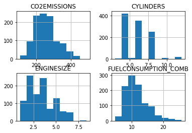


```python

```


```python

```


```python
ndata = df[["FUELCONSUMPTION_HWY",'FUELCONSUMPTION_COMB']]
ndata.head(8)
```


<div>
<style scoped>
    .dataframe tbody tr th:only-of-type {
        vertical-align: middle;
    }

    .dataframe tbody tr th {
        vertical-align: top;
    }

    .dataframe thead th {
        text-align: right;
    }
</style>
<table border="1" class="dataframe">
  <thead>
    <tr style="text-align: right;">
      <th></th>
      <th>FUELCONSUMPTION_HWY</th>
      <th>FUELCONSUMPTION_COMB</th>
    </tr>
  </thead>
  <tbody>
    <tr>
      <th>0</th>
      <td>6.7</td>
      <td>8.5</td>
    </tr>
    <tr>
      <th>1</th>
      <td>7.7</td>
      <td>9.6</td>
    </tr>
    <tr>
      <th>2</th>
      <td>5.8</td>
      <td>5.9</td>
    </tr>
    <tr>
      <th>3</th>
      <td>9.1</td>
      <td>11.1</td>
    </tr>
    <tr>
      <th>4</th>
      <td>8.7</td>
      <td>10.6</td>
    </tr>
    <tr>
      <th>5</th>
      <td>7.7</td>
      <td>10.0</td>
    </tr>
    <tr>
      <th>6</th>
      <td>8.1</td>
      <td>10.1</td>
    </tr>
    <tr>
      <th>7</th>
      <td>9.0</td>
      <td>11.1</td>
    </tr>
  </tbody>
</table>
</div>


```python
# let's see if there is a relationship between fuel consumption on highway and comb
ndata.plot.scatter(x="FUELCONSUMPTION_HWY",y="FUELCONSUMPTION_COMB" )
plt.show()
```


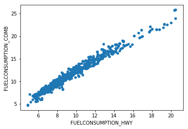


```python
plt.scatter(cdf.FUELCONSUMPTION_COMB, cdf.CO2EMISSIONS,  color='green')
plt.xlabel("FUELCONSUMPTION_COMB")
plt.ylabel("Emission")
plt.show()
```


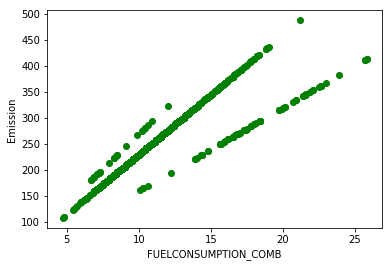


```python
# write your code here

plt.scatter(cdf.CYLINDERS, cdf.CO2EMISSIONS,  color='blue')
plt.xlabel("CYLINDERS")
plt.ylabel("Emission")
plt.show()

```


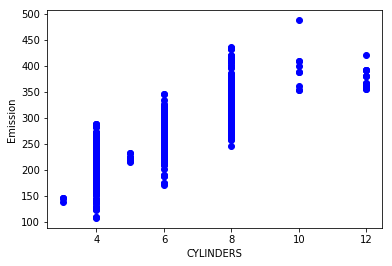


```python
dir(ndata)
```


    ['FUELCONSUMPTION_COMB',
     'FUELCONSUMPTION_HWY',
     'T',
     '_AXIS_ALIASES',
     '_AXIS_IALIASES',
     '_AXIS_LEN',
     '_AXIS_NAMES',
     '_AXIS_NUMBERS',
     '_AXIS_ORDERS',
     '_AXIS_REVERSED',
     '_AXIS_SLICEMAP',
     '__abs__',
     '__add__',
     '__and__',
     '__array__',
     '__array_wrap__',
     '__bool__',
     '__bytes__',
     '__class__',
     '__contains__',
     '__copy__',
     '__deepcopy__',
     '__delattr__',
     '__delitem__',
     '__dict__',
     '__dir__',
     '__div__',
     '__doc__',
     '__eq__',
     '__finalize__',
     '__floordiv__',
     '__format__',
     '__ge__',
     '__getattr__',
     '__getattribute__',
     '__getitem__',
     '__getstate__',
     '__gt__',
     '__hash__',
     '__iadd__',
     '__iand__',
     '__ifloordiv__',
     '__imod__',
     '__imul__',
     '__init__',
     '__init_subclass__',
     '__invert__',
     '__ior__',
     '__ipow__',
     '__isub__',
     '__iter__',
     '__itruediv__',
     '__ixor__',
     '__le__',
     '__len__',
     '__lt__',
     '__matmul__',
     '__mod__',
     '__module__',
     '__mul__',
     '__ne__',
     '__neg__',
     '__new__',
     '__nonzero__',
     '__or__',
     '__pos__',
     '__pow__',
     '__radd__',
     '__rand__',
     '__rdiv__',
     '__reduce__',
     '__reduce_ex__',
     '__repr__',
     '__rfloordiv__',
     '__rmatmul__',
     '__rmod__',
     '__rmul__',
     '__ror__',
     '__round__',
     '__rpow__',
     '__rsub__',
     '__rtruediv__',
     '__rxor__',
     '__setattr__',
     '__setitem__',
     '__setstate__',
     '__sizeof__',
     '__str__',
     '__sub__',
     '__subclasshook__',
     '__truediv__',
     '__unicode__',
     '__weakref__',
     '__xor__',
     '_accessors',
     '_add_numeric_operations',
     '_add_series_only_operations',
     '_add_series_or_dataframe_operations',
     '_agg_by_level',
     '_agg_doc',
     '_aggregate',
     '_aggregate_multiple_funcs',
     '_align_frame',
     '_align_series',
     '_box_col_values',
     '_box_item_values',
     '_builtin_table',
     '_check_inplace_setting',
     '_check_is_chained_assignment_possible',
     '_check_label_or_level_ambiguity',
     '_check_percentile',
     '_check_setitem_copy',
     '_clear_item_cache',
     '_clip_with_one_bound',
     '_clip_with_scalar',
     '_combine_const',
     '_combine_frame',
     '_combine_match_columns',
     '_combine_match_index',
     '_compare_frame',
     '_consolidate',
     '_consolidate_inplace',
     '_construct_axes_dict',
     '_construct_axes_dict_for_slice',
     '_construct_axes_dict_from',
     '_construct_axes_from_arguments',
     '_constructor',
     '_constructor_expanddim',
     '_constructor_sliced',
     '_convert',
     '_count_level',
     '_create_indexer',
     '_cython_table',
     '_deprecations',
     '_dir_additions',
     '_dir_deletions',
     '_drop_axis',
     '_drop_labels_or_levels',
     '_ensure_valid_index',
     '_expand_axes',
     '_find_valid_index',
     '_from_arrays',
     '_from_axes',
     '_get_agg_axis',
     '_get_axis',
     '_get_axis_name',
     '_get_axis_number',
     '_get_axis_resolvers',
     '_get_block_manager_axis',
     '_get_bool_data',
     '_get_cacher',
     '_get_index_resolvers',
     '_get_item_cache',
     '_get_label_or_level_values',
     '_get_numeric_data',
     '_get_value',
     '_get_values',
     '_getitem_array',
     '_getitem_column',
     '_getitem_frame',
     '_getitem_multilevel',
     '_getitem_slice',
     '_gotitem',
     '_iget_item_cache',
     '_indexed_same',
     '_info_axis',
     '_info_axis_name',
     '_info_axis_number',
     '_info_repr',
     '_init_dict',
     '_init_mgr',
     '_init_ndarray',
     '_internal_names',
     '_internal_names_set',
     '_is_builtin_func',
     '_is_cached',
     '_is_copy',
     '_is_cython_func',
     '_is_datelike_mixed_type',
     '_is_label_or_level_reference',
     '_is_label_reference',
     '_is_level_reference',
     '_is_mixed_type',
     '_is_numeric_mixed_type',
     '_is_view',
     '_ix',
     '_ixs',
     '_join_compat',
     '_maybe_cache_changed',
     '_maybe_update_cacher',
     '_metadata',
     '_needs_reindex_multi',
     '_obj_with_exclusions',
     '_protect_consolidate',
     '_reduce',
     '_reindex_axes',
     '_reindex_axis',
     '_reindex_columns',
     '_reindex_index',
     '_reindex_multi',
     '_reindex_with_indexers',
     '_repr_data_resource_',
     '_repr_fits_horizontal_',
     '_repr_fits_vertical_',
     '_repr_html_',
     '_repr_latex_',
     '_reset_cache',
     '_reset_cacher',
     '_sanitize_column',
     '_selected_obj',
     '_selection',
     '_selection_list',
     '_selection_name',
     '_series',
     '_set_as_cached',
     '_set_axis',
     '_set_axis_name',
     '_set_is_copy',
     '_set_item',
     '_set_value',
     '_setitem_array',
     '_setitem_frame',
     '_setitem_slice',
     '_setup_axes',
     '_shallow_copy',
     '_slice',
     '_stat_axis',
     '_stat_axis_name',
     '_stat_axis_number',
     '_take',
     '_to_dict_of_blocks',
     '_try_aggregate_string_function',
     '_typ',
     '_unpickle_frame_compat',
     '_unpickle_matrix_compat',
     '_update_inplace',
     '_validate_dtype',
     '_values',
     '_where',
     '_xs',
     'abs',
     'add',
     'add_prefix',
     'add_suffix',
     'agg',
     'aggregate',
     'align',
     'all',
     'any',
     'append',
     'apply',
     'applymap',
     'as_matrix',
     'asfreq',
     'asof',
     'assign',
     'astype',
     'at',
     'at_time',
     'axes',
     'between_time',
     'bfill',
     'bool',
     'boxplot',
     'clip',
     'clip_lower',
     'clip_upper',
     'columns',
     'combine',
     'combine_first',
     'compound',
     'copy',
     'corr',
     'corrwith',
     'count',
     'cov',
     'cummax',
     'cummin',
     'cumprod',
     'cumsum',
     'describe',
     'diff',
     'div',
     'divide',
     'dot',
     'drop',
     'drop_duplicates',
     'dropna',
     'dtypes',
     'duplicated',
     'empty',
     'eq',
     'equals',
     'eval',
     'ewm',
     'expanding',
     'ffill',
     'fillna',
     'filter',
     'first',
     'first_valid_index',
     'floordiv',
     'from_dict',
     'from_records',
     'ftypes',
     'ge',
     'get',
     'get_dtype_counts',
     'get_ftype_counts',
     'get_values',
     'groupby',
     'gt',
     'head',
     'hist',
     'iat',
     'idxmax',
     'idxmin',
     'iloc',
     'index',
     'infer_objects',
     'info',
     'insert',
     'interpolate',
     'isin',
     'isna',
     'isnull',
     'items',
     'iteritems',
     'iterrows',
     'itertuples',
     'ix',
     'join',
     'keys',
     'kurt',
     'kurtosis',
     'last',
     'last_valid_index',
     'le',
     'loc',
     'lookup',
     'lt',
     'mad',
     'mask',
     'max',
     'mean',
     'median',
     'melt',
     'memory_usage',
     'merge',
     'min',
     'mod',
     'mode',
     'mul',
     'multiply',
     'ndim',
     'ne',
     'nlargest',
     'notna',
     'notnull',
     'nsmallest',
     'nunique',
     'pct_change',
     'pipe',
     'pivot',
     'pivot_table',
     'plot',
     'pop',
     'pow',
     'prod',
     'product',
     'quantile',
     'query',
     'radd',
     'rank',
     'rdiv',
     'reindex',
     'reindex_axis',
     'reindex_like',
     'rename',
     'rename_axis',
     'reorder_levels',
     'replace',
     'resample',
     'reset_index',
     'rfloordiv',
     'rmod',
     'rmul',
     'rolling',
     'round',
     'rpow',
     'rsub',
     'rtruediv',
     'sample',
     'select',
     'select_dtypes',
     'sem',
     'set_axis',
     'set_index',
     'shape',
     'shift',
     'size',
     'skew',
     'slice_shift',
     'sort_index',
     'sort_values',
     'squeeze',
     'stack',
     'std',
     'style',
     'sub',
     'subtract',
     'sum',
     'swapaxes',
     'swaplevel',
     'tail',
     'take',
     'to_clipboard',
     'to_csv',
     'to_dense',
     'to_dict',
     'to_excel',
     'to_feather',
     'to_gbq',
     'to_hdf',
     'to_html',
     'to_json',
     'to_latex',
     'to_msgpack',
     'to_panel',
     'to_parquet',
     'to_period',
     'to_pickle',
     'to_records',
     'to_sparse',
     'to_sql',
     'to_stata',
     'to_string',
     'to_timestamp',
     'to_xarray',
     'transform',
     'transpose',
     'truediv',
     'truncate',
     'tshift',
     'tz_convert',
     'tz_localize',
     'unstack',
     'update',
     'values',
     'var',
     'where',
     'xs']


```python
msk = np.random.rand(len(df)) < 0.8  # creates random values between 0 and 1 and check which of them i sless than 0.8
train = cdf[msk]  
test = cdf[~msk]
```


```python
train.head()
```


<div>
<style scoped>
    .dataframe tbody tr th:only-of-type {
        vertical-align: middle;
    }

    .dataframe tbody tr th {
        vertical-align: top;
    }

    .dataframe thead th {
        text-align: right;
    }
</style>
<table border="1" class="dataframe">
  <thead>
    <tr style="text-align: right;">
      <th></th>
      <th>ENGINESIZE</th>
      <th>CYLINDERS</th>
      <th>FUELCONSUMPTION_COMB</th>
      <th>CO2EMISSIONS</th>
    </tr>
  </thead>
  <tbody>
    <tr>
      <th>5</th>
      <td>3.5</td>
      <td>6</td>
      <td>10.0</td>
      <td>230</td>
    </tr>
    <tr>
      <th>6</th>
      <td>3.5</td>
      <td>6</td>
      <td>10.1</td>
      <td>232</td>
    </tr>
    <tr>
      <th>8</th>
      <td>3.7</td>
      <td>6</td>
      <td>11.6</td>
      <td>267</td>
    </tr>
    <tr>
      <th>10</th>
      <td>2.4</td>
      <td>4</td>
      <td>9.8</td>
      <td>225</td>
    </tr>
    <tr>
      <th>12</th>
      <td>5.9</td>
      <td>12</td>
      <td>15.6</td>
      <td>359</td>
    </tr>
  </tbody>
</table>
</div>


```python
test.head()
```


<div>
<style scoped>
    .dataframe tbody tr th:only-of-type {
        vertical-align: middle;
    }

    .dataframe tbody tr th {
        vertical-align: top;
    }

    .dataframe thead th {
        text-align: right;
    }
</style>
<table border="1" class="dataframe">
  <thead>
    <tr style="text-align: right;">
      <th></th>
      <th>ENGINESIZE</th>
      <th>CYLINDERS</th>
      <th>FUELCONSUMPTION_COMB</th>
      <th>CO2EMISSIONS</th>
    </tr>
  </thead>
  <tbody>
    <tr>
      <th>0</th>
      <td>2.0</td>
      <td>4</td>
      <td>8.5</td>
      <td>196</td>
    </tr>
    <tr>
      <th>1</th>
      <td>2.4</td>
      <td>4</td>
      <td>9.6</td>
      <td>221</td>
    </tr>
    <tr>
      <th>2</th>
      <td>1.5</td>
      <td>4</td>
      <td>5.9</td>
      <td>136</td>
    </tr>
    <tr>
      <th>3</th>
      <td>3.5</td>
      <td>6</td>
      <td>11.1</td>
      <td>255</td>
    </tr>
    <tr>
      <th>4</th>
      <td>3.5</td>
      <td>6</td>
      <td>10.6</td>
      <td>244</td>
    </tr>
  </tbody>
</table>
</div>


```python
# plot the train data set
plt.scatter(train.ENGINESIZE, train.CO2EMISSIONS,  color='blue')
plt.xlabel("Engine size")
plt.ylabel("Emission")
plt.show()
```


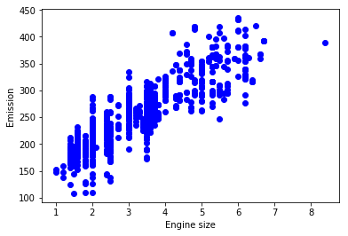


```python

```


```python
# use enginesize to predict co2 emission
from sklearn import linear_model
regr = linear_model.LinearRegression()
train_x = np.asanyarray(train[['ENGINESIZE']])
train_y = np.asanyarray(train[['CO2EMISSIONS']])
regr.fit (train_x, train_y)
# The coefficients
print ('Coefficients: ', regr.coef_)
print ('Intercept: ',regr.intercept_)
```

    Coefficients:  [[ 39.21765383]]
    Intercept:  [ 126.14030878]


```python
plt.scatter(train.ENGINESIZE, train.CO2EMISSIONS,  color='blue')
plt.plot(train_x, regr.coef_[0][0]*train_x + regr.intercept_[0], '-r')
plt.xlabel("Engine size")
plt.ylabel("Emission")
```


    Text(0,0.5,'Emission')


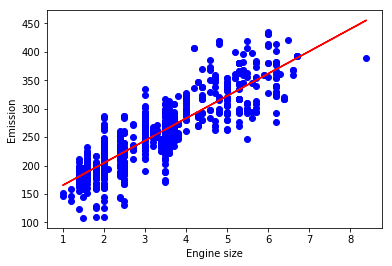


```python

```


```python
# use enginesize to fuel consumption

train_x = np.asanyarray(train[['ENGINESIZE']])
train_y = np.asanyarray(train[['FUELCONSUMPTION_COMB']])
regr.fit (train_x, train_y)
# The coefficients
print ('Coefficients: ', regr.coef_)
print ('Intercept: ',regr.intercept_)
```

    Coefficients:  [[ 2.03043163]]
    Intercept:  [ 4.82472659]


```python
plt.scatter(train.ENGINESIZE, train.FUELCONSUMPTION_COMB,  color='blue')
plt.plot(train_x, regr.coef_[0][0]*train_x + regr.intercept_[0], '-r')
plt.xlabel("Engine size")
plt.ylabel("FUELCONSUMPTION_COMB")
```


    Text(0,0.5,'FUELCONSUMPTION_COMB')


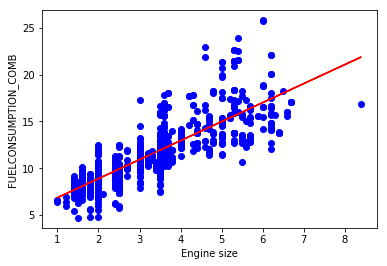


```python
# use number of cylinder to predict fuel consumption

from sklearn import linear_model
regA = linear_model.LinearRegression()
train_x = np.asanyarray(train[['CYLINDERS']])
train_y = np.asanyarray(train[['FUELCONSUMPTION_COMB']])

regA.fit (train_x, train_y)
# The coefficients
print ('Coefficients: ', regA.coef_)
print ('Intercept: ',regA.intercept_)
```

    Coefficients:  [[ 1.50065231]]
    Intercept:  [ 2.90459941]


```python

```


```python
plt.scatter(train.CYLINDERS, train.FUELCONSUMPTION_COMB,  color='blue')
plt.plot(train_x, regA.coef_[0][0]*train_x + regA.intercept_[0], '-r')
plt.xlabel("CYLINDERS")
plt.ylabel("FUELCONSUMPTION_COMB")
```


    Text(0,0.5,'FUELCONSUMPTION_COMB')


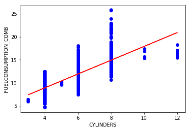


```python
# let us check the relationship between 'enginesize' and 'cylinders'
plt.scatter(train.ENGINESIZE, train.CYLINDERS,  color='blue')
plt.xlabel("Engine size")
plt.ylabel("Cylinders")
plt.show()  
```


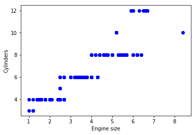


# Nonlinear regression


```python
x = np.linspace(-5.0, 5.0, 100)
## linear function
y = 4*(x) + 0.5
y_noise = 4 * np.random.normal(size=x.size)
ydata = y + y_noise
#plt.figure(figsize=(8,6))
plt.plot(x, ydata,  'bo')
plt.plot(x,y, 'r') 
plt.ylabel('Dependent Variable')
plt.xlabel('Indepdendent Variable')
plt.show()
```


```python
## quadratic function
y = 0.5 + 2*x + 4*x**2 
ydata = y + y_noise

plt.plot(x, ydata,  'bo')
plt.plot(x,y, 'r') 
plt.ylabel('Dependent Variable')
plt.xlabel('Indepdendent Variable')
plt.show()
```


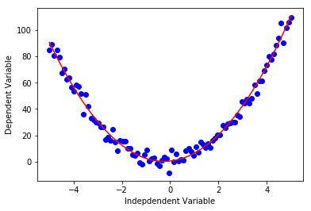


```python
## cubic function
y = 5 + 2*x + 4*x**2 + 3*x**3
y_noise = 19 * np.random.normal(size=x.size)
ydata = y + y_noise

plt.plot(x, ydata,  'bo')
plt.plot(x,y, 'r') 
plt.ylabel('Dependent Variable')
plt.xlabel('Indepdendent Variable')
plt.show()
```


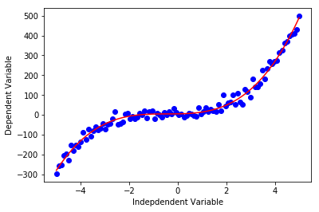


```python
## exponential function
y = 5 + 2*3**x
y_noise = 19 * np.random.normal(size=x.size)
ydata = y + y_noise
#plt.figure(figsize=(8,6))
plt.plot(x, ydata,  'bo')
plt.plot(x,y, 'r') 
plt.ylabel('Dependent Variable')
plt.xlabel('Indepdendent Variable')
plt.show()
```


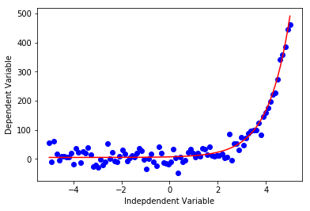


```python
## exponential function
y = 5 + np.log(x)
y_noise = np.random.normal(size=x.size)
ydata = y + y_noise
plt.plot(x, ydata,  'bo')
plt.plot(x,y, 'r') 
plt.ylabel('Dependent Variable')
plt.xlabel('Indepdendent Variable')
plt.show()
```

    /opt/conda/lib/python3.6/site-packages/ipykernel_launcher.py:2: RuntimeWarning: invalid value encountered in log
      


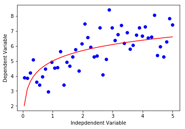


```python
# sigmoidal/logistic function
y = 5 + 4/(1 + 7**(x-3))
y_noise = np.random.normal(size=x.size)
ydata = y + y_noise
plt.plot(x, ydata,  'bo')
plt.plot(x,y, 'r') 
plt.ylabel('Dependent Variable')
plt.xlabel('Indepdendent Variable')
plt.show()
```


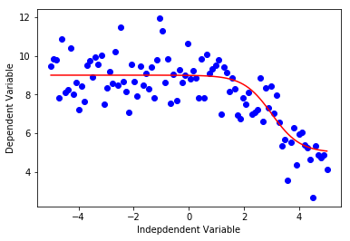


Now, let us look at how to fit a nonlinear regression to data


```python

#downloading dataset
!wget -nv -O china_gdp.csv https://s3-api.us-geo.objectstorage.softlayer.net/cf-courses-data/CognitiveClass/ML0101ENv3/labs/china_gdp.csv
    
df = pd.read_csv("china_gdp.csv")
df.head(10)
```

    2018-12-10 23:32:09 URL:https://s3-api.us-geo.objectstorage.softlayer.net/cf-courses-data/CognitiveClass/ML0101ENv3/labs/china_gdp.csv [1218/1218] -> "china_gdp.csv" [1]


<div>
<style scoped>
    .dataframe tbody tr th:only-of-type {
        vertical-align: middle;
    }

    .dataframe tbody tr th {
        vertical-align: top;
    }

    .dataframe thead th {
        text-align: right;
    }
</style>
<table border="1" class="dataframe">
  <thead>
    <tr style="text-align: right;">
      <th></th>
      <th>Year</th>
      <th>Value</th>
    </tr>
  </thead>
  <tbody>
    <tr>
      <th>0</th>
      <td>1960</td>
      <td>5.918412e+10</td>
    </tr>
    <tr>
      <th>1</th>
      <td>1961</td>
      <td>4.955705e+10</td>
    </tr>
    <tr>
      <th>2</th>
      <td>1962</td>
      <td>4.668518e+10</td>
    </tr>
    <tr>
      <th>3</th>
      <td>1963</td>
      <td>5.009730e+10</td>
    </tr>
    <tr>
      <th>4</th>
      <td>1964</td>
      <td>5.906225e+10</td>
    </tr>
    <tr>
      <th>5</th>
      <td>1965</td>
      <td>6.970915e+10</td>
    </tr>
    <tr>
      <th>6</th>
      <td>1966</td>
      <td>7.587943e+10</td>
    </tr>
    <tr>
      <th>7</th>
      <td>1967</td>
      <td>7.205703e+10</td>
    </tr>
    <tr>
      <th>8</th>
      <td>1968</td>
      <td>6.999350e+10</td>
    </tr>
    <tr>
      <th>9</th>
      <td>1969</td>
      <td>7.871882e+10</td>
    </tr>
  </tbody>
</table>
</div>


```python
# let us plot the  data set
plt.plot(df.Year,df.Value,'r*')
plt.ylabel('GDP per capital')
plt.xlabel('Year')
plt.show()
```


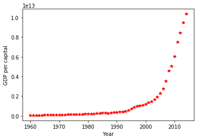


```python
# this can also be done as follows
plt.plot(df["Year"], df["Value"],'r*')
plt.ylabel('GDP per capital')
plt.xlabel('Year')
plt.show()
```


```python
# this can also be done as follows
plt.plot(df["Year"].values, df["Value"].values,'b*')
plt.ylabel('GDP per capital')
plt.xlabel('Year')
plt.show()
```


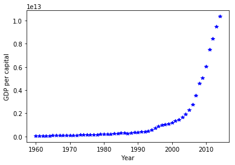


```python

```


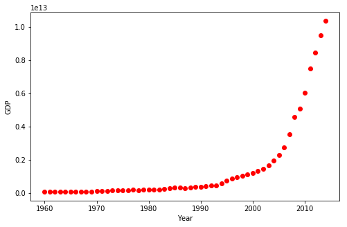


```python
X = np.arange(-5.0, 5.0, 0.1)
Y = 1.0 / (1.0 + np.exp(-X))

plt.plot(X,Y) 
plt.ylabel('Dependent Variable')
plt.xlabel('Indepdendent Variable')
plt.show()
```


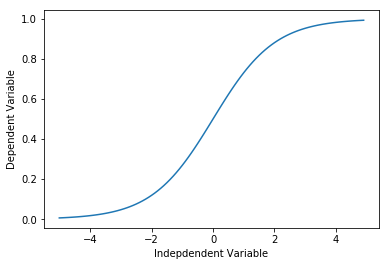


```python

```

Let us construct the following model:

$$ \hat{Y} = \frac1{1+e^{\beta_1(X-\beta_2)}}$$

$\beta_1$: Controls the curve's steepness,

$\beta_2$: Slides the curve on the x-axis.


```python
def sigmoid(x, Beta_1, Beta_2):
     y = 1 / (1 + np.exp(-Beta_1*(x-Beta_2)))
     return y
```


```python
# initial parameter
beta_1 = 0.10
beta_2 = 1990.0

# calling the logistic function
Y_pred = sigmoid(x_data, beta_1 , beta_2)

plt.figure(1)
plt.plot(x_data, Y_pred*15000000000000.) # plot prediction
plt.plot(x_data, y_data, 'ro') # plot data
plt.show()
```


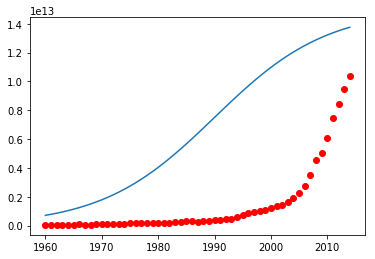


```python
# normalizing the data to have values between 0 and 1
xdata =x_data/max(x_data)
ydata =y_data/max(y_data)
```


```python
from scipy.optimize import curve_fit
popt, pcov = curve_fit(sigmoid, xdata, ydata)
#print the final parameters
print(" beta_1 = %f, beta_2 = %f" % (popt[0], popt[1]))
```

     beta_1 = 690.453017, beta_2 = 0.997207


```python
pcov
```


    array([[  1.52273887e+03,  -2.88115957e-04],
           [ -2.88115957e-04,   7.25956452e-09]])


```python
x = np.linspace(1960, 2015, 55)
x = x/max(x)
plt.figure(figsize=(8,5))
y = sigmoid(x, *popt)
plt.plot(xdata, ydata, 'ro', label='data')
plt.plot(x,y, linewidth=3.0, label='fit')
plt.legend(loc='best')
plt.ylabel('GDP')
plt.xlabel('Year')
plt.show()
```


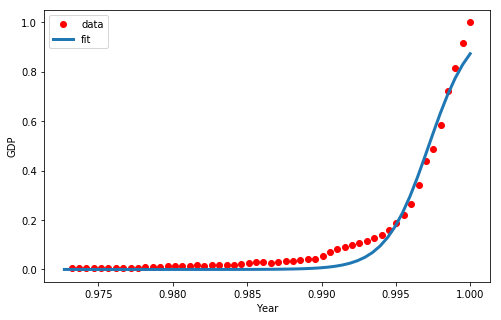


```python
# computing the mean squared error
err = (sum(y - ydata)**2)/len(y)
err

```


    0.029736670161677376


# exponential model

$$ \hat{Y} = \alpha_0 + \alpha_1*\alpha_2^x  $$

$\alpha_0, \alpha_1, \alpha_3$ are parameters of the model


```python
def Exponential(x, alpha_0, alpha_1, alpha_2):
     y = alpha_0 + alpha_1*alpha_2**x
     return y

x_data = np.linspace(1,10,100)

#initial parameter
alpha_0 = 0.90
alpha_1 = 0.4
alpha_2 = 0.5

# calling the logistic function
Y_pred = Exponential(x_data, alpha_0, alpha_1, alpha_2)
y_data = Y_pred + 0.2*np.random.normal(size=len(x_data))

plt.figure(1)
plt.plot(x_data, Y_pred) # plot prediction
plt.plot(x_data, y_data, 'ro') # plot data
plt.show()
```


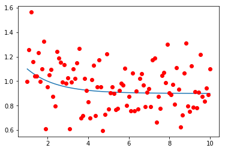


```python
# normalizing the data to have values between 0 and 1
xdata =x_data/max(x_data)
ydata =y_data/max(y_data)
```


```python
from scipy.optimize import curve_fit
popt, pcov = curve_fit(Exponential, xdata, ydata)
#print the final parameters
print(" alpha_0 = %f, alpha_1 = %f, alpha_2 = %f" % (popt[0], popt[1],popt[2]))
```

     alpha_0 = 0.590377, alpha_1 = 0.497928, alpha_2 = 0.000093


    /opt/conda/lib/python3.6/site-packages/ipykernel_launcher.py:2: RuntimeWarning: invalid value encountered in power
      


```python
plt.figure(figsize=(7,7))
y = Exponential(xdata, *popt)
plt.plot(xdata, ydata, 'ro', label='data')
plt.plot(xdata,y, linewidth=3.0, label='fit')
plt.legend(loc='best')
plt.ylabel('x')
plt.xlabel('Y')
plt.show()
```


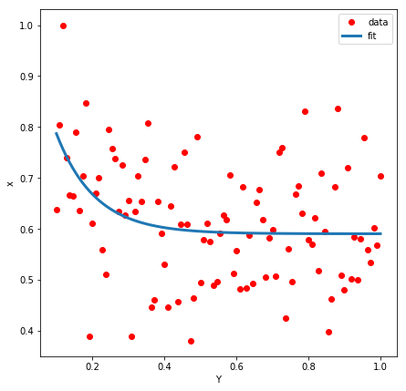


```python
# write your code here
err = (sum(y - ydata)**2)/len(y)
err

```


    3.6951322125621422e-13


```python

```


```python

```
