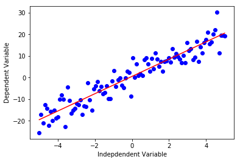

```python
# loading the necessary library for this exercise

import matplotlib.pyplot as plt
import pandas as pd
import pylab as pl
import numpy as np
%matplotlib inline
```


```python
!wget -O FuelConsumption.csv https://s3-api.us-geo.objectstorage.softlayer.net/cf-courses-data/CognitiveClass/ML0101ENv3/labs/FuelConsumptionCo2.csv
```

    --2018-12-10 19:29:22--  https://s3-api.us-geo.objectstorage.softlayer.net/cf-courses-data/CognitiveClass/ML0101ENv3/labs/FuelConsumptionCo2.csv
    Resolving s3-api.us-geo.objectstorage.softlayer.net (s3-api.us-geo.objectstorage.softlayer.net)... 67.228.254.193
    Connecting to s3-api.us-geo.objectstorage.softlayer.net (s3-api.us-geo.objectstorage.softlayer.net)|67.228.254.193|:443... connected.
    HTTP request sent, awaiting response... 200 OK
    Length: 72629 (71K) [text/csv]
    Saving to: ‘FuelConsumption.csv’
    
    FuelConsumption.csv 100%[===================>]  70.93K  --.-KB/s    in 0.04s   
    
    2018-12-10 19:29:22 (1.58 MB/s) - ‘FuelConsumption.csv’ saved [72629/72629]
    


```python
DataFile = open('FuelConsumption.csv','r')
```


```python
Data = DataFile.read()
```


```python
type(Data)
```


    str


```python
#with open('FuelConsumption.csv','r') as RawData:
 #   for line in RawData:
        #print(line)
    
#RawData.closed
```


```python
df = pd.read_csv("FuelConsumption.csv")  # loads the data set using pandas
df.head()
```


<div>
<style scoped>
    .dataframe tbody tr th:only-of-type {
        vertical-align: middle;
    }

    .dataframe tbody tr th {
        vertical-align: top;
    }

    .dataframe thead th {
        text-align: right;
    }
</style>
<table border="1" class="dataframe">
  <thead>
    <tr style="text-align: right;">
      <th></th>
      <th>MODELYEAR</th>
      <th>MAKE</th>
      <th>MODEL</th>
      <th>VEHICLECLASS</th>
      <th>ENGINESIZE</th>
      <th>CYLINDERS</th>
      <th>TRANSMISSION</th>
      <th>FUELTYPE</th>
      <th>FUELCONSUMPTION_CITY</th>
      <th>FUELCONSUMPTION_HWY</th>
      <th>FUELCONSUMPTION_COMB</th>
      <th>FUELCONSUMPTION_COMB_MPG</th>
      <th>CO2EMISSIONS</th>
    </tr>
  </thead>
  <tbody>
    <tr>
      <th>0</th>
      <td>2014</td>
      <td>ACURA</td>
      <td>ILX</td>
      <td>COMPACT</td>
      <td>2.0</td>
      <td>4</td>
      <td>AS5</td>
      <td>Z</td>
      <td>9.9</td>
      <td>6.7</td>
      <td>8.5</td>
      <td>33</td>
      <td>196</td>
    </tr>
    <tr>
      <th>1</th>
      <td>2014</td>
      <td>ACURA</td>
      <td>ILX</td>
      <td>COMPACT</td>
      <td>2.4</td>
      <td>4</td>
      <td>M6</td>
      <td>Z</td>
      <td>11.2</td>
      <td>7.7</td>
      <td>9.6</td>
      <td>29</td>
      <td>221</td>
    </tr>
    <tr>
      <th>2</th>
      <td>2014</td>
      <td>ACURA</td>
      <td>ILX HYBRID</td>
      <td>COMPACT</td>
      <td>1.5</td>
      <td>4</td>
      <td>AV7</td>
      <td>Z</td>
      <td>6.0</td>
      <td>5.8</td>
      <td>5.9</td>
      <td>48</td>
      <td>136</td>
    </tr>
    <tr>
      <th>3</th>
      <td>2014</td>
      <td>ACURA</td>
      <td>MDX 4WD</td>
      <td>SUV - SMALL</td>
      <td>3.5</td>
      <td>6</td>
      <td>AS6</td>
      <td>Z</td>
      <td>12.7</td>
      <td>9.1</td>
      <td>11.1</td>
      <td>25</td>
      <td>255</td>
    </tr>
    <tr>
      <th>4</th>
      <td>2014</td>
      <td>ACURA</td>
      <td>RDX AWD</td>
      <td>SUV - SMALL</td>
      <td>3.5</td>
      <td>6</td>
      <td>AS6</td>
      <td>Z</td>
      <td>12.1</td>
      <td>8.7</td>
      <td>10.6</td>
      <td>27</td>
      <td>244</td>
    </tr>
  </tbody>
</table>
</div>


```python
df.describe() # similar to "summarize()" in R. It gives the summary of each column
```


<div>
<style scoped>
    .dataframe tbody tr th:only-of-type {
        vertical-align: middle;
    }

    .dataframe tbody tr th {
        vertical-align: top;
    }

    .dataframe thead th {
        text-align: right;
    }
</style>
<table border="1" class="dataframe">
  <thead>
    <tr style="text-align: right;">
      <th></th>
      <th>MODELYEAR</th>
      <th>ENGINESIZE</th>
      <th>CYLINDERS</th>
      <th>FUELCONSUMPTION_CITY</th>
      <th>FUELCONSUMPTION_HWY</th>
      <th>FUELCONSUMPTION_COMB</th>
      <th>FUELCONSUMPTION_COMB_MPG</th>
      <th>CO2EMISSIONS</th>
    </tr>
  </thead>
  <tbody>
    <tr>
      <th>count</th>
      <td>1067.0</td>
      <td>1067.000000</td>
      <td>1067.000000</td>
      <td>1067.000000</td>
      <td>1067.000000</td>
      <td>1067.000000</td>
      <td>1067.000000</td>
      <td>1067.000000</td>
    </tr>
    <tr>
      <th>mean</th>
      <td>2014.0</td>
      <td>3.346298</td>
      <td>5.794752</td>
      <td>13.296532</td>
      <td>9.474602</td>
      <td>11.580881</td>
      <td>26.441425</td>
      <td>256.228679</td>
    </tr>
    <tr>
      <th>std</th>
      <td>0.0</td>
      <td>1.415895</td>
      <td>1.797447</td>
      <td>4.101253</td>
      <td>2.794510</td>
      <td>3.485595</td>
      <td>7.468702</td>
      <td>63.372304</td>
    </tr>
    <tr>
      <th>min</th>
      <td>2014.0</td>
      <td>1.000000</td>
      <td>3.000000</td>
      <td>4.600000</td>
      <td>4.900000</td>
      <td>4.700000</td>
      <td>11.000000</td>
      <td>108.000000</td>
    </tr>
    <tr>
      <th>25%</th>
      <td>2014.0</td>
      <td>2.000000</td>
      <td>4.000000</td>
      <td>10.250000</td>
      <td>7.500000</td>
      <td>9.000000</td>
      <td>21.000000</td>
      <td>207.000000</td>
    </tr>
    <tr>
      <th>50%</th>
      <td>2014.0</td>
      <td>3.400000</td>
      <td>6.000000</td>
      <td>12.600000</td>
      <td>8.800000</td>
      <td>10.900000</td>
      <td>26.000000</td>
      <td>251.000000</td>
    </tr>
    <tr>
      <th>75%</th>
      <td>2014.0</td>
      <td>4.300000</td>
      <td>8.000000</td>
      <td>15.550000</td>
      <td>10.850000</td>
      <td>13.350000</td>
      <td>31.000000</td>
      <td>294.000000</td>
    </tr>
    <tr>
      <th>max</th>
      <td>2014.0</td>
      <td>8.400000</td>
      <td>12.000000</td>
      <td>30.200000</td>
      <td>20.500000</td>
      <td>25.800000</td>
      <td>60.000000</td>
      <td>488.000000</td>
    </tr>
  </tbody>
</table>
</div>


```python
df.ndim # dimension of the dataframe
df.size # number of rows or observations
```


    13871


```python
# create a subset of the data to be used for further analysis

cdf = df[['ENGINESIZE','CYLINDERS','FUELCONSUMPTION_COMB','CO2EMISSIONS']]
cdf.head(9)  # displays first 9 observations
```


<div>
<style scoped>
    .dataframe tbody tr th:only-of-type {
        vertical-align: middle;
    }

    .dataframe tbody tr th {
        vertical-align: top;
    }

    .dataframe thead th {
        text-align: right;
    }
</style>
<table border="1" class="dataframe">
  <thead>
    <tr style="text-align: right;">
      <th></th>
      <th>ENGINESIZE</th>
      <th>CYLINDERS</th>
      <th>FUELCONSUMPTION_COMB</th>
      <th>CO2EMISSIONS</th>
    </tr>
  </thead>
  <tbody>
    <tr>
      <th>0</th>
      <td>2.0</td>
      <td>4</td>
      <td>8.5</td>
      <td>196</td>
    </tr>
    <tr>
      <th>1</th>
      <td>2.4</td>
      <td>4</td>
      <td>9.6</td>
      <td>221</td>
    </tr>
    <tr>
      <th>2</th>
      <td>1.5</td>
      <td>4</td>
      <td>5.9</td>
      <td>136</td>
    </tr>
    <tr>
      <th>3</th>
      <td>3.5</td>
      <td>6</td>
      <td>11.1</td>
      <td>255</td>
    </tr>
    <tr>
      <th>4</th>
      <td>3.5</td>
      <td>6</td>
      <td>10.6</td>
      <td>244</td>
    </tr>
    <tr>
      <th>5</th>
      <td>3.5</td>
      <td>6</td>
      <td>10.0</td>
      <td>230</td>
    </tr>
    <tr>
      <th>6</th>
      <td>3.5</td>
      <td>6</td>
      <td>10.1</td>
      <td>232</td>
    </tr>
    <tr>
      <th>7</th>
      <td>3.7</td>
      <td>6</td>
      <td>11.1</td>
      <td>255</td>
    </tr>
    <tr>
      <th>8</th>
      <td>3.7</td>
      <td>6</td>
      <td>11.6</td>
      <td>267</td>
    </tr>
  </tbody>
</table>
</div>


```python
viz = cdf[['CYLINDERS','ENGINESIZE','CO2EMISSIONS','FUELCONSUMPTION_COMB']]
viz.hist()
plt.show()
```


```python

```


```python

```


```python
ndata = df[["FUELCONSUMPTION_HWY",'FUELCONSUMPTION_COMB']]
ndata.head(8)
```


<div>
<style scoped>
    .dataframe tbody tr th:only-of-type {
        vertical-align: middle;
    }

    .dataframe tbody tr th {
        vertical-align: top;
    }

    .dataframe thead th {
        text-align: right;
    }
</style>
<table border="1" class="dataframe">
  <thead>
    <tr style="text-align: right;">
      <th></th>
      <th>FUELCONSUMPTION_HWY</th>
      <th>FUELCONSUMPTION_COMB</th>
    </tr>
  </thead>
  <tbody>
    <tr>
      <th>0</th>
      <td>6.7</td>
      <td>8.5</td>
    </tr>
    <tr>
      <th>1</th>
      <td>7.7</td>
      <td>9.6</td>
    </tr>
    <tr>
      <th>2</th>
      <td>5.8</td>
      <td>5.9</td>
    </tr>
    <tr>
      <th>3</th>
      <td>9.1</td>
      <td>11.1</td>
    </tr>
    <tr>
      <th>4</th>
      <td>8.7</td>
      <td>10.6</td>
    </tr>
    <tr>
      <th>5</th>
      <td>7.7</td>
      <td>10.0</td>
    </tr>
    <tr>
      <th>6</th>
      <td>8.1</td>
      <td>10.1</td>
    </tr>
    <tr>
      <th>7</th>
      <td>9.0</td>
      <td>11.1</td>
    </tr>
  </tbody>
</table>
</div>


```python
# let's see if there is a relationship between fuel consumption on highway and comb
ndata.plot.scatter(x="FUELCONSUMPTION_HWY",y="FUELCONSUMPTION_COMB" )
plt.show()
```


```python
plt.scatter(cdf.FUELCONSUMPTION_COMB, cdf.CO2EMISSIONS,  color='green')
plt.xlabel("FUELCONSUMPTION_COMB")
plt.ylabel("Emission")
plt.show()
```


```python
# write your code here

plt.scatter(cdf.CYLINDERS, cdf.CO2EMISSIONS,  color='blue')
plt.xlabel("CYLINDERS")
plt.ylabel("Emission")
plt.show()

```


```python
dir(ndata)
```


    ['FUELCONSUMPTION_COMB',
     'FUELCONSUMPTION_HWY',
     'T',
     '_AXIS_ALIASES',
     '_AXIS_IALIASES',
     '_AXIS_LEN',
     '_AXIS_NAMES',
     '_AXIS_NUMBERS',
     '_AXIS_ORDERS',
     '_AXIS_REVERSED',
     '_AXIS_SLICEMAP',
     '__abs__',
     '__add__',
     '__and__',
     '__array__',
     '__array_wrap__',
     '__bool__',
     '__bytes__',
     '__class__',
     '__contains__',
     '__copy__',
     '__deepcopy__',
     '__delattr__',
     '__delitem__',
     '__dict__',
     '__dir__',
     '__div__',
     '__doc__',
     '__eq__',
     '__finalize__',
     '__floordiv__',
     '__format__',
     '__ge__',
     '__getattr__',
     '__getattribute__',
     '__getitem__',
     '__getstate__',
     '__gt__',
     '__hash__',
     '__iadd__',
     '__iand__',
     '__ifloordiv__',
     '__imod__',
     '__imul__',
     '__init__',
     '__init_subclass__',
     '__invert__',
     '__ior__',
     '__ipow__',
     '__isub__',
     '__iter__',
     '__itruediv__',
     '__ixor__',
     '__le__',
     '__len__',
     '__lt__',
     '__matmul__',
     '__mod__',
     '__module__',
     '__mul__',
     '__ne__',
     '__neg__',
     '__new__',
     '__nonzero__',
     '__or__',
     '__pos__',
     '__pow__',
     '__radd__',
     '__rand__',
     '__rdiv__',
     '__reduce__',
     '__reduce_ex__',
     '__repr__',
     '__rfloordiv__',
     '__rmatmul__',
     '__rmod__',
     '__rmul__',
     '__ror__',
     '__round__',
     '__rpow__',
     '__rsub__',
     '__rtruediv__',
     '__rxor__',
     '__setattr__',
     '__setitem__',
     '__setstate__',
     '__sizeof__',
     '__str__',
     '__sub__',
     '__subclasshook__',
     '__truediv__',
     '__unicode__',
     '__weakref__',
     '__xor__',
     '_accessors',
     '_add_numeric_operations',
     '_add_series_only_operations',
     '_add_series_or_dataframe_operations',
     '_agg_by_level',
     '_agg_doc',
     '_aggregate',
     '_aggregate_multiple_funcs',
     '_align_frame',
     '_align_series',
     '_box_col_values',
     '_box_item_values',
     '_builtin_table',
     '_check_inplace_setting',
     '_check_is_chained_assignment_possible',
     '_check_label_or_level_ambiguity',
     '_check_percentile',
     '_check_setitem_copy',
     '_clear_item_cache',
     '_clip_with_one_bound',
     '_clip_with_scalar',
     '_combine_const',
     '_combine_frame',
     '_combine_match_columns',
     '_combine_match_index',
     '_compare_frame',
     '_consolidate',
     '_consolidate_inplace',
     '_construct_axes_dict',
     '_construct_axes_dict_for_slice',
     '_construct_axes_dict_from',
     '_construct_axes_from_arguments',
     '_constructor',
     '_constructor_expanddim',
     '_constructor_sliced',
     '_convert',
     '_count_level',
     '_create_indexer',
     '_cython_table',
     '_deprecations',
     '_dir_additions',
     '_dir_deletions',
     '_drop_axis',
     '_drop_labels_or_levels',
     '_ensure_valid_index',
     '_expand_axes',
     '_find_valid_index',
     '_from_arrays',
     '_from_axes',
     '_get_agg_axis',
     '_get_axis',
     '_get_axis_name',
     '_get_axis_number',
     '_get_axis_resolvers',
     '_get_block_manager_axis',
     '_get_bool_data',
     '_get_cacher',
     '_get_index_resolvers',
     '_get_item_cache',
     '_get_label_or_level_values',
     '_get_numeric_data',
     '_get_value',
     '_get_values',
     '_getitem_array',
     '_getitem_column',
     '_getitem_frame',
     '_getitem_multilevel',
     '_getitem_slice',
     '_gotitem',
     '_iget_item_cache',
     '_indexed_same',
     '_info_axis',
     '_info_axis_name',
     '_info_axis_number',
     '_info_repr',
     '_init_dict',
     '_init_mgr',
     '_init_ndarray',
     '_internal_names',
     '_internal_names_set',
     '_is_builtin_func',
     '_is_cached',
     '_is_copy',
     '_is_cython_func',
     '_is_datelike_mixed_type',
     '_is_label_or_level_reference',
     '_is_label_reference',
     '_is_level_reference',
     '_is_mixed_type',
     '_is_numeric_mixed_type',
     '_is_view',
     '_ix',
     '_ixs',
     '_join_compat',
     '_maybe_cache_changed',
     '_maybe_update_cacher',
     '_metadata',
     '_needs_reindex_multi',
     '_obj_with_exclusions',
     '_protect_consolidate',
     '_reduce',
     '_reindex_axes',
     '_reindex_axis',
     '_reindex_columns',
     '_reindex_index',
     '_reindex_multi',
     '_reindex_with_indexers',
     '_repr_data_resource_',
     '_repr_fits_horizontal_',
     '_repr_fits_vertical_',
     '_repr_html_',
     '_repr_latex_',
     '_reset_cache',
     '_reset_cacher',
     '_sanitize_column',
     '_selected_obj',
     '_selection',
     '_selection_list',
     '_selection_name',
     '_series',
     '_set_as_cached',
     '_set_axis',
     '_set_axis_name',
     '_set_is_copy',
     '_set_item',
     '_set_value',
     '_setitem_array',
     '_setitem_frame',
     '_setitem_slice',
     '_setup_axes',
     '_shallow_copy',
     '_slice',
     '_stat_axis',
     '_stat_axis_name',
     '_stat_axis_number',
     '_take',
     '_to_dict_of_blocks',
     '_try_aggregate_string_function',
     '_typ',
     '_unpickle_frame_compat',
     '_unpickle_matrix_compat',
     '_update_inplace',
     '_validate_dtype',
     '_values',
     '_where',
     '_xs',
     'abs',
     'add',
     'add_prefix',
     'add_suffix',
     'agg',
     'aggregate',
     'align',
     'all',
     'any',
     'append',
     'apply',
     'applymap',
     'as_matrix',
     'asfreq',
     'asof',
     'assign',
     'astype',
     'at',
     'at_time',
     'axes',
     'between_time',
     'bfill',
     'bool',
     'boxplot',
     'clip',
     'clip_lower',
     'clip_upper',
     'columns',
     'combine',
     'combine_first',
     'compound',
     'copy',
     'corr',
     'corrwith',
     'count',
     'cov',
     'cummax',
     'cummin',
     'cumprod',
     'cumsum',
     'describe',
     'diff',
     'div',
     'divide',
     'dot',
     'drop',
     'drop_duplicates',
     'dropna',
     'dtypes',
     'duplicated',
     'empty',
     'eq',
     'equals',
     'eval',
     'ewm',
     'expanding',
     'ffill',
     'fillna',
     'filter',
     'first',
     'first_valid_index',
     'floordiv',
     'from_dict',
     'from_records',
     'ftypes',
     'ge',
     'get',
     'get_dtype_counts',
     'get_ftype_counts',
     'get_values',
     'groupby',
     'gt',
     'head',
     'hist',
     'iat',
     'idxmax',
     'idxmin',
     'iloc',
     'index',
     'infer_objects',
     'info',
     'insert',
     'interpolate',
     'isin',
     'isna',
     'isnull',
     'items',
     'iteritems',
     'iterrows',
     'itertuples',
     'ix',
     'join',
     'keys',
     'kurt',
     'kurtosis',
     'last',
     'last_valid_index',
     'le',
     'loc',
     'lookup',
     'lt',
     'mad',
     'mask',
     'max',
     'mean',
     'median',
     'melt',
     'memory_usage',
     'merge',
     'min',
     'mod',
     'mode',
     'mul',
     'multiply',
     'ndim',
     'ne',
     'nlargest',
     'notna',
     'notnull',
     'nsmallest',
     'nunique',
     'pct_change',
     'pipe',
     'pivot',
     'pivot_table',
     'plot',
     'pop',
     'pow',
     'prod',
     'product',
     'quantile',
     'query',
     'radd',
     'rank',
     'rdiv',
     'reindex',
     'reindex_axis',
     'reindex_like',
     'rename',
     'rename_axis',
     'reorder_levels',
     'replace',
     'resample',
     'reset_index',
     'rfloordiv',
     'rmod',
     'rmul',
     'rolling',
     'round',
     'rpow',
     'rsub',
     'rtruediv',
     'sample',
     'select',
     'select_dtypes',
     'sem',
     'set_axis',
     'set_index',
     'shape',
     'shift',
     'size',
     'skew',
     'slice_shift',
     'sort_index',
     'sort_values',
     'squeeze',
     'stack',
     'std',
     'style',
     'sub',
     'subtract',
     'sum',
     'swapaxes',
     'swaplevel',
     'tail',
     'take',
     'to_clipboard',
     'to_csv',
     'to_dense',
     'to_dict',
     'to_excel',
     'to_feather',
     'to_gbq',
     'to_hdf',
     'to_html',
     'to_json',
     'to_latex',
     'to_msgpack',
     'to_panel',
     'to_parquet',
     'to_period',
     'to_pickle',
     'to_records',
     'to_sparse',
     'to_sql',
     'to_stata',
     'to_string',
     'to_timestamp',
     'to_xarray',
     'transform',
     'transpose',
     'truediv',
     'truncate',
     'tshift',
     'tz_convert',
     'tz_localize',
     'unstack',
     'update',
     'values',
     'var',
     'where',
     'xs']


```python
msk = np.random.rand(len(df)) < 0.8  # creates random values between 0 and 1 and check which of them i sless than 0.8
train = cdf[msk]  
test = cdf[~msk]
```


```python
train.head()
```


<div>
<style scoped>
    .dataframe tbody tr th:only-of-type {
        vertical-align: middle;
    }

    .dataframe tbody tr th {
        vertical-align: top;
    }

    .dataframe thead th {
        text-align: right;
    }
</style>
<table border="1" class="dataframe">
  <thead>
    <tr style="text-align: right;">
      <th></th>
      <th>ENGINESIZE</th>
      <th>CYLINDERS</th>
      <th>FUELCONSUMPTION_COMB</th>
      <th>CO2EMISSIONS</th>
    </tr>
  </thead>
  <tbody>
    <tr>
      <th>5</th>
      <td>3.5</td>
      <td>6</td>
      <td>10.0</td>
      <td>230</td>
    </tr>
    <tr>
      <th>6</th>
      <td>3.5</td>
      <td>6</td>
      <td>10.1</td>
      <td>232</td>
    </tr>
    <tr>
      <th>8</th>
      <td>3.7</td>
      <td>6</td>
      <td>11.6</td>
      <td>267</td>
    </tr>
    <tr>
      <th>10</th>
      <td>2.4</td>
      <td>4</td>
      <td>9.8</td>
      <td>225</td>
    </tr>
    <tr>
      <th>12</th>
      <td>5.9</td>
      <td>12</td>
      <td>15.6</td>
      <td>359</td>
    </tr>
  </tbody>
</table>
</div>


```python
test.head()
```


<div>
<style scoped>
    .dataframe tbody tr th:only-of-type {
        vertical-align: middle;
    }

    .dataframe tbody tr th {
        vertical-align: top;
    }

    .dataframe thead th {
        text-align: right;
    }
</style>
<table border="1" class="dataframe">
  <thead>
    <tr style="text-align: right;">
      <th></th>
      <th>ENGINESIZE</th>
      <th>CYLINDERS</th>
      <th>FUELCONSUMPTION_COMB</th>
      <th>CO2EMISSIONS</th>
    </tr>
  </thead>
  <tbody>
    <tr>
      <th>0</th>
      <td>2.0</td>
      <td>4</td>
      <td>8.5</td>
      <td>196</td>
    </tr>
    <tr>
      <th>1</th>
      <td>2.4</td>
      <td>4</td>
      <td>9.6</td>
      <td>221</td>
    </tr>
    <tr>
      <th>2</th>
      <td>1.5</td>
      <td>4</td>
      <td>5.9</td>
      <td>136</td>
    </tr>
    <tr>
      <th>3</th>
      <td>3.5</td>
      <td>6</td>
      <td>11.1</td>
      <td>255</td>
    </tr>
    <tr>
      <th>4</th>
      <td>3.5</td>
      <td>6</td>
      <td>10.6</td>
      <td>244</td>
    </tr>
  </tbody>
</table>
</div>


```python
# plot the train data set
plt.scatter(train.ENGINESIZE, train.CO2EMISSIONS,  color='blue')
plt.xlabel("Engine size")
plt.ylabel("Emission")
plt.show()
```


```python

```


```python
# use enginesize to predict co2 emission
from sklearn import linear_model
regr = linear_model.LinearRegression()
train_x = np.asanyarray(train[['ENGINESIZE']])
train_y = np.asanyarray(train[['CO2EMISSIONS']])
regr.fit (train_x, train_y)
# The coefficients
print ('Coefficients: ', regr.coef_)
print ('Intercept: ',regr.intercept_)
```

    Coefficients:  [[ 39.21765383]]
    Intercept:  [ 126.14030878]


```python
plt.scatter(train.ENGINESIZE, train.CO2EMISSIONS,  color='blue')
plt.plot(train_x, regr.coef_[0][0]*train_x + regr.intercept_[0], '-r')
plt.xlabel("Engine size")
plt.ylabel("Emission")
```


    Text(0,0.5,'Emission')


```python

```


```python
# use enginesize to fuel consumption

train_x = np.asanyarray(train[['ENGINESIZE']])
train_y = np.asanyarray(train[['FUELCONSUMPTION_COMB']])
regr.fit (train_x, train_y)
# The coefficients
print ('Coefficients: ', regr.coef_)
print ('Intercept: ',regr.intercept_)
```

    Coefficients:  [[ 2.03043163]]
    Intercept:  [ 4.82472659]


```python
plt.scatter(train.ENGINESIZE, train.FUELCONSUMPTION_COMB,  color='blue')
plt.plot(train_x, regr.coef_[0][0]*train_x + regr.intercept_[0], '-r')
plt.xlabel("Engine size")
plt.ylabel("FUELCONSUMPTION_COMB")
```


    Text(0,0.5,'FUELCONSUMPTION_COMB')


```python
# use number of cylinder to predict fuel consumption

from sklearn import linear_model
regA = linear_model.LinearRegression()
train_x = np.asanyarray(train[['CYLINDERS']])
train_y = np.asanyarray(train[['FUELCONSUMPTION_COMB']])

regA.fit (train_x, train_y)
# The coefficients
print ('Coefficients: ', regA.coef_)
print ('Intercept: ',regA.intercept_)
```

    Coefficients:  [[ 1.50065231]]
    Intercept:  [ 2.90459941]


```python

```


```python
plt.scatter(train.CYLINDERS, train.FUELCONSUMPTION_COMB,  color='blue')
plt.plot(train_x, regA.coef_[0][0]*train_x + regA.intercept_[0], '-r')
plt.xlabel("CYLINDERS")
plt.ylabel("FUELCONSUMPTION_COMB")
```


    Text(0,0.5,'FUELCONSUMPTION_COMB')


```python
# let us check the relationship between 'enginesize' and 'cylinders'
plt.scatter(train.ENGINESIZE, train.CYLINDERS,  color='blue')
plt.xlabel("Engine size")
plt.ylabel("Cylinders")
plt.show()  
```


# Nonlinear regression


```python
x = np.linspace(-5.0, 5.0, 100)
## linear function
y = 4*(x) + 0.5
y_noise = 4 * np.random.normal(size=x.size)
ydata = y + y_noise
#plt.figure(figsize=(8,6))
plt.plot(x, ydata,  'bo')
plt.plot(x,y, 'r') 
plt.ylabel('Dependent Variable')
plt.xlabel('Indepdendent Variable')
plt.show()
```





```python
## quadratic function
y = 0.5 + 2*x + 4*x**2 
ydata = y + y_noise

plt.plot(x, ydata,  'bo')
plt.plot(x,y, 'r') 
plt.ylabel('Dependent Variable')
plt.xlabel('Indepdendent Variable')
plt.show()
```


```python
## cubic function
y = 5 + 2*x + 4*x**2 + 3*x**3
y_noise = 19 * np.random.normal(size=x.size)
ydata = y + y_noise

plt.plot(x, ydata,  'bo')
plt.plot(x,y, 'r') 
plt.ylabel('Dependent Variable')
plt.xlabel('Indepdendent Variable')
plt.show()
```


```python
## exponential function
y = 5 + 2*3**x
y_noise = 19 * np.random.normal(size=x.size)
ydata = y + y_noise
#plt.figure(figsize=(8,6))
plt.plot(x, ydata,  'bo')
plt.plot(x,y, 'r') 
plt.ylabel('Dependent Variable')
plt.xlabel('Indepdendent Variable')
plt.show()
```


```python
## exponential function
y = 5 + np.log(x)
y_noise = np.random.normal(size=x.size)
ydata = y + y_noise
plt.plot(x, ydata,  'bo')
plt.plot(x,y, 'r') 
plt.ylabel('Dependent Variable')
plt.xlabel('Indepdendent Variable')
plt.show()
```

    /opt/conda/lib/python3.6/site-packages/ipykernel_launcher.py:2: RuntimeWarning: invalid value encountered in log
      


```python
# sigmoidal/logistic function
y = 5 + 4/(1 + 7**(x-3))
y_noise = np.random.normal(size=x.size)
ydata = y + y_noise
plt.plot(x, ydata,  'bo')
plt.plot(x,y, 'r') 
plt.ylabel('Dependent Variable')
plt.xlabel('Indepdendent Variable')
plt.show()
```


Now, let us look at how to fit a nonlinear regression to data


```python

#downloading dataset
!wget -nv -O china_gdp.csv https://s3-api.us-geo.objectstorage.softlayer.net/cf-courses-data/CognitiveClass/ML0101ENv3/labs/china_gdp.csv
    
df = pd.read_csv("china_gdp.csv")
df.head(10)
```

    2018-12-10 23:32:09 URL:https://s3-api.us-geo.objectstorage.softlayer.net/cf-courses-data/CognitiveClass/ML0101ENv3/labs/china_gdp.csv [1218/1218] -> "china_gdp.csv" [1]


<div>
<style scoped>
    .dataframe tbody tr th:only-of-type {
        vertical-align: middle;
    }

    .dataframe tbody tr th {
        vertical-align: top;
    }

    .dataframe thead th {
        text-align: right;
    }
</style>
<table border="1" class="dataframe">
  <thead>
    <tr style="text-align: right;">
      <th></th>
      <th>Year</th>
      <th>Value</th>
    </tr>
  </thead>
  <tbody>
    <tr>
      <th>0</th>
      <td>1960</td>
      <td>5.918412e+10</td>
    </tr>
    <tr>
      <th>1</th>
      <td>1961</td>
      <td>4.955705e+10</td>
    </tr>
    <tr>
      <th>2</th>
      <td>1962</td>
      <td>4.668518e+10</td>
    </tr>
    <tr>
      <th>3</th>
      <td>1963</td>
      <td>5.009730e+10</td>
    </tr>
    <tr>
      <th>4</th>
      <td>1964</td>
      <td>5.906225e+10</td>
    </tr>
    <tr>
      <th>5</th>
      <td>1965</td>
      <td>6.970915e+10</td>
    </tr>
    <tr>
      <th>6</th>
      <td>1966</td>
      <td>7.587943e+10</td>
    </tr>
    <tr>
      <th>7</th>
      <td>1967</td>
      <td>7.205703e+10</td>
    </tr>
    <tr>
      <th>8</th>
      <td>1968</td>
      <td>6.999350e+10</td>
    </tr>
    <tr>
      <th>9</th>
      <td>1969</td>
      <td>7.871882e+10</td>
    </tr>
  </tbody>
</table>
</div>


```python
# let us plot the  data set
plt.plot(df.Year,df.Value,'r*')
plt.ylabel('GDP per capital')
plt.xlabel('Year')
plt.show()
```


```python
# this can also be done as follows
plt.plot(df["Year"], df["Value"],'r*')
plt.ylabel('GDP per capital')
plt.xlabel('Year')
plt.show()
```


```python
# this can also be done as follows
plt.plot(df["Year"].values, df["Value"].values,'b*')
plt.ylabel('GDP per capital')
plt.xlabel('Year')
plt.show()
```


```python

```


```python
X = np.arange(-5.0, 5.0, 0.1)
Y = 1.0 / (1.0 + np.exp(-X))

plt.plot(X,Y) 
plt.ylabel('Dependent Variable')
plt.xlabel('Indepdendent Variable')
plt.show()
```


```python

```

Let us construct the following model:

$$ \hat{Y} = \frac1{1+e^{\beta_1(X-\beta_2)}}$$

$\beta_1$: Controls the curve's steepness,

$\beta_2$: Slides the curve on the x-axis.


```python
def sigmoid(x, Beta_1, Beta_2):
     y = 1 / (1 + np.exp(-Beta_1*(x-Beta_2)))
     return y
```


```python
# initial parameter
beta_1 = 0.10
beta_2 = 1990.0

# calling the logistic function
Y_pred = sigmoid(x_data, beta_1 , beta_2)

plt.figure(1)
plt.plot(x_data, Y_pred*15000000000000.) # plot prediction
plt.plot(x_data, y_data, 'ro') # plot data
plt.show()
```


```python
# normalizing the data to have values between 0 and 1
xdata =x_data/max(x_data)
ydata =y_data/max(y_data)
```


```python
from scipy.optimize import curve_fit
popt, pcov = curve_fit(sigmoid, xdata, ydata)
#print the final parameters
print(" beta_1 = %f, beta_2 = %f" % (popt[0], popt[1]))
```

     beta_1 = 690.453017, beta_2 = 0.997207


```python
pcov
```


    array([[  1.52273887e+03,  -2.88115957e-04],
           [ -2.88115957e-04,   7.25956452e-09]])


```python
x = np.linspace(1960, 2015, 55)
x = x/max(x)
plt.figure(figsize=(8,5))
y = sigmoid(x, *popt)
plt.plot(xdata, ydata, 'ro', label='data')
plt.plot(x,y, linewidth=3.0, label='fit')
plt.legend(loc='best')
plt.ylabel('GDP')
plt.xlabel('Year')
plt.show()
```


```python
# computing the mean squared error
err = (sum(y - ydata)**2)/len(y)
err

```


    0.029736670161677376


# exponential model

$$ \hat{Y} = \alpha_0 + \alpha_1*\alpha_2^x  $$

$\alpha_0, \alpha_1, \alpha_3$ are parameters of the model


```python
def Exponential(x, alpha_0, alpha_1, alpha_2):
     y = alpha_0 + alpha_1*alpha_2**x
     return y

x_data = np.linspace(1,10,100)

#initial parameter
alpha_0 = 0.90
alpha_1 = 0.4
alpha_2 = 0.5

# calling the logistic function
Y_pred = Exponential(x_data, alpha_0, alpha_1, alpha_2)
y_data = Y_pred + 0.2*np.random.normal(size=len(x_data))

plt.figure(1)
plt.plot(x_data, Y_pred) # plot prediction
plt.plot(x_data, y_data, 'ro') # plot data
plt.show()
```


```python
# normalizing the data to have values between 0 and 1
xdata =x_data/max(x_data)
ydata =y_data/max(y_data)
```


```python
from scipy.optimize import curve_fit
popt, pcov = curve_fit(Exponential, xdata, ydata)
#print the final parameters
print(" alpha_0 = %f, alpha_1 = %f, alpha_2 = %f" % (popt[0], popt[1],popt[2]))
```

     alpha_0 = 0.590377, alpha_1 = 0.497928, alpha_2 = 0.000093


    /opt/conda/lib/python3.6/site-packages/ipykernel_launcher.py:2: RuntimeWarning: invalid value encountered in power
      


```python
plt.figure(figsize=(7,7))
y = Exponential(xdata, *popt)
plt.plot(xdata, ydata, 'ro', label='data')
plt.plot(xdata,y, linewidth=3.0, label='fit')
plt.legend(loc='best')
plt.ylabel('x')
plt.xlabel('Y')
plt.show()
```


```python
# write your code here
err = (sum(y - ydata)**2)/len(y)
err

```


    3.6951322125621422e-13


```python

```


```python

```
